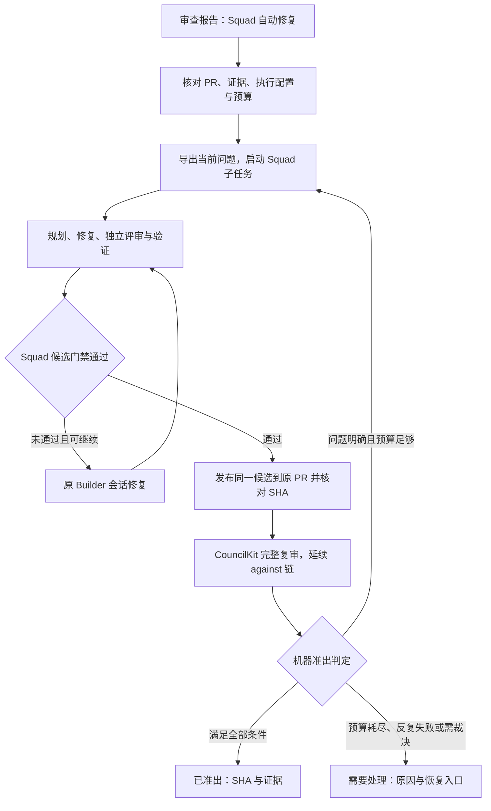

# Squad 自动修复与 CouncilKit 复审闭环

## 目标与设计结论

用户现在手动执行「CouncilKit 报告 → hengzhuo-engineering-squad 修复 → 更新原 PR → CouncilKit 复审」，然后根据残余问题再启动 Squad。产品应接管这段往返：从一份审查报告发起一次 Autonomous Run，持续修复、复审，在准出、预算耗尽或需要人裁决时给出明确结果。

推荐在 CouncilKit 的 `repair` 命令下新增执行能力：**CouncilKit 管循环和准出，Squad 管工程交付，CouncilKit review 管独立复审**。一个父 Run 串联 Squad 子任务与 review 子 Run，保留每轮证据。本文是设计提案，不表示功能已存在。已锁定：准出要求全部未被有效接受的 finding 验证闭环（含 minor/nit）；父预算最多 10 次外循环。

预期体验：点一次「Squad 自动修复」，看到「第 2 / 10 次外循环，正在复审，剩余 2 项」；正常路径无需复制报告、重启 skill 或手动再审。完成时展示准出 SHA、最终复审和门禁证据；中断时展示具体原因与可恢复入口。

## 已有能力与缺口

以下事实核对自当前仓库 `4b4f1f6`，以及本机 Squad v2.1 skill 和控制面文档。

| 已有能力 | 可复用部分 | 新闭环需要补足 |
| --- | --- | --- |
| `fix` | 单轮方案陪审、一个集群 apply、一次 `review --against` | 它只按复审退出码判断流程结束，没有准出循环 |
| `repair export` | 完整 SHA、稳定 finding ID、rootCause、范围、不变量、验收、deferred | 自动交接、可信完成回执、跨轮预算 |
| `review --against` | 延续账本、验证旧问题、保留回归和新发现 | 强制同 PR、候选和 against 链关联；冻结复审班子 |
| 关闭证据 | 独立 reviewer 在同 SHA 上提供测试命令或代码位置 | 将全部必要证据合并成严格机器准出判定 |
| Squad `intake/convergence` | 严格导入、最多 3 个逻辑 fix 轮、同根因两次未闭环转诊断、跨任务历史 | 无人值守的 Orchestrator 启动与受监督交付 |
| Squad observe | 过程、任务文档、handoff | 父 Run 的进度、决策、停止与恢复 |

关键事实：

- review 部分席位失败时可能仍是 `exitCode=0/status=completed`，而 `incomplete=true`；账本落盘失败也可能只记诊断。零退出码不能当准出。
- `canExportRepairPackage` 为兼容旧记录接受未定义的 `evidenceComplete`。自动准出必须要求明确、可核验的完整性，不能照搬兼容判断。
- 现有 `review <PR URL>` 获取远端 PR HEAD，没有公开的本地候选 SHA 参数。首版已锁定为每轮发布候选到原 PR，再复审；不在本版做本地钉 SHA 复审。
- `squadctl` 是控制面，没有“一条命令完整执行 skill”的接口；worktree、角色运行、裁决、commit 和交付仍需 Orchestrator。
- `intake` 只允许未冻结的 briefing，不能每轮向已冻结 task 再导入新包。
- Squad 已有跨任务历史格式和 `intake --history`，但当前入口仅绑定本任务目录，含外部祖先的历史不能完整核验，会进入 `inspect_history`。可验证的祖先目录解析/历史交接是本次必补能力，不能仅传一个历史 JSON 就宣称继承成功。
- 现有 apply 的测试 gate 失败可能仅记日志再 push。新闭环使用 Squad 的严格门禁，不能继承这种推进条件。

## 方案选择

| 方案 | 做法 | 代价与适用性 |
| --- | --- | --- |
| A：交给一个长期 Agent 全程决定 | Agent 反复调用 skill 和 review，最后读报告决定停止 | 接入快，但完成判定、恢复、预算容易依赖自然语言和会话；适合验证流程，不适合作为产品准出契约 |
| B：CouncilKit 父 Run + Squad 执行桥接 | 持久控制器决定阶段与准出；Agent 只在受约束的 Squad 子任务中规划、实现和裁决 | 复用现有资产，需补执行契约；推荐 |
| C：将 Squad 工程引擎搬入 CouncilKit | CouncilKit 自行调度 Planner/Builder/Reviewer/Verifier 和全部门禁 | 消除外部 skill 安装依赖，但形成第二份工程协议，维护成本高；首版不选 |

另一个可选方向是「先在本地反复修复与复审，准出后只 push 一次」。它减少 PR 上的中间提交，但需要新增本地候选 review、发布后再校验等能力。首版采用逐轮更新原 PR，保留该方向作为后续独立设计。

## 用户流程



图中只有开启下一 Squad 子任务才消耗父预算的一次外循环；子任务内部的 candidate 修复走 Squad 自己的 3 次上限，不扣父预算。任何阶段也可因执行失败进入恢复，或响应用户停止。零问题、旧报告和证据不全的入口行为见 R2。

## 产品要求

**入口与授权范围**

- **R1. 一次启动，一条 PR。** 从已有 PR review 报告进入；冻结规范化 PR 身份、仓库、源分支、来源 run、来源 SHA、目标 base、复审班子和执行配置。首版支持现有 GitHub/AntCode PR 能力，不新增 PR 平台。默认修复包覆盖所有当前需处理问题，由 Squad 规划分批实施，避免只完成一个 cluster 就宣告整个 PR 准出。
- **R2. 先核对证据再派修复。** 旧报告 SHA 与远端不一致时先审当前 HEAD，再生成任务包；完整审查的 against 链必须属于同一 PR。失败、截断、账本缺失、缺必要覆盖证据时进入补审/恢复，不启动盲修。需要补写证据但 resume 无法修复产物时，在同一候选重跑完整审查。来源已无待修项时跳过空包导出：仅凭 CouncilKit 报告输出「需要处理：无需源码修复，但 Squad 验收未建立」，CLI 非零退出；只有已有可核验的同 SHA Squad 门禁才可直接走准出判定。
- **R3. 一次明确范围，逐轮沿用。** 启动界面明确展示允许修改和运行验证，并允许把通过 Squad 门禁的候选更新到指定 PR 源分支。该授权绑定本次 Run，不包括合并 PR、部署、评论、扩大范围或接受风险。已有有效授权可复用；无人值守配置缺少必要授权时在执行前返回需要处理。可复用授权保存在 `COUNCILKIT_HOME`（目录 `0700`、文件 `0600`），绑定规范化 PR/仓库/源分支/base 与能力白名单（仅快进推送到该源分支），带完整性 hash；冻结身份漂移则拒绝复用，不得扩大到启动摘要未展示的范围，须可过期与吊销。任务包只传事实和约束，不能授予权限。本文设计工作不执行这些操作。

**Squad 执行与复审**

- **R4. 使用真实 Squad 流程。** 执行桥接必须加载已定位的 skill、遵循冻结计划、唯一 writer、候选审计和独立 Review/Verify；输出受控制面核验的记录。Agent 自述“完成”、进程正常退出、observe `closed` 均不足以启动发布。首版 Orchestrator 是独立 adapter 连续会话（cursor / codex / grok 之一，由已保存 profile 写死 requested/actual runtime），不是人类主会话，也不是 CouncilKit 进程内的 playbook 状态机。CouncilKit 只启动、查询、停止和收取结构化事件。配置须包含可解析的运行时、角色模型、native session、skill/协议版本；缺失、不可恢复或不支持的能力在启动前报出，不从浏览器猜测“当前主会话模型”。按照 skill 的 simple/deep 规则裁决。Builder/Review/Verify 进程不得继承 push 凭据；push 凭据只存在于桥接的 integrate 步骤。沿用现有 driver home 隔离，去掉验证不需要的云/CI token；验证命令按冻结配置执行，不是 agent 任意 shell。
- **R5. 每次外部复审对应一个新的 Squad 子任务。** 新任务以最新完整审查 SHA 初始化并 intake；其内部规划、实现、门禁后的修复复用同一个 Builder runtime/model/session/worktree。外部复审提出下一批问题时，新子任务显式记录 fresh session，携带上一任务与整条修复链历史；不得声称跨 task 连续，也不得清零预算。执行中断则恢复原任务，不重建一个伪装成首次执行的任务。此选择适配现有 intake/freeze 边界，避免修改已冻结 brief。
- **R6. 只有同一候选才能向前流转。** Squad 独立门禁通过后，以候选完整 SHA 发布到原 PR。复用 `integrate check-remote/push-remote` 的预期旧 SHA、祖先证明与远端读回，确保仅快进且不覆盖他人提交。CouncilKit 复审读取的 SHA 必须与候选一致；任何 amend、rebase、cherry-pick 或集成产生不同 SHA 都使旧门禁不可复用。用户主 checkout 不作为临时修复区；桥接使用自己拥有的隔离工作区，完成远端交付无需移动用户工作分支。Push 只用本机已有 git/gh 凭据助手，CouncilKit 不另存长期 token；禁止把凭据写入任务包、CLI argv、pipeline.log、父 Run 记录、Squad journal 或交接文件。隔离工作区路径在启动时冻结，且不得等于 CouncilKit checkout 或用户脏工作树。
- **R7. 延续问题与检查新问题。** 每轮 `--against` 指向上一份完整有效复审；失败子 Run 保留用于恢复，不替换有效基线。复审包含候选 PR 上下文、修复差异、全部需复核的历史 finding，保留新问题、回归和独立少数派发现。新发现若属于冻结目标中的缺陷修复可自动进入下一子任务；新功能、范围外重构或验收规则变化进入待裁决。范围内也不能凭 Builder 声明认定旧 finding 关闭。

**准出与收敛**

- **R8. 机器判定准出。** 采用下一节的准出矩阵，失败项返回稳定原因码和证据引用。所有未被有效接受的问题都必须在当前候选上验证闭环，包含 minor/nit；不能改成仅 critical/major 阻塞。严重级别使用仓库原生枚举，不能直接把 Squad 的 P0/P1 当成 CouncilKit severity。Aggregator 的 approve 可展示，但不单独授予准出；changes-requested 或其他未解释的裁决与账本矛盾必须先解决。
- **R9. 全链预算，完成末轮验证。** 父 Run 默认最多 10 次外循环。一次外循环 = 启动一个 Squad 子任务 + 该候选的独立门禁 +（门禁通过后）发布到原 PR + CouncilKit 复审 + 准出判定。首次子任务也计一次。Squad 子任务内部的 candidate fix 仍受 Squad 自身最多 3 次上限约束，不扣父预算；不得把两套计数乘成 10 × 3，也不得把内部修复当成一次新的外循环。父预算在启动下一可写 Squad 子任务前消耗 1；该子任务内部门禁失败后的原 session 修复不另计。第 10 次外循环完成后仍允许其独立门禁、发布、CouncilKit 复审和准出判定；未通过才记预算耗尽，禁止第 11 次外循环。旧历史未知不能初始化为零。默认没有整段墙钟上限，只靠 10 次外循环和现有席位 timeout；启动时可另设总时限。若设置了总时限并到期，复用 R13 的停止流程：停止调度、保存检查点并取消所属执行，确认所有 writer 已终止才释放互斥。终止状态无法确认则保持写入阻塞；在途发布结果不明确时按 R12 读回核对。恢复不自动重置预算。
- **R10. 识别不收敛。** 同稳定 finding/rootCause 在两次有效源码修复后仍成立，先进入只读根因诊断；诊断必须给出新复现证据、被破坏的不变量与不同的修复方向。同范围、剩余预算足够且诊断形成可验证方案时才能继续；无新证据、超范围或预算耗尽则需要处理。只读复审重试不算根因失败次数。无源码变化而原问题仍未解决时不得反复审同一 SHA 空转。零新增 finding、deferred、预算耗尽都不是成功；运行器不能自行 accept、降级 severity、删问题或放宽门禁。

**可恢复运行与可见性**

- **R11. 持久父 Run。** 记录阶段、每次修复与复审、当前有效 SHA、against 链、Squad task/observe ID、策略快照、累计预算、操作 intent/结果及下一动作。使用独立父 Run（`ck-repair-<uuid>`），不覆盖来源报告及旧轮次，也不把 `pipeline.pid` 写入来源 `ck-review` 目录。浏览器关闭和 Host 重启不终止独立 CLI 控制器；机器/控制器退出后存储/API 状态为 `interrupted`，用户文案为「执行中断」，需显式恢复，不承诺后台自启动服务。
- **R12. 幂等和互斥。** 同一规范化仓库、PR 源分支只能有一个自动写入控制器；同机旧 `fix/apply` 的写入入口也须遵守此互斥。重复点击返回已有 Run。远端外部改动无法靠本机锁阻止，必须在发布前和读回时核对；异常时不自动覆盖。恢复先核验进程身份、租约、Squad journal、候选、远端和已落盘结果；push 成功但记录未完成时先读远端，复审完成但父记录缺失时先关联子 Run，避免重复执行。
- **R13. 区分业务结果与进程状态。** 对用户展示「已准出」「需要处理」「已停止」「执行中断」。预算耗尽、远端漂移、席位失败、证据不足都是「需要处理」的原因码，不是并列终态。执行阶段单独展示「准备、Squad 修复、Squad 验收、更新 PR、CouncilKit 复审、根因诊断、最终核对」。停止先保存检查点并停止本 Run 所有的活动子进程，再释放 writer；停止不回滚已提交或已推送内容。不得标记停止却留下可继续写入的 Builder。
- **R14. CLI 与页面能力一致。** CLI 支持发起、查询、停止和恢复；报告页对应相同动作。父 Run 展示剩余项、已关闭/仍成立/新增/回归差异、轮数、当前阶段、候选 SHA、两套门禁和实际耗时，并链接 Squad 过程与每份复审。只有存在用户可执行的恢复动作才显示按钮，并说明会从哪一步继续。新增页面写动作沿用现有 `auth:mutation` 的 Host/session/Origin/CSRF 校验和严格请求 schema，查询使用 `auth:session`；不能用请求体中的 authorized/passed 布尔值代替本 Run 授权与门禁核验。父 Run 持久化授权 grant id/hash；可能再次 push 的 resume 必须核验同一 grant 与冻结 PR 身份，不能仅凭新的 loopback session+CSRF 重新武装远端写入。observe 继续作为只读投影；Host 仍只以结构化参数启动同 checkout 的 CouncilKit CLI，不直接启动 squadctl，不读取 `.squad/`。Host 启动动作是枚举（`repair run/stop/resume`）映射到固定 CLI argv，不接受请求体或 profile 里的自由命令行。

## 准出矩阵

准出是对「指定 PR、指定候选、指定规则、指定时间」的结论，不能表示未来 HEAD 也已通过。

| 条件 | 必须核验的事实 |
| --- | --- |
| 身份一致 | 来源、任务包、Squad 候选、发布结果、复审都属于同一 PR 和连续修复链 |
| Squad 候选有效 | 当前候选未 invalidate；journal 确认 Review/Verify 独立、冻结的全部 required gates 通过，结果均绑定同一 SHA 和 gate policy |
| CouncilKit 运行完整 | 冻结席位全部成功，Aggregator 完成，incomplete=false；所需产物真实存在且 schema、runId、SHA 匹配 |
| 复审覆盖完整 | 必要 assessments 明确完整，uncovered 为空；不能以字段缺失、旧记录兼容或“聚合未提到”代替覆盖 |
| 问题闭环 | 所有非有效 accepted finding 均通过当前 SHA 的 `isFindingVerifiedClosed`（含 minor/nit）；修复声明均有独立证据，没有仍成立、未评估和证据矛盾 |
| 裁决一致 | Aggregator 已完成只证明执行完整；changes-requested 或其他裁决与账本矛盾且未获解释时不能通过，返回矛盾的证据引用 |
| 例外可追溯 | accepted/deferred 不等于关闭。只有用户已明确授权且适用范围未变的 accepted 可作为例外；无理由、来源不明或条件失效的旧 accepted 须核实。运行器无权新增例外 |
| 当前 PR 未漂移 | 最终读回远端 source HEAD 等于候选 SHA；目标分支/base 与复审冻结上下文仍一致，PR 未关闭或改投分支 |

门禁输出需要包含 `passed`、候选 SHA、检查时间、策略 hash、来源/最终 reviewRunId、Squad task 与门禁引用、未满足原因和已授权例外列表。证据不足输出 unknown，业务结果为「需要处理」，不能折算成通过。通过后的 PR 后续变化只使“当前有效”标识过期，保留原 SHA 的历史准出事实。

## 执行桥接与职责

| 参与方 | 拥有的决定和数据 |
| --- | --- |
| CouncilKit 父控制器 | 冻结启动范围、预算、阶段推进、子任务关联、发布请求、against 链、机器准出结论 |
| Squad Orchestrator 执行桥接 | 按 skill 规划与裁决、角色启动、唯一 writer、候选/门禁、受授权远端交付；只通过 squadctl 合法命令更改控制面 |
| Squad 控制面 | journal、runtime identity、候选生命周期、独立门禁、修复历史和交付回执的权威 |
| CouncilKit review | 独立审查、逐条验证、账本与覆盖证据；不替代 Squad 内部门禁 |
| Runtime Host / 浏览器 | 启动和展示父 Run、发送停止/恢复请求，展示现有只读 Squad sidecar |

桥接是此次跨仓库必做工作，首版随 Squad skill 一侧交付一个版本化、受监督的入口。CouncilKit 只集成这一种执行器，不先建通用工作流引擎或插件注册框架。

桥接最小能力：启动/恢复一个子任务，查询其权威状态，请求停止，收取 `candidate_ready / blocked / failed / stopped` 等结构化事件，并在 CouncilKit 请求发布时返回可核验的交付回执。`candidate_ready` 只代表可交付候选；控制器还须核验 Squad journal/门禁引用，不能信任模型输出里的布尔值。父控制器通过桥接查询权威数据，Host 只读取其已验证投影。远端交付只用固定 `squadctl integrate` 动词（`check-remote`/`push-remote`）和结构化参数，禁止 shell `-c`，禁止任务包或 profile 提供 argv。

运行配置须保存 requested/actual runtime、模型、native session 与版本指纹。Orchestrator 与 Builder 都走已支持的 adapter 连续会话，不能把任意 PID 或 CouncilKit Host 进程当作原生 session。runtime 替换、角色降级或版本不兼容不得静默发生。复审班子与 Builder/内部门禁使用独立 session/worktree；无需为了“独立”强制新增模型供应商。

每次外部复审开启下一子任务时继承完整的 `repair-history.v1.json`，通过项目/修复链/rootCause/task/逻辑轮关联。桥接必须新增受控的祖先任务目录解析与历史导出/导入，校验原 journal、来源包 hash 及项目身份；禁止从不可信包任意指定祖先目录。父控制器持有外循环次数的权威记录（默认上限 10）；Squad 保留子任务内 candidate fix 记录（默认上限 3）。两者在启动下一外循环前对账，不在每次内部 writer 启动时扣父预算。缺失或冲突的历史进入待核实，不采用乐观较小值。这一交接和计数映射是桥接契约的一部分，必须有契约测试。

任务包使用现有 schema v1；执行配置与授权单独传递，不经由任务包下发命令。导出文件落在 `COUNCILKIT_HOME` 下受控交接目录（目录 `0700`、文件 `0600`，拒绝 symlink），父 Run 只保存路径及 hash；Host 不静态提供原始包内容。遵守现有 `repair export` 不覆盖历史、独占创建的约束。保留恢复所需文件，准出/停止后也不自动删除证据。

## 拟定 CLI 与界面

以下为新增接口草案，当前不能直接执行：

```bash
councilkit repair run --from <ck-review-id> --profile <saved-profile> --json
councilkit repair status <ck-repair-id> --json
councilkit repair stop <ck-repair-id> --json
councilkit repair resume <ck-repair-id> --json
```

`repair export` 保持现有语义。首版 `repair run` 固定使用 Squad，运行次数/时限是本 Run 的可配置上限，省略时使用 R9 默认值；不能隐含无限模式。`--json` 保持 stderr 进度、stdout 一个最终结果。异步页面启动立即返回父 Run ID，CLI 前台执行只在终止或需要处理时输出最终结果。CLI 仅「已准出」返回成功；「需要处理」（含预算耗尽）为非零，具体码在实现时沿用当前错误分类，用户停止沿用 130。

报告页新增主动作「Squad 自动修复」，原「立即修复」注明「内置修复」并保留兼容，避免混淆。启动摘要展示 PR、范围、全部 finding 清零、最多 10 次外循环、可选总时限和逐轮更新 PR 的授权；使用已保存配置时一键启动，不每轮弹确认。进度文案「第 N / 10 次」只表示外循环，不表示 Squad 内部 candidate 次数。

父 Run 顶部示例：

```text
PR #123 · Squad 自动修复
第 2 / 10 次外循环 · CouncilKit 正在复审
上一轮 5 项 → 已验证解决 3 项 / 仍成立 1 项 / 新增 1 项
候选 abc123… · Squad 验收通过 · CouncilKit 复审进行中
[查看 Squad 过程] [查看本轮复审] [停止]
```

复审未完成时上轮计数明确标注“上一轮”，不提前显示清零。成功时主卡片显示「已准出 · SHA」，附最终检查时间与例外；需要处理时给出「同根因两次未闭环」「远端已变化」「复审席位失败」等实际原因。停止确认仅用于存在活动写入且用户需要了解保存点的情形，不阻碍无副作用停止请求。

建议的恢复交互如下；这是本提案的产品选择，用户可在实施前调整，不能将所有需要处理原因都绑定到同一个无条件继续按钮。

| 需要处理原因 | 页面动作与恢复条件 |
| --- | --- |
| 复审席位失败 / 可修复的产物缺失 | 「恢复复审」；确认候选和 base 未变后复用成功席或重建缺失证据，跳过源码修复和 push |
| runtime 暂不可用 | 「检查配置」；原 runtime 恢复后继续原任务；需换 runtime 则先明确展示变更及失效证据，不静默降级 |
| 历史缺失 / writer 是否终止不明 | 「查看待核实项」；权威历史、进程和租约核验通过后才出现「恢复」 |
| 两次同根因未闭环 | 「查看诊断」；有新证据、同范围且预算足够才可继续；诊断失败时提供交接资料 |
| 外循环预算耗尽 | 「查看残余问题 / 导出交接」；无第 11 次外循环按钮。末轮缺失的验证可恢复；追加外循环需要另行明确授权，保留累计历史，不能重开 Run 清零 |
| 时限到期 | 「查看检查点」；确认旧执行终止后，可明确延长时限再恢复剩余阶段，保留已用时和外循环预算 |
| 远端 HEAD / base 已变化 | 「查看分支变化 / 从最新审查重新发起」；先重审当前状态，保留原候选和累计历史，不自动迁移旧门禁或应用旧候选 |
| 没有待修项但缺 Squad 门禁 | 「查看现有审查 / 补充验收后重新核对」；首版不创建空修复任务、不宣告准出 |

## 首版范围与实现顺序

首版必须完整打通 CLI + 报告页。只做已有报告驱动、单 PR、固定 Squad 执行桥接、逐轮发布、独立复审、严格准出、有限预算、停止和恢复；一次最多一个写入者。新问题自动回流和失败恢复属于闭环本身，不留给后续手工操作。

不包含：自动合并/部署/PR 评论、定时轮询、跨仓库批量修复、无人值守任意扩范围、自动接受风险、本地候选复审模式，以及通用多执行器平台。

实施按三个可验收阶段推进，不依赖真实 PR 去试错：

1. **契约与准出**：给缺失的权威执行/交付回执补契约，实现严格门禁评估，固定源身份、产物完整性和预算映射；验证真实 Squad runtime 的启动与恢复能力。
2. **CLI 闭环**：接通 export → 子任务 → 发布 → review → gate，加入持久记录、共享互斥、停止、恢复；复用原流程但不继承宽松成功判断。
3. **产品入口**：父 Run 的索引和详情、启动摘要、动作与原因提示，串联旧 Squad observe/review 页面；完成真实隔离仓库验收。

计划阶段要给跨仓库 bridge 变更安排明确交付版本；CouncilKit 在该版本缺失时启动前报出依赖，不能先展示一个实际上无法执行的自动修复按钮。

## 验收场景

| 场景 | 预期结果 |
| --- | --- |
| 修复一次、两套门禁均通过 | 自动更新原 PR，完成复审，输出同一 SHA 的准出证据 |
| 复审仍有旧问题或发现新回归 | 在范围与预算内自动创建下一任务，稳定 ID/根因历史不丢 |
| Squad 内部门禁先失败后修好 | 原 Builder session 继续，内部修复扣 Squad 自己的 3 次上限，不扣父预算外循环 |
| 第十次外循环终于通过 / 仍未通过 | 允许完成第十次候选的全部验证；前者准出，后者需要处理，无第十一次外循环 |
| 同根因修复两次仍成立 | 先只读诊断；无新证据不继续相同补丁，不自动重开预算 |
| review 零退出码但有失败席/缺账本/缺 assessments | 不准出，恢复或重跑必要审查，不额外让 Squad 改代码 |
| 只有历史 closed、repairClaim、accepted 无授权依据 | 不计为已验证闭环；不因问题计数减少而通过 |
| Squad closed、模型声称完成但独立门禁不全 | 不发布，不准出，显示缺少的证据 |
| 来源 SHA 已旧 / 推送前远端变化 / base 漂移 | 首次派工前补审；执行中漂移保存候选并需要处理，不覆盖别人代码或复用失效证据 |
| push 成功后断电 / review 完成后父进程退出 | 恢复核对既有副作用，复用同一候选和子 Run，不重复提交、发布或计轮 |
| 页面双击/两标签页/同时运行旧 fix | 返回现有 Run 或写入冲突，最多一个 writer |
| 用户停止、浏览器关闭、Host 重启 | 停止终止所属执行且保留证据；关闭浏览器/重启 Host 不取消独立控制器 |
| 初始无待修项、缺 runtime、权限不满足或旧历史未知 | 不导出空包、不空跑、不伪造准出；输出明确的无需修复或需要处理原因 |

## 待反馈的默认值与计划阶段核查

**已锁定**：准出要求全部未被有效接受的 finding 验证闭环（含 minor/nit）；父预算最多 10 次外循环；Squad 每子任务最多 3 次内部 candidate fix，不扣父预算；默认没有整段墙钟上限（只靠外循环 + 席位 timeout，启动时可另设总时限）；Orchestrator 为独立 adapter 连续会话；首版逐轮更新原 PR 再复审。不能隐式降低门禁，也不能对每个子任务重新发放外循环次数。

**计划阶段必须核验、不得改掉的前提**：现网 `review` 经常覆盖不全或产不出 `verified_closed`，准出环要把「同 SHA 覆盖完整 + 可重复关闭证据」当作前置里程碑，不能靠兼容字段放行。AntCode `inspectPullRequest` 目前不返回 `headSha`，身份一致/未漂移要么补上 PR HEAD 读回，要么 GitHub 路径先准出、AntCode 启动前失败。

**计划阶段核查**：在 cursor / codex / grok 中选定第一个能启动并恢复的独立 adapter Orchestrator，写入 profile 的 requested/actual；核验跨任务 history 导入/导出和预算对齐的实际 CLI；为缺失/损坏产物的同 SHA 复审定义兼容现有 resume 的重建路径；核验托管隔离工作区通过现有远端交付接口的参数；确定产物 schema、状态码和前后端扩展位置。上述行为要求已确定，具体实现不能降低证据、会话或授权约束。

## 代码依据

- 单轮修复与复审：`cli/src/commands/fix.ts`（runApply 和 startFollowUpReview）。
- 复审部分失败与冻结上下文：`cli/src/commands/review.ts`（finalize、freezeReviewContext 调用、persistFindingsFromReport 调用）。
- 任务包与导出目录限制：`shared/runtime/repair-package.ts`、`cli/src/commands/repair.ts`。
- 当前 SHA 的关闭证据：`shared/runtime/cli-ledger.ts`、`cli/src/auto/ledger.ts`。
- 完整性和历史兼容：`shared/runtime/review-case.ts`、`shared/runtime/cli-runs-index.ts`。
- 稳定根因身份：`shared/runtime/finding-groups.ts`、`cli/src/auto/finding-groups.ts`。
- 页面与启动：`src/components/report/FixPipeline.tsx`、`src/lib/squad-workspace.ts`、`runtime-host/cli-launcher.ts`、`runtime-host/routes/cli-runs.ts`。
- 外部依赖：已安装的 `hengzhuo-engineering-squad/SKILL.md`，及其 `references/repair-workflow.md`、`references/builder-continuity.md`、`references/playbook.md`、`references/squadctl.md`；安装路径通过运行配置解析，不写死个人机器绝对路径。
