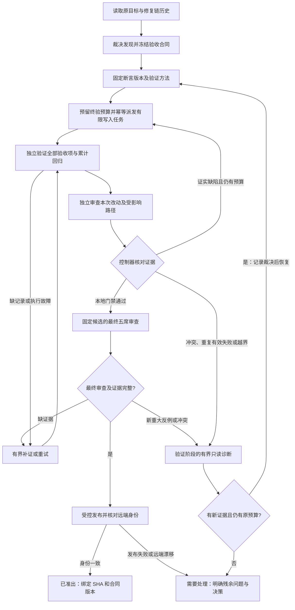

# 自动修复的目标保持与收敛控制：需求增补提案

## 问题与边界

用户希望 CouncilKit 的「Squad 自动修复」在长时间执行、跨 Agent 交接和多轮审查后仍保持原研发目标，并在有限成本内到达可验证的交付或明确的诊断结论。

PR #128 的证据支持三种机制共同作用的诊断解释：真实修复回归；计划验收未形成固定测试；循环脱离控制面。CouncilKit 的账本身份、覆盖判定和格式纠正也存在成本放大路径；尚未通过对照实验测量各机制的因果贡献。详见 [PR #128 诊断](/Users/hengzhuo/code/github/Wenfeng-GAO/councilkit/docs/verification/2026-09-21-pr128-convergence-diagnosis.md)。

本提案扩展现有 repair 控制器、Squad journal 和验收机制，不建设通用工作流平台。它不直接修改运行配置、不改变用户已经授予的权限、不重写旧账本、不降低当前“全部非有效 accepted 项闭合”的准出规则。

原需求 [Squad 自动修复](/Users/hengzhuo/code/github/Wenfeng-GAO/councilkit/docs/brainstorms/2026-09-20-squad-repair-until-approved-requirements.md) 已锁定外循环 10 次、内层修复 3 次、可选整段时限、逐轮发布再复审。本文将涉及这些行为的改变显式列为 v2 建议，未视为用户已经批准。

2026-09-21 已读取[网页版 GPT-6 Pro 完整评审](/Users/hengzhuo/code/github/Wenfeng-GAO/councilkit/docs/verification/2026-09-21-gpt6-pro-review.md)，并据此修订本提案。评审支持方向、要求修改后实施；它没有复跑 PR 测试或批准当前候选。发给 Pro 的原始材料单独保存，本提案修订不覆盖当时输入。采纳的关键修订为：统一裁决与准出输入、明确身份未知值、受测快照与测试语义、幂等受监督执行、终验时间预留；三次派工/两小时等数值仍待校准和授权。

## 核心原则

**Agent 提出方案、实现候选、给出证据；确定性的控制器管理目标版本、执行许可、预算、状态转移和准出。**

系统分别保证三件事：

- 目标保持：后续任务仍能追溯到原请求和冻结验收，不能通过改题变成完成。
- 有界执行：所有写入、验证、诊断、格式修补和恢复共享有限执行预算，不因换 run/session 清零。
- 有证据的准出：只为满足当前合同且证据完整的 SHA 发出通过结论。

有界执行不等于问题必能修好；目标语义和测试有效性仍需独立判断，hash 或状态机不能替代这些判断。

权威状态仅保留四类逻辑数据，复用现有存储与控制器；不要求新建四个服务或独立工作流：

| 权威数据 | 内容与唯一责任 |
|---|---|
| 目标合同 | 原始请求、目标版本、范围、不变量、可信准出策略和授权引用；引用执行记录中的预算，不复制另一份预算 |
| 经裁决的验收清单 | 不可变断言版本、验证责任、原始 finding 映射、测试与证据、裁决结果；派工、进展和准出共用同一投影 |
| 执行记录 | 修复链、累计预算、execution ID、输入/输出候选、执行 intent、结果和恢复身份 |
| 准出回执 | 候选 SHA、base SHA、可信策略、验收证据及真实远端核验、检查时间 |

任务卡、界面和根因统计均为只读投影，不能成为新的可独立改写的事实来源。原报告/日志作为证据保留，新发现必须经裁决进入清单后才影响派工；尚未完成必要裁决的证据缺口不能被忽略以获得准出。

## 当前代码中已经具备与尚有差距的能力

| 能力 | 当前实现事实 | 本提案要求 |
|---|---|---|
| 真实 Squad、独立门禁 | 已接入 SquadctlBridge；journal 映射检查同 SHA、不同 session/worktree、必需 gate | 保留并增加验收项到证据的逐项映射 |
| 外循环上限 | repair state 默认最多 10 次 | 增加原修复链层面的写入派工和总时限预算 |
| Squad 修复次数 | 已安装 Squad 对 source-fix 3 次有硬门禁，并累加 verified 跨 task 历史；不能理解为 10×3 次 | 保留已有门禁，补上初次实现、无候选退出及新父 Run 的统一记账 |
| 同根因检测 | repair-run 的 sameAgainstStillOpen 只比较 againstRunId；stillOpen 统计全部非 accepted 行 | 按稳定根因和实际 still_open 证据计数；缺证明与真复发分开 |
| 超时 | timeout 可空；waitForCandidate 每次进入重建 startedAt | 用持久化 deadline 覆盖全流程和恢复 |
| 历史继承 | 同父 Run 的后续任务要求冻结历史导出和来源映射 | 新父 Run/新 review/session 继续同目标时也不能重置 |
| 目标/验收 | repair package 有 invariant/acceptance 字段；无 plan 时可退化为“修复 ID：标题” | 写入前形成可执行目标合同，标题不能充当完整验收 |
| 终验策略 | repair-run 使用固定 POLICY 字符串，真实 Squad 映射要求 64 位策略 hash | 两端绑定同一份真实冻结策略；测试必须覆盖生产装配 |
| 终验身份事实 | 终验装配将缺 base SHA、未给 prOpen 等情形转换为肯定值，publishedSha 也存在回退 | 保留未知值与原因，只有明确核验通过才准出；验证真实入口可达性，不把代码路径直接当成现场事故 |

上述为当前源码读取结论；不等同于已对按钮进行完整真实 PR 验收。终验 hash 问题另用无副作用探针确认：将真实形状的 journal 经 journalFromSquadStatus 映射，再交 evaluateRepairGate；其他条件均通过时，预期值为 gate-policy-1 则仅报 squad_candidate_invalid，换成候选的真实 hash 即 passed:true。此处改变 expected 只用于定位拒绝条件，不是建议生产实现自我比较候选 hash。未将此合成探针称为 #128 的实际运行失败。

Pro 复审后追加核对：生产 PR parser 确实允许 baseSha/prOpen 缺失，前置核验只要求完整 head SHA，因此存在缺事实路径；尚未取证实际服务响应是否在本次运行命中。publishedSha 的正常发布路径有持久回执，fallback 是否在正常运行触发未证实，不能直接断言现场假发布；纯 gate 目前也接受 null，仅删除 fallback 不足以形成发布证明门禁。现有 accepted 有独立保护，不能说所有裁决都会被 raw finding 推翻；待补的是等价映射、误报证伪和事实冲突的裁决投影。先修复协议不一致，再评价自动循环效果。

## 拟议执行路径

图示为 v2 建议的“本地候选验证后发布”路径，区别于现有逐轮发布。最终完整 CouncilKit 审查及远端核验仍必需；本地候选审查须先补齐能力，不能仅改文案就切换路径。

## 需求

**目标、发现与验收**

- **R1 原目标合同。** 保存原始用户请求及其引用，形成版本化合同：目标、非目标、产品不变量、允许修改范围、验收清单、已授权例外、可信准出策略和同链预算记录的引用。每项验收要说明如何观察结果、对应何种证据。机械完整性检查不证明合同语义正确；独立核实其确实代表用户目标后才允许写源码。用户已明确的意图直接落入合同；不要求用户逐条确认机械性细节。新增目标、削弱验收或接受风险须回到明确的授权变更，旧历史和预算继续保留。

- **R2 发现裁决与范围分流。** 原始 reviewer finding 是待判定的发现，不直接等于修复任务。它必须绑定候选 SHA、触发条件、违反的不变量、错误终态和证据。分类为：当前改动引入的回归、原范围内遗漏、范围外问题、未证实假设、重复别名、证据冲突。控制器只派发经裁决且在合同范围内的修复；范围外问题保持记录，重大未决不得因“范围外”而批准整个 PR。not_evaluated 不是反证；有验证责任却未评估则属于覆盖缺口。

  裁决生成版本化验收清单，必须同时成为派工、进展与准出的输入。固定断言版本、候选、测试版本后才比较证据；不同断言不是同一事实冲突。原断言 E1 关闭后出现新反例 E2，保留 E1 的结果并关联 E2，不能通过复用 ID 改写 E1 的含义。根因分组可调整，历史验证对象不可随之变更。旧账本若无法表达这些结论，须显式适配 gate 输入；原始 still_open 或文本不能绕过有效裁决直接否决闭合。保持全部非有效 accepted 项闭环的严格含义：每个原始项都必须有映射和处置证据，重复要证明等价，被证伪要有独立证据，未复现不等于证伪，不能通过遗漏映射或改写状态消除待裁决项。

- **R3 可累积的验收资产。** 每个被接受的缺陷必须形成可重复反例，优先成为版本控制中的测试；确实不可执行的项保留具体 code trace、环境限制及替代证据。修复必须保存坏版本失败、新版本通过的对应证据。验收项与测试/验证方法逐项映射，整体 go test PASS 不能替代未覆盖的验收。Builder 不能自行降低验收或删除失败反例；测试本身错误可经独立裁决修订，保留旧版本和理由。所有候选重跑累计契约测试，模型只需重新判断受影响的语义与真实证据冲突。

  每项验收明示前置条件、触发、允许的后续刺激、可观察结果及环境假设。Ready 自恢复测试可以释放 barrier 和观察，不可再次调用 Retry 帮它完成；断言验证行为不变量，不无必要地冻结内部实现。受测源码必须是不可变候选快照，新增探针另有明确的验证资产版本；HEAD 相同但存在未声明改动不算同一验证对象。必需测试须实际运行、未被 skip，零测试不能作通过证明。历史 FAIL 须归因到目标断言，编译/环境失败另记。固定反例是累计下限，还需检查相邻交错/失败边界并保留最终独立探索；明确存储最终恢复、runtime 保持 Ready 等活性前提，不要求永久外部故障下必然恢复。

**受控执行、连续性与预算**

- **R4 单一写入派工入口。** 控制器在启动 Builder 前持久化合同版本、根因集合、输入 SHA、范围、截止时间和本次执行 ID，并登记本次预算；不能等提交成功才计数。检查同链预算、取得唯一活跃写入身份和预留次数必须构成一次原子授权，并继续遵守 repo＋source branch 的单 writer 约束；未取得授权不能启动子进程。失败、取消、无提交退出仍消耗该次派工预算；同一次执行的基础设施恢复不重复计写入轮，但有独立重试额度且总时限继续累计。Writer 只写候选工作树；Reviewer/Verifier 对候选源码独立只读核验，测试输出写到各自临时目录；发布由已授权控制器执行。只靠 skill 或 worktree 不构成权限隔离，见安全实施边界。

  Bridge/runner 必须以 execution ID 提供幂等启动：同 ID 重复请求只能返回同一执行或其终态；控制器在启动回执落盘前崩溃也不能补开第二份。执行期限需由独立于父控制器轮询的执行边界落实，父控制器退出后仍可识别、查询和到期终止所属进程范围。执行器能力未验收时，只能承诺不再授权新写入，不能承诺旧进程已停或硬成本上限。已得到有效代码失败证据后的再次修改属于新修复派工，不能伪装成基础设施恢复。

- **R5 跨任务的有限预算。** 项目＋PR＋原始目标对应一条持久修复链，新 task/run/session 自动继承。改标题、换模型、重建父 Run、压缩上下文均不能清零；同一 PR 上真正新目标须显式关联为新的目标版本或新链，不自动猜测切断。以当前 10 外轮/3 内轮为兼容上限，同时引入总写入派工数、整段 deadline、验证/格式/诊断的独立有限重试数。token 可观测时记录，缺失必须标 unknown；时间和次数仍可硬限制，不能宣称精确限额。恢复在发起任何新工作前重新核对预算、身份、合同和旧 writer 退出状态。

  总 deadline 之外，设置停止新增源码派工的时间点，为必要验证、最终五席审查、发布核对和停止清理预留预算。新派工必须同时满足次数及后续阶段预算，不得把所有时间用于实现。预留按任务类型与历史阶段耗时校准，是计划容量而非必然按时完成的保证。总期限到达后不追加一轮诊断，只保存已有证据、停止所属执行并给出原因；诊断十五分钟仍受总期限约束。

- **R6 基于证据的进展与诊断。** 进展记录包括：原目标验收覆盖、经证实根因的关闭/新增/复发、累计反例结果、证据缺口和已用预算；不用 commit 数、原始 finding 数或模型自评分代表进展。同一冻结断言或经裁决的规范根因，在两次实际源码修复后仍被有效验证证实，停止同类写入进入诊断。根因关联需记录语义裁决，不能依靠标题匹配；两次阈值是更换解题策略的启发式，不证明不可修复。席位/格式/环境失败、缺日志和无有效验证的任务消耗各自预算，但不计根因修复失败次数。删除“连续两次没有新增验收”这一独立停写条件，证据补充和其他空转用重试额度与总预算限制。诊断是验证阶段的一种限时只读执行，只能输出新假设、最小反例、必要合同变更或阻塞原因；有新证据且旧预算足够才恢复，否则需要处理。诊断、裁决和计划也有 deadline/调用次数上限，不形成新的无限外循环。

- **R7 每次交接重新定位目标。** 每次启动、恢复、模型替换或上下文压缩后，从控制器读取由目标合同、验收清单和执行记录生成的短任务卡：合同版本、当前候选、责任验收项、原反例、已经否证的方案、仍缺证据和剩余预算；需要详情时按证据引用读取。任务卡不独立存储权威状态，Agent 的长聊天摘要也不是权威状态。卡片过期时重新生成，不能继续写入或沿用旧 PASS。计划中的每条必需验收都必须有当前候选证据，不因新 finding 把旧验收挤出上下文。

**准出与产品行为**

- **R8 独立证据准出。** 保存执行器直接采集的命令、cwd、退出码、日志工件、候选 SHA、合同与测试版本、角色/session 身份及验证责任；结构化 envelope 只索引真实证据，不能手写替代 stdout 或 exit-code。语义审核负责判断反例是否代表目标，控制器负责核验来源、覆盖和身份。终验采用同一冻结 gate policy 的实际 hash，未知或不匹配拒绝准出。成功同时满足原目标、冻结范围、现有 finding 准出规则、独立门禁和最终远端身份；任务已完成、进程 exit 0、observe closed 均不代替成功。

  预期策略须从控制器事先冻结的可信来源读取，不能临时采用候选声称的 hash 作 expected 值。终验装配必须保留 source/base SHA、PR 开放状态、发布结果等事实的未知/读取失败/不匹配，不得将缺失值转换成 true。实际交付依赖发布回执或明确的“核验采用既有远端候选”记录，不能补造 publishedSha。发布结果不明时先核验在途执行和远端：已是合法候选则补记核验，已漂移则阻塞，仍可能在途则不盲目重发；保证逻辑发布可核验、无覆盖，不承诺网络请求恰好发送一次。准出与派工使用 R2 同一份有来源、版本和覆盖证据的裁决投影。

- **R9 操作界面表达真实状态。** 启动摘要展示原目标、验收摘要、预算、范围和已有发布授权；用已保存策略可一键执行，正常步骤不反复询问。界面只展示控制器状态及其原因，不另建业务状态机。运行中优先显示“验收完成几项、真实根因关闭几项、当前阻塞原因、剩余预算”，技术计数与日志折叠。明确分开源码修复、补证、事实裁决和根因诊断；提供与原因相符的恢复入口。业务终态仅为已准出、需要处理、用户停止；interrupted 属于执行状态，不能冒充用户停止或已作出的业务裁决。展示绑定 SHA、未满足验收和下一项所需决策，不以运行 completed 代替研发目标完成。

预算耗尽后的继续沿用原需求已有的显式授权规则：可结束并导出交接；也可在看到诊断证据、耗尽项和所需增量后，由用户一次授权追加预算。追加是同链的版本化预算修订，保留全部已用量、历史及原目标，不重置计数。普通“恢复”不能暗中追加；已触发同根因重复诊断时，仅追加预算不足以解除诊断要求。

本地候选验证通过与“已发布 PR 准出”是不同阶段。前者可以没有发布证明，但不能显示整个 PR 已准出；后者必须有真实交付或采用既有远端候选的核验记录，以及完整 source/base/PR 状态事实。补证应返回缺失的原阶段，不重复启动源码修复或已经完成的审查。

## 安全实施边界

必须区分“控制器拒绝派发/发布”和“Agent 在操作系统层不能绕过”。清除 token 环境变量不够：SSH agent、Git credential helper、宿主目录、共享同用户文件权限都可能保留发布或改账本能力。

首版最小工程边界是：Builder 只写自己的工作树；控制器合同、账本、证据目录不可写；不得访问发布凭据和 SSH socket；发布动作由独立控制器执行。此隔离覆盖所有会执行候选代码的角色及其子进程，包括构建、测试和验证执行器；不能让 Builder 借候选测试获得 Verifier 的更高权限。发布执行器不得以发布权限运行候选提供的脚本或 Git hooks。具体用受限 runner、隔离用户或容器由实施阶段核验，不能把普通 worktree 称为安全边界。若某 runtime 暂不支持，就明确标为协作约定模式，不声称“不可绕过”；策略要求强隔离时不能静默降级。

任何停止/超时只终止本任务持有的执行；旧 writer 无法确认退出时不能发放新 writer，租约过期不代表进程已经消失。必须能接管正常可识别的旧执行，不能把永久保持写锁作为全部恢复场景的实现。父控制器死亡后 deadline 能否继续生效属于 runner 的待验收能力，未具备时明确降低保证范围而非静默降级。范围内的常规修复沿用现有授权，权限隔离不是逐步弹窗批准。

## 实施顺序与验收

先建设一个能用历史轨迹和模拟执行器重放的控制协议测试集，日常验证不调用真实模型。测试输入为明确状态/证据/事件，断言可执行动作与准出结果；少量真实隔离仓验收再验证 runtime 是否遵守能力边界。

| 阶段 | 交付 | 必过验收 |
|---|---|---|
| A 协议修正 | 可信预期策略、显式身份事实、coverage、同根因判定一致 | 通过生产装配路径验证合格候选可以通过；未知/不匹配策略和缺 source/base/PR 状态拒绝；真实核验采用既有远端候选可以通过；弃权不制造假冲突；已关闭项不计复发 |
| B 目标与证据闭环 | 四类权威数据、断言版本、裁决到 gate 的统一投影、反例和实际执行回执 | E1 关闭与 E2 新反例分别记录，别名不膨胀；旧 PASS、手写回执、额外 Retry 帮助恢复、零测试/全 skip、未声明脏工作树不能准出；合法测试纠错后可以继续 |
| C 全链执行边界 | 新父 Run 继承预算、原子授权、幂等 runner、独立期限监督、隔离与恢复 | 并发最多一个 writer；启动前后崩溃不重复执行；父控制器死亡后受支持的 runner 仍落实期限；旧 writer 不明拒绝新写入，可识别执行可以接管；候选代码无法改控制面或获得发布权限 |
| D 获授权的 v2 路径 | 本地候选终审、终验时间预留、受控发布、简化界面 | 用模拟时钟拒绝侵占终验预留的新派工；合格候选能完成终验；发布成功但回执丢失可读回恢复、不盲目重发；漂移不覆盖，缺事实只补证；最终新反例不绕过原链预算 |

附加防过度阻塞测试：两个不同新根因不能误判为同一根因重复；合法测试纠错可通过版本化裁决恢复；一席未评估不否定另一席的有效证明，但未分配责任或未覆盖的必需验收不能放行；范围外重大项仍阻止整个 PR 准出。

准出测试与终止测试都必须有正例。一个“永远拒绝通过”的控制器不满足本提案。

以上历史重放证明控制器行为符合规则，不证明模型代码质量已经提高。还需在相近任务难度、相同准出标准和可比预算下做少量真实任务对比：有效交付率 = 达到同等门禁且后续独立检查仍有效的交付任务数 / 全部纳入比较的任务数。同步报告回归逃逸、总耗时、可观测成本和用户介入比例；不能只统计成功任务，或把更早进入“需要处理”计作交付改善。缺数据保留 unknown。

## 候选默认策略（待实施时确认，不修改当前配置）

建议为新 v2 profile 提供“有限自主修复”：整条链最多 3 次源码修复派工、总时限 2 小时、同根因 2 次失败转诊断；只读诊断最多 15 分钟且仍受总时限约束。已有 profile 保留旧合同，不能静默迁移。数值是起始策略建议，可按任务规模预设；并非“2 小时一定修好”的承诺。

这些数值仅供试运行。#128 是同一 PR 的关联轨迹，不能推导通用最优阈值；最后一轮审查约 38 分 45 秒，足以说明第 105 分钟才完成实现的候选未必赶得上两小时终验，但不能把 38 分钟直接作为所有任务的预留常量。先收集任务级实现、验证、诊断、终验时长和有效闭合/回归结果，按任务类型校准写入截止点与终验预留；没有预算时不承诺额外完成诊断。

默认保留最终五席完整审查。内层先跑累计测试和定向独立检查；缩减的是重复发现过程，不能减少已冻结的验收责任。最终发现新重大反例时沿同链处理，禁止改记新链绕过上限。

## 待实施阶段确定

- 基于用户授权选择 v2 数值和发布节奏；本次不把提案默认值写成已批准策略。
- 核验各 adapter 的真实权限隔离及子进程停止能力；无法硬隔离时确定产品中的能力标识。
- 根因/测试语义争议由独立裁决角色处理一次，有证据可自动解决；涉及目标变更或风险接受再请求用户决策。
- 旧修复链无可靠历史时保留 unknown，完成历史导入或明确重建基线裁决后再启用自动写入，不能记零。

可合并或延后：复杂根因自动聚类、独立任务卡存储、精细化 UI、多 adapter 同时铺开，以及缺少数据时的精确 token 计费。先打通四类权威数据的单一路径。格式修正优先用确定性结构处理；需要重新作事实判断时计为有预算的原席位重试，不增加一条反复重判的纠错循环。

## 当前实现依据

- [repair-run](/Users/hengzhuo/code/github/Wenfeng-GAO/councilkit/cli/src/auto/repair-run.ts:663)：重复判断、候选等待超时与父 Run 身份。
- [repair-persist](/Users/hengzhuo/code/github/Wenfeng-GAO/councilkit/cli/src/auto/repair-persist.ts:18)：现有外循环上限与持久字段。
- [squadctl-bridge](/Users/hengzhuo/code/github/Wenfeng-GAO/councilkit/cli/src/auto/squadctl-bridge.ts:593)：跨任务历史继承与真实执行。
- [squad-journal-map](/Users/hengzhuo/code/github/Wenfeng-GAO/councilkit/shared/runtime/squad-journal-map.ts:10)：独立性和真实策略 hash。
- [repair-gate](/Users/hengzhuo/code/github/Wenfeng-GAO/councilkit/shared/runtime/repair-gate.ts:98)：准出条件。
- [repair-package](/Users/hengzhuo/code/github/Wenfeng-GAO/councilkit/shared/runtime/repair-package.ts:159)：目标/验收输入当前可能退化为 finding 标题。
