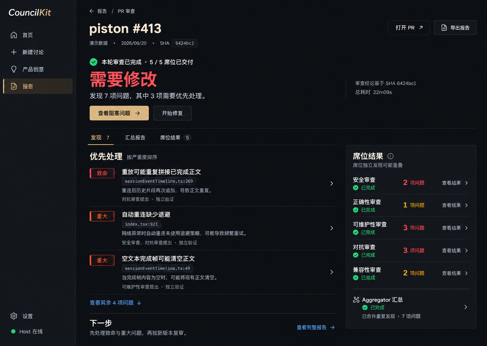
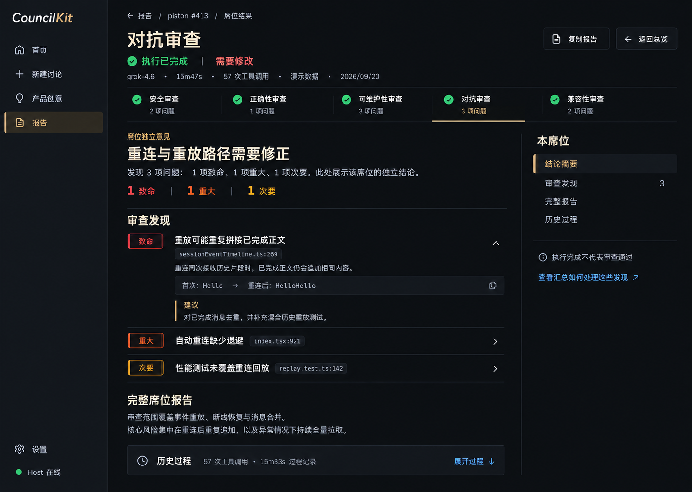
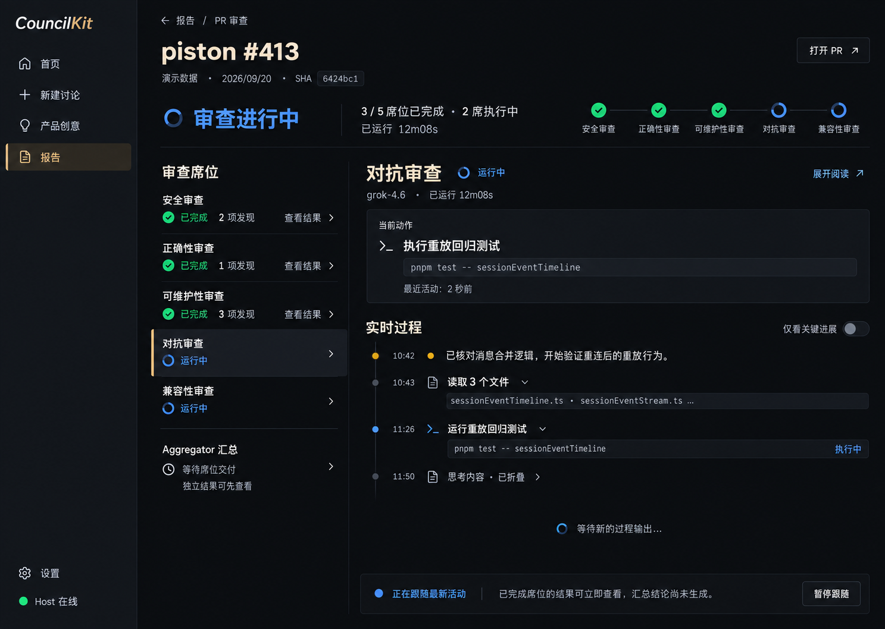
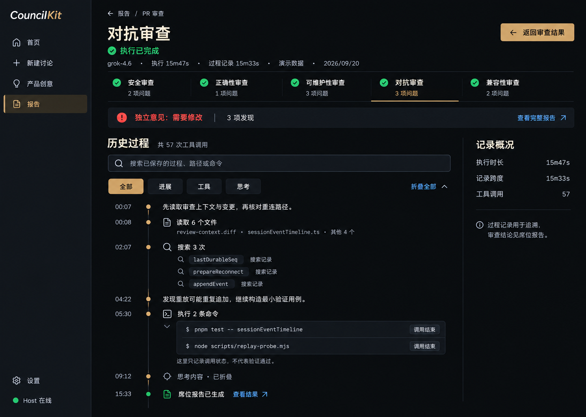
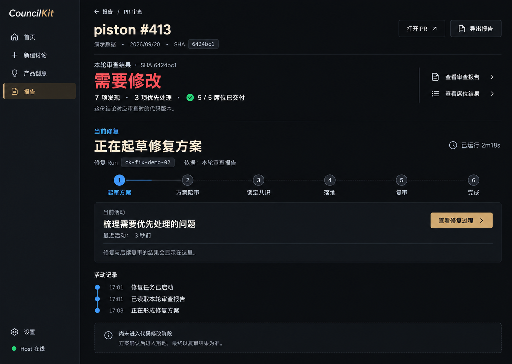

> **已选定固定席位工作台：请使用 [v3 细节交付包](v3-detail/README.md)。本文件保留为 v1 历史稿，不作为当前实现目标。**

# CouncilKit 审查体验 · 高保真画板

这是一套连续状态设计。图片为视觉参考；正式尺寸与文案见 [VISUAL-SPEC.md](VISUAL-SPEC.md)，交互与数据来源见 [INTERACTION-SPEC.md](INTERACTION-SPEC.md)。所有示例内容为演示数据。

## 01 · 审查总览

完成后先看结论与优先问题。席位结果压缩为可扫读列表；执行状态与审查结论分开。

## 02 · 已完成席位

打开席位先读结果与完整报告。历史过程位于正文下方，右侧目录用于长文阅读。

## 03 · 审查进行中

左边辨识每席位状态，右边突出当前动作，再展示实时过程。已完成席位随时可读。

## 04 · 历史过程

结果上下文保留在顶部；连续活动合并，搜索、筛选和展开明细帮助定位证据。

## 05 · 修复进行中

上方保留旧版本审查结论，下方突出当前修复阶段。审查交付数量不充当修复进度。

