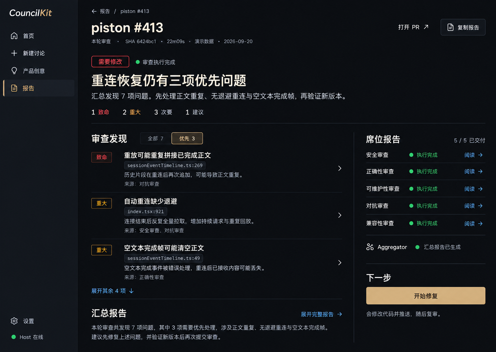
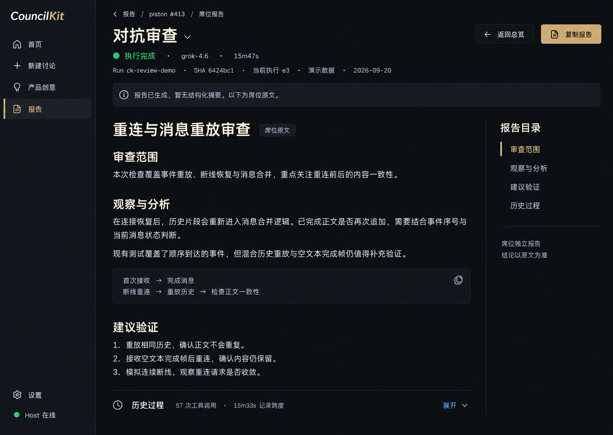
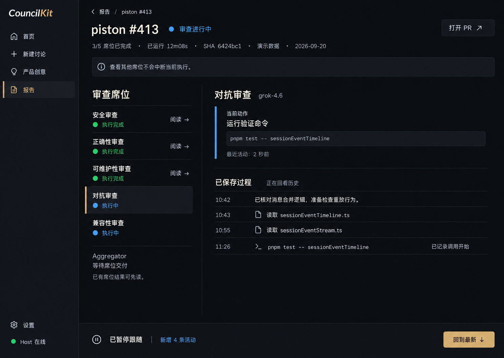
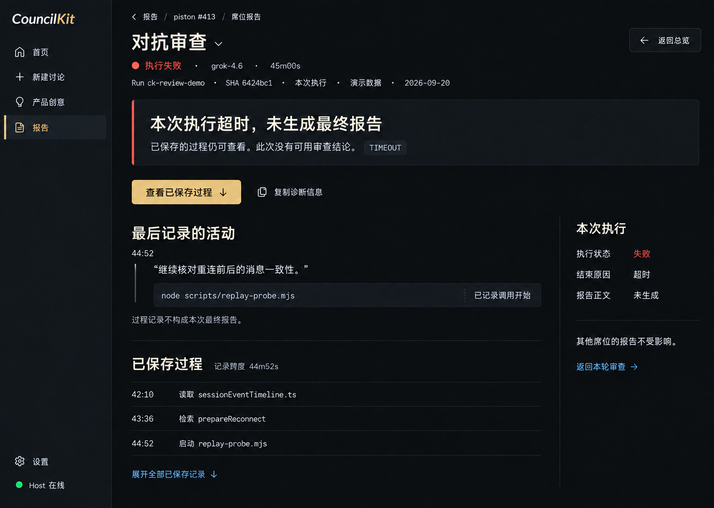
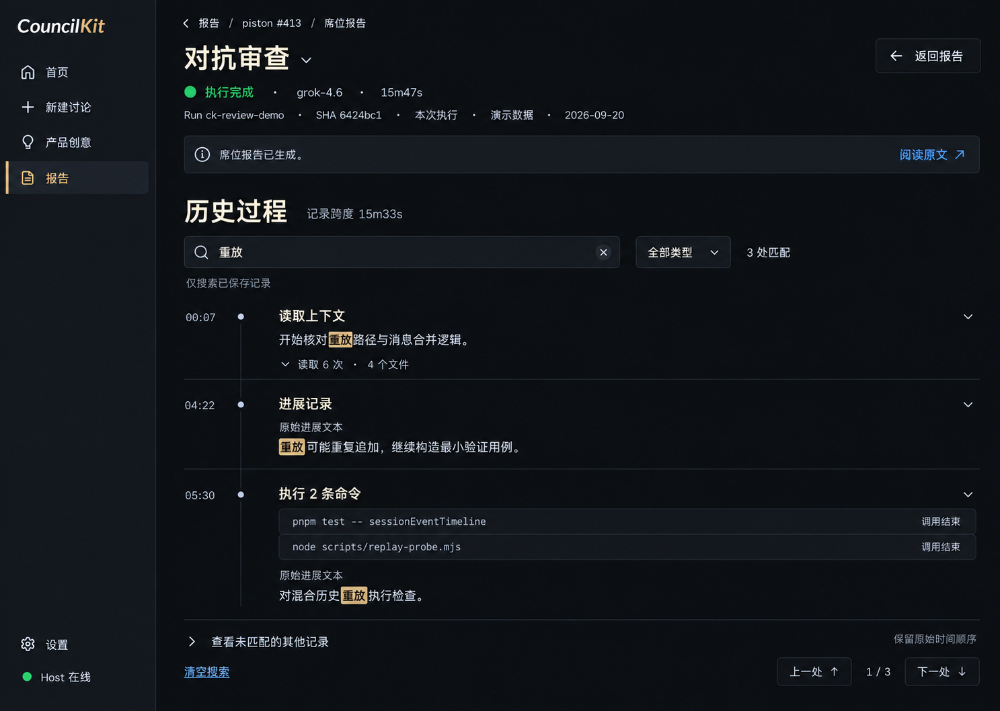
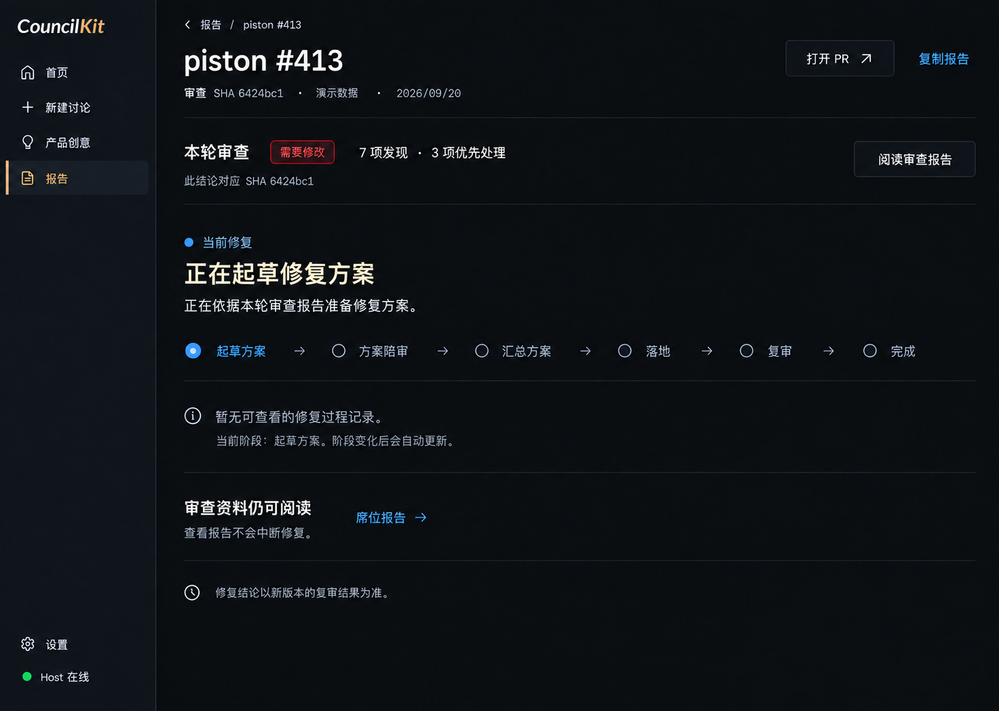

> **布局已选定：当前视觉与字体/图标细节请使用 [v3-detail](../v3-detail/README.md)。本目录的真实数据与分期契约继续有效，布局由新版覆盖。**

# CouncilKit 审查工作台 v2 · 带注释画板

当前实现目标。父目录为 v1 历史稿。图 01/03 展示 A+B 联动；图 05 整体属于 C。

## 01 · 审查总览

**交付：A 布局 · B 席位全文**。先读本轮结论，再进入需要处理的问题。

- 结论缩成状态标签，正文摘要成为视觉中心；严重性有文字，数字保持中性色。
- 席位报告只保留右栏一处入口，与切席菜单同源同序；不显示启发式单席计数。
- 图示 A+B 联动。A 单独发布时入口为“查看详情”；B 验收后才使用“阅读”。

数据门槛：Run 级汇总与账本已有数据。没有汇总结论时显示执行状态和原报告，不生成标题结论。

## 02 · 原文可读，暂无结构化摘要

**交付：B 核心结果**。报告有内容就是正常阅读态。

- 顶部中性说明不使用警告色；没有结构化摘要不会让报告降格为空态。
- 执行完成与报告来源清楚展示；原文标题、段落、目录来自实际 Markdown，不二次生成。
- 过程在原文后展开。执行引用作为诊断身份，普通显示优先“本次执行”；不提供历史版本选择器。

数据门槛：正文必须从本次 durable output 读取。图中 e3 只是 fixture 的当前执行显示标识；真实 ref 可以放来源详情，不要求向用户展示内部 token。

## 03 · 运行中，暂停回看历史

**交付：A 跟随控制 · B 结果入口**。最新状态更新，阅读位置保持不动。

- 席位并行列表没有连接线；选中态与运行态分别表达，不做假完成百分比。
- 当前动作保持可见；历史列表不因新事件滚动。暂停的是跟随，不是 Agent 执行。
- 底部只保留明确的“回到最新”；新增 4 条按稳定活动行计数，不按 delta 或字符。

数据门槛：A 可独立上线；未接通 B 时完成席入口使用“查看详情”。顶端提示属于阅读说明，不是任务执行状态。

## 04 · 执行失败，保留过程

**交付：B 核心结果**。说明失败范围与可读内容，不制造审查结论。

- 超时是执行错误，不能渲染成“需要修改”或“通过”；不出现 0 项发现。
- 只保留一个诊断复制入口，主操作用于查看已保存过程；没有虚构单席重试按钮。
- 最后活动与过程不充当最终报告。无法证明与本次执行对应时，只标席位已保存过程。

数据门槛：TIMEOUT 和 45m00s 来自示例记录，不是前端硬编码判定。过程版本未知时隐藏“最后记录的活动”中本次暗示，按契约显示版本不明说明。

## 05 · 历史过程检索

**交付：C 后续增强**。在已保存内容中找到具体记录。

- 这张明确属于 C，不进入 A/B 的必交范围；搜索不是首期结果接口的阻塞项。
- 查询“重放”对应 3 处字面匹配，分组只采用记录类型、工具类别或已记录描述。
- “调用结束”不等于验证通过；只搜索已保存范围。折叠与命中定位保留阅读锚点。

数据门槛：需要稳定分组、查询索引与容量预算；不得从未保存的工具输出构造结果。

## 06 · 修复中，只有阶段信息

**交付：A 独立交付**。旧结论与当前修复任务一眼分清。

- 原审查压成短摘要，当前修复阶段成为主体；旧 SHA 结论不会随修复变成通过。
- 第三阶段已在图中改为“汇总方案”；没有虚构 Run、已运行时长或精确活动时间线。
- 无过程记录就给中性说明，保留报告阅读入口；不放无效“查看修复过程”按钮。

数据门槛：当前 pipeline 的真实阶段即可渲染。它是阶段说明，不承诺 Agent 最近正在输出或已经修改/未修改代码。

