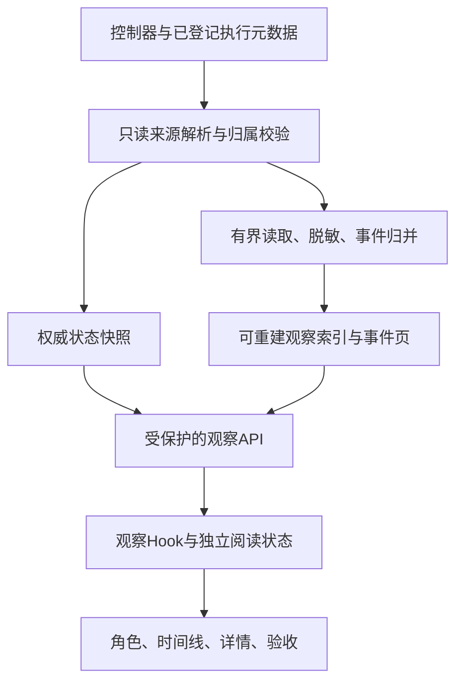

# Squad 自动修复过程工作台 · 研发分析与红绿测试交付约定

版本：1.0 · 2026-09-22。本文供Cursor实施，**不是已实现能力说明**。本次仅新增两份分析文档；真实修复任务、Host和模型配置不变。

## 1. 目标、边界与文档优先级

目标：让用户在真实repair运行中看见“正在做什么、最近是否有活动、是否需要处理”，并能追溯单个工具操作、角色与验收证据。观察层不得改变执行预算、调度、准出或发布权。

资料优先级：本交付约定与[测试分析](/Users/hengzhuo/code/github/Wenfeng-GAO/councilkit/docs/design/2026-09-22-squad-observability/TEST-ANALYSIS.md)中的生产澄清 → [PRD](/Users/hengzhuo/code/github/Wenfeng-GAO/councilkit/docs/design/2026-09-22-squad-observability/PRD.md)/[交互脚本](/Users/hengzhuo/code/github/Wenfeng-GAO/councilkit/docs/design/2026-09-22-squad-observability/INTERACTIONS.md) → [HTML原型](/Users/hengzhuo/code/github/Wenfeng-GAO/councilkit/docs/design/2026-09-22-squad-observability/prototype.html) → PNG。HTML用于理解交互，PNG用于视觉比对，不能把fake状态机复制为业务状态权威。遇到新冲突先记录具体条款与行为，不能自行扩大功能或降低验收。

当前原型SHA-256：`5ed1ee05601e50a00b520a59561c6bd546fe2611da2d69abc08626d4957777b8`。这一轮以该版本为实现基线，不重做设计探索。原PRD页首保留早期“待确认”字样属于历史状态，本次用户已明确要求形成开发交接材料；不据此自行启动开发或发布。

P0包含单轮历史切换、已有记录的轻量diff、最小证据导出；P1才是跨轮比较、完整Git浏览器和成本平台。不新增模型自动fallback、额度恢复器、运行中热切模型、预算追加或PR推送动作。v2同链预算与v1差异仅在既有换席说明中准确呈现。

## 2. 现状与接入点（已核对源码）

| 当前文件 | 事实 | 本次处理 |
|---|---|---|
| [repair-persist.ts](/Users/hengzhuo/code/github/Wenfeng-GAO/councilkit/cli/src/auto/repair-persist.ts) | writeRepairLive 写阶段，attempts固定为空、pipeline=null | 不用虚假attempt填满UI；观察数据走单独投影 |
| [squadctl-bridge.ts](/Users/hengzhuo/code/github/Wenfeng-GAO/councilkit/cli/src/auto/squadctl-bridge.ts) | 编排输出在已登记taskDir/orchestrator.log；bridge identity有execution/model/session/PID指纹 | 从受信任关系找来源，不扫描账号聊天存储或候选源码 |
| [cli-runs.ts](/Users/hengzhuo/code/github/Wenfeng-GAO/councilkit/runtime-host/routes/cli-runs.ts) | 已有detail/result/live及stop/resume；review live按afterSeq读，但readLiveSidecar全量读文件 | 复用鉴权/路由惯例和小型解析工具；新增repair观察路由，不直接照搬全量读取 |
| [attempt-live-events.ts](/Users/hengzhuo/code/github/Wenfeng-GAO/councilkit/shared/runtime/attempt-live-events.ts) | 原事件只有seq/at和有限payload，无execution/callId；包含thinking类型 | 新repair schema明确身份并过滤隐藏推理，不破坏既有review schema |
| [live-events.ts](/Users/hengzhuo/code/github/Wenfeng-GAO/councilkit/cli/src/auto/live-events.ts) | 已有多driver结构化解析和摘要逻辑 | 只复用可满足语义的纯函数；保留Cursor原始toolCallId，不照搬丢ID的适配 |
| [ReportDetailPage.tsx](/Users/hengzhuo/code/github/Wenfeng-GAO/councilkit/src/app/pages/ReportDetailPage.tsx) | kind=repair目前主要渲染RepairRunPanel；整体查询约2秒一次 | 增加RepairWorkspace挂载分支，复用原mutation处理和页面上下文 |
| [RepairView.tsx](/Users/hengzhuo/code/github/Wenfeng-GAO/councilkit/src/components/report/workbench/RepairView.tsx) / [RepairRunPanel.tsx](/Users/hengzhuo/code/github/Wenfeng-GAO/councilkit/src/components/report/RepairRunPanel.tsx) | review内有修复入口；repair面板只有概要/控制 | 原入口保留；修复详情使用新观察工作台；不要让overview出现两套停止按钮 |
| [useWorkbenchProcess.ts](/Users/hengzhuo/code/github/Wenfeng-GAO/councilkit/src/components/report/workbench/useWorkbenchProcess.ts) | 已有单in-flight、代次防迟到、48px跟随阈值、2.5MiB缓存理念 | 可抽复用纯函数；repair独立阅读状态/游标，不能直接套单attempt假设 |
| [execution-ref.ts](/Users/hengzhuo/code/github/Wenfeng-GAO/councilkit/shared/runtime/execution-ref.ts) | 既有执行身份约定 | 能复用时扩展组合，不另发明“角色名即身份” |

`sourceRunId`是原始审查基线，不等于本轮复审执行。后续复审必须从current cycle的`childReviewId`等明确关联读取；Squad独立Reviewer/Verifier和CouncilKit终验jury是不同执行分组。

## 3. 产品与原型的差异必须落实

1. 去掉演示工具条、场景按钮、模拟新活动、重置演示、fake徽章；正常生产页面不是演示页。测试fixture由测试Host供给，不在生产页面留开关。
2. 复用现有全局导航与路由，**不要照抄原型的独立全局导航**。新增角色栏和主内容；保持原有首页/报告/设置入口。
3. 时间、轮次、角色、目标、模型、预算、证据来自数据。相对时间需要真实时钟语义，不使用原型字符串倒计时。目标未知写目标未记录并链接源审查，不拿PR URL假装完整目标。
4. 原型运行在file://且内存重置；生产必须从落盘证据恢复。77项原型检查不能计作新生产测试通过。
5. 历史轮次只读是P0；搜索范围为**所选轮次已加载记录**，明确显示已加载N条/有更早记录，空匹配不能宣称整个磁盘无记录。后续全历史索引搜索作为P1，不隐藏这个限制。
6. 同步与存活不混用：执行进程、Host可达性、观察连接分别表示。Host在线不证明某个Agent活着，进程退出也不代表Host退出。
7. 暂停跟随冻结阅读快照/锚点，但继续接收、计数；顶层错误和角色状态仍更新。恢复后应用缓冲区；一条新操作只计一次，delta/重放/较早历史页不计新活动。
8. 指南里的换席是只读解释。旧session不能跨模型恢复；v2可同链新parent Run继承CouncilKit预算，但旧Squad子任务history与未提交改动不会自动复制；v1不能宣称同样跨Run预算保证。

## 4. 数据流与模块边界



选择：**Host只读观察投影**，不让模型“总结进度”，不增加LLM调用，不修改Squad journal或伪造CLI attempts。这样能观察升级前已运行的任务，不要求重开任务才能获得日志。需要缓存时写入独立`COUNCILKIT_HOME/observation-cache/`；缓存可以删除并从来源重建，绝非业务权威。缓存失败只能降低观察可用性，不能让修复执行失败。

建议新增模块（均为建议文件，当前不存在）：
- `shared/runtime/repair-observation.ts`：Zod DTO/联合类型/限制常量；纯事件合并和展示状态可按项目惯例拆到独立model文件。
- `runtime-host/repair-observation/`：resolver、source-reader、normalizer、service。入口分工清晰；不做通用工作流框架。
- `src/runtime/repair-observation-client.ts`：通过现有RuntimeClient/session调用。
- `src/components/report/repair-workspace/`：RepairWorkspace、RepairRoles、RepairActivity、RepairEventDrawer、RepairEvidence、useRepairObservation、repairViewModel。
- `src/styles/repair-workspace.css`：`ck-repair-*`命名空间，使用既有`--ck-*`变量。

### 4.1 受信任来源解析

从经过校验的parentRun开始，按其cycles/关联记录构造来源清单。当前/历史Squad、编排日志、独立adapter运行工件、明确关联的childReview sidecar逐一登记。任务关联不存在时返回partial/unavailable及原因；不猜另一个run，不扫描所有文件“凑”完整过程。

路径必须规范化、检查目录归属和普通文件属性，拒绝软链接越界/兄弟任务/任意查询路径；遵循仓库“Host不读.squad”的边界，不能直接钻用户候选仓库的`.squad`。浏览器仅提交opaque event/artifact ref，不能提交本机绝对路径。解析原始JSONL只白名单读取公开text、tool、明确状态；排除thinking/reasoning。

对没有新sidecar的旧任务，直接从已登记的orchestrator.log及官方adapter元数据提供受限投影；没有记录就解释仅有最终报告或等待首条记录。不得凭日志mtime补出有效进展/在线状态。

### 4.2 四类权威不要混合

| 信息 | 权威来源 | 缺失时 |
|---|---|---|
| 阶段、业务结果、剩余派工预算、恢复资格 | repair控制器持久状态 | unknown/不可操作，不从自然语言猜 |
| 角色计划、执行身份、真实模型/session、退出结果 | 明确绑定的bridge/官方执行记录 | actual未知；可显示requested但注明 |
| 工具/文件/公开进展 | 对应执行的已完成JSONL记录与有效工件 | 无记录/部分记录；不编造diff或exit=0 |
| 验收、候选SHA、基准SHA、准出核验 | 同候选/断言版本的既有验收与准出记录 | 证据不足，不做绿色准出 |

发生冲突应显示“状态与证据不一致”，保留原始业务状态供诊断；观察服务不能改写控制器状态以使页面好看。

## 5. 最小 API / DTO 合同（待实现）

建议新增：
- `GET /api/v1/cli-runs/:runId/repair/observation?round=current&cursor=<opaque>&limit=200`：阶段/角色快照+增量操作upserts。
- `GET /api/v1/cli-runs/:runId/repair/events/:eventId?cursor=<opaque>`：单操作脱敏详情/长输出下一页。
- `GET /api/v1/cli-runs/:runId/repair/evidence?round=<n>`：验收与改动；已有可用result服务可内部复用。
- 最小证据下载可复用evidence响应生成JSON/Markdown，不增加发布接口。

stop/resume继续使用现有`POST .../:runId/repair/stop|resume`和session/CSRF；本需求不改变其授权规则。所有新GET走现有session鉴权。无权访问/未知Run遵循现有4xx；局部日志缺失返回200+availability，不伪造空成功。

合同示意（可调整命名，含义和测试不变）：
```ts
type RepairObservation = {
  schemaVersion: 1;
  runId: string;
  round: number;
  currentRound: number;
  snapshotVersion: string;
  serverTime: string;
  observedAt: string;
  availability: 'available' | 'partial' | 'unavailable';
  reasons: string[];
  sourceWatermarks: Array<{sourceId: string; generation: string; cursor: string}>;
  task: {
    phase: string | null;
    businessResult: 'approved' | 'needs_attention' | 'stopped' | null;
    candidateSha: string | null;
    baseSha: string | null;
    lastActivityAt: string | null;
    lastActivityTimeSource: 'recorded' | 'observed_live' | 'unknown';
    process: {state: 'alive'|'exited'|'unknown'; checkedAt: string|null};
    resumeEligible: boolean | null;
    // goal/budget/startedAt/endAt均可缺失；不补默认事实
  };
  roles: Array<{
    roleKey: string; label: string; executionGroup: string;
    executionRef: string | null; planned: boolean;
    status: 'pending'|'active'|'ended'|'failed'|'unknown';
    requestedModel: string|null; actualModel: string|null;
  }>;
  upserts: RepairOperation[];
  nextCursor: string;
  earlierCursor: string | null;
  hasMore: boolean;
  reset: boolean; // 来源generation/cursor失效；仅重建受影响范围
  observationDone: boolean; // 父任务终态+来源排空，非“某个child完成”
};
type RepairOperation = {
  eventId: string;
  sourceId: string;
  sourceGeneration: string;
  executionRef: string;
  round: number;
  roleKey: string;
  operationId: string; // execution+native callId；缺ID采用可审计offset身份
  revision: number;
  occurredAt: string|null;
  receivedAt: string;
  kind: 'progress'|'tool'|'file'|'command'|'state';
  status: 'started'|'completed'|'failed'|'unfinished'|'unknown';
  summary: string;
  detailRef: string|null;
  truncated: boolean;
};
```

约束：eventId不可使用角色名称、展示模型名或数组下标；operationId至少包含executionRef+sourceGeneration+callId。相同callId出现在不同执行必须隔离。源没有callId时以稳定来源字节偏移和子记录编号生成ID，不能按同名命令猜配对。DTO须有Zod解析与大小上限；未知字段不能自动成为可执行动作。

`sourceWatermarks`/opaque cursor绑定Run、轮次、来源generation及已读偏移，不能接受另一个任务的cursor。初次取最近窗口；较早页单独cursor；invalid/expired返回可诊断reset，不能永远等旧seq。不要把所有来源局部seq硬拼成一个不可靠全局seq。

排序使用稳定的来源顺序/接收排序键，同一source保持原始顺序；occurredAt仅展示，不让来源时钟偏差反复重排已读行。已有工具由更高revision更新，迟到started不能把completed回退。重要异常可顶层提示，但不得伪造新的工具调用。

### 5.1 有界读取与长日志

- 初始/增量页最多200个upserts、响应≤512KiB；单行摘要≤4KiB，长输出按≤64KiB块读取，标记截断与nextCursor。查询超上限clamp或4xx，不能无界。
- 源文件用范围读取/持久偏移与流式UTF-8解码；保留未完成尾行，等完整换行再提交cursor。坏行跳过并记录partial计数；单条>1MiB记录隔离并给明确受限提示，不能耗尽内存。
- 冷启动大日志先读有界尾部，展示最近窗口与更早记录可用；索引历史分块构建，不在一个HTTP请求内全读50MiB。派生索引可持久化，但恢复后仍核对generation/文件指纹。
- 检测缩短、inode/来源替换或明显序号重置，生成新generation；旧事件不重用ID。部分来源坏掉不抹除其他来源。
- UI缓存上限2.5MiB（按规范化records的UTF-8 JSON字节数计，不是宣称整个JS heap≤2.5MiB），初始渲染200行、最大400行；再加载历史以锚点保持的窗口方式替换，不无限堆DOM。被淘汰历史仍能从服务端分页读取，不计为新活动。

### 5.2 时间、连接、存活与排空

repair观察前台默认每1000ms排程一次，同query一个in-flight。该频率不同于旧review的2秒，因新需求目标是落盘到可见2秒；量化验收采用测试文档E57的20样本标准。无需改旧review全局常量。失败退避2/4/8/16/30秒，成功回到1秒。document.hidden停周期排程，恢复可见立即续读。可取消请求与generation检查要同时覆盖then/catch/finally。

静默阈值180秒；只有当前执行身份匹配且≤15秒的新鲜进程/心跳证据，才可显示“进程仍在线”。先前身份遗失或只有PID存活写unknown。权威终态不被旧心跳改回active。

`lastActivityAt`来自有效公开事件，不是每次GET/父status.json重写/Host heartbeat。没有源时间时，初次读取的历史不能标“刚发生”；新观察到的追加可用observed_live并显示“最近收到活动，发生时间未记录”。上次同步时间与活动时间独立。网络中断时保留最后已知快照，不持续推进假的运行时钟。

候选完成/当前role结束不停止父任务观察。只有父任务真正终态、所有已知来源终止并读到尾部才`observationDone=true`；终态先到、尾日志后到的窗口须继续排空。新childReview来源的登记也属于快照变化。

### 5.3 安全与错误口径

脱敏发生在服务端、归并/缓存/详情/下载之前；复用现有redaction并为嵌套参数、URL query、header补回归。UI仍按文本渲染，不能dangerouslySetInnerHTML原始日志。隐藏推理不进入新观察DTO/下载。来源不存在、损坏、权限不足、无日志、连接失败分开表示；不统一catch返回空数组且标成功。观察GET不能spawn模型、修复CLI或执行日志里的命令。

## 6. UI 规格与资产

### 6.1 可直接使用的高保真参考

| 工件 | 用途 | 尺寸/指纹 |
|---|---|---|
| [overview.png](/Users/hengzhuo/code/github/Wenfeng-GAO/councilkit/docs/design/2026-09-22-squad-observability/screens/overview.png) | 桌面编码中：结构、层次、密度 | 1440×960；sha前缀534df2895cad588e |
| [quota.png](/Users/hengzhuo/code/github/Wenfeng-GAO/councilkit/docs/design/2026-09-22-squad-observability/screens/quota.png) | 额度故障及右侧详情 | 1440×960；a76b1f1d7be4db25 |
| [mobile.png](/Users/hengzhuo/code/github/Wenfeng-GAO/councilkit/docs/design/2026-09-22-squad-observability/screens/mobile.png) | 窄屏角色横向选择与换行 | 390×844；fb9a78a440b39216 |
| [prototype.html](/Users/hengzhuo/code/github/Wenfeng-GAO/councilkit/docs/design/2026-09-22-squad-observability/prototype.html) | 所有状态、点击、详情与停止确认 | 离线单文件；非生产代码模板 |

无需再生成视觉方向图。生产截图要去掉顶部演示工具条，并复用现有全局导航；这两项差异是预期，不要求机械像素重合。相对时间/长ID在截图测试中固定，不遮挡关键状态/错误/证据。最终金图由确认后的真实React生成，不能直接把fake截图当永久基线。

### 6.2 布局与尺寸（CSS px）

| 对象 | 桌面目标 | 窄屏/说明 |
|---|---|---|
| 全局导航 | 184px视觉参考，复用应用shell | 不新建第二导航；沿用shell可达菜单 |
| 新角色栏 | 232px，独立纵向滚动 | ≤720px转横向角色选择条，项目横滚且键盘可达；不是整页横滚 |
| 主内容 | flex:1，min-width:0/min-height:0 | 自身可滚动，确保活动区域和工具栏可达 |
| 上下文区 | padding 18px 24px 0 | ≤720：14px 16px 0 |
| 状态/观察/Tab边距 | 左右24px、状态顶部16px | ≤720左右16px |
| 详情抽屉 | 430px，top/right/bottom=0，**left:auto**，100vh | ≤720全宽；原生dialog未open必须display:none |
| 停止确认框 | 宽min(440px, viewport−32px)，居中，padding20px 22px | 不遮出viewport；含取消、确认两按钮 |
| 控件高度 | 常规至少32px，图标点击区≥36px | 触屏主要动作≥44px；禁止只留18px命中区 |
| 间距尺度 | 4/8/12/16/20/24/32/48 | 不逐组件发明随机间距 |
| 圆角 | 控件6px，选择行/轻面板8px，确认框12px | 新功能内统一；不改全站组件 |
| 边框 | 分组1px divider，状态强调线2px | 必需输入边界用controlBorder，不能只靠低对比装饰线 |

720/721、1280、1440和390均有测试。若应用shell已有自己的折叠阈值，保留shell规则，新角色栏断点仍按本表；在视口验收中确认两者不造成不可用主区。

### 6.3 颜色 Token

| 语义 | 既有token/值 |
|---|---|
| 全局导航 / 角色栏 / 主内容 / 悬停与代码底 | `--ck-nav #101113` / `--ck-seats #16171A` / `--ck-content #1B1D21` / `--ck-raised #23262C` |
| 选中 / 分隔线 / 必需控件边界 | `--ck-selected #2C2924` / `--ck-divider #2C3037` / `--ck-controlBorder #707783` |
| 主文 / 次文 / 辅助文 | `--ck-text #E7E9EE` / `--ck-secondary #B2B7C2` / `--ck-tertiary #929AA7` |
| 黄铜强调 / 活动蓝 / 成功 / 错误 / 警告 | `#C9B18A` / `#8CB4E8` / `#8AAE9B` / `#ED969B` / `#D6B27A` |
| 键盘焦点 | `--ck-focus #ACC9F3`，2px outline+2px offset |

不加渐变背景、泛光、装饰大图或统计卡片墙。颜色只辅助语义，配状态文字/图标。执行结束用中性，不用大绿色制造准出错觉。disabled原因使用可读辅助色，不能随按钮一起低对比到看不见。

### 6.4 字体与字阶

生产复用 [InterVariable.woff2](/Users/hengzhuo/code/github/Wenfeng-GAO/councilkit/public/fonts/InterVariable.woff2) 与 [字体许可证](/Users/hengzhuo/code/github/Wenfeng-GAO/councilkit/public/fonts/LICENSE-Inter.txt)，中文回退PingFang SC/Microsoft YaHei/Noto Sans CJK SC/system-ui；不复制系统中文字体、不在线拉字体。原型为系统字体栈，生产拉丁字体与其少量字宽差异是明确适配，不要求截图字形逐像素一致。

| 用途 | 字号/行高 | 字重 |
|---|---|---|
| 原目标标题 | 26/34，窄屏20/28 | 600 |
| 阶段主说明、抽屉标题 | 16/24 | 600 |
| 活动正文、角色名称、按钮 | 14/22（长段可16/28） | 400/500 |
| 时间/元信息/次说明 | 13/20 | 400 |
| 代码/命令/diff | 13/22，SF Mono/Menlo/Consolas/monospace | 400 |

采用tabular-nums、中文不加字距、font-synthesis:none。正常文字至少4.5:1，控件边界/焦点至少3:1。不要因为完整路径很长而把字号缩小，使用换行/省略+详情。

### 6.5 图标资产与映射

复用 [现有Lucide SVG目录](/Users/hengzhuo/code/github/Wenfeng-GAO/councilkit/docs/design/2026-09-20-review-workspace/v3-detail/assets/icons)（版本1.47.0）及其 [LICENSE](/Users/hengzhuo/code/github/Wenfeng-GAO/councilkit/docs/design/2026-09-20-review-workspace/v3-detail/assets/icons/LICENSE)。可作为React SVG组件或按项目约定复制到public，保留许可证。不要使用截图裁出的图标、Unicode叉号或emoji替代正式UI图标。

| 用途 | 文件 |
|---|---|
| 活动 / 待启动 / 已结束 / 失败 | activity.svg / clock-3.svg / check.svg / circle-x.svg |
| 详情关闭 / 展开收起 / 更多说明 | x.svg / chevron-right.svg、chevron-down.svg / info.svg |
| 搜索 / 复制 / 文件 / 跟随到最新 | search.svg / copy.svg / files.svg / arrow-down.svg |

图标18×18（行内状态14×14），24 viewBox、strokeWidth=1.75、currentColor。装饰图标aria-hidden；纯图标按钮有中文aria-label和≥36px点击区。停止/暂停跟随保持文字按钮，不依赖相似图标区分。

### 6.6 状态与文案

| 条件 | 主文案/动作 |
|---|---|
| active+公开操作 | 正在修复… + 最近真实操作摘要 |
| 空日志且任务active | 等待首条记录；展示已登记角色，不显示空白 |
| >180秒无有效活动+有效存活 | 暂时没有新活动，进程仍在线 |
| 无有效存活证据 | 执行进程状态未知；保留日志可读 |
| 观察请求失败 | 连接已断开，显示最后已知状态；重新连接 |
| role额度失败+needs_attention | 独立评审额度不足，需要处理；查看换席步骤 |
| candidate完成但未approved | 本地候选完成，等待最终准出 |
| approved+身份/证据齐全 | 已准出 · 证据与提交一致 |
| approved但证据缺/冲突 | 状态与证据不一致；查看缺项，不显示绿色通过 |
| 用户stop受理但未终态 | 停止中，等待执行确认 |
| 控制器stopped | 已停止；历史与预算保留 |

真实UI不使用“模拟”“全部fake”“展示公开事实而不展示隐藏推理”等设计说明作主文案。运行详情可解释实际证据来源。copy/stop/download失败均显示具体可恢复信息，不假装成功。

## 7. 前端交互实现约定

- `selection`以run/round/role/execution为键；`readingState`保存Tab、已加载筛选、pinned、锚点、新活动缓冲。选择与控制器运行状态分离。观察查询键为run/round/来源代次，角色筛选可在客户端完成，不要求每次选角色都重启请求；有效的同轮响应可更新数据，但不能把选择恢复成旧角色。
- 默认活动Tab/当前轮/全部活动。切角色不抢页面滚动；当前角色结束不自动切到其他角色；历史轮不因当前任务推进而跳回。
- 暂停跟随不取消数据请求；角色状态与异常区继续更新。newCount基于新operationId，重复upsert不增加。选择“查看新活动”才应用缓冲并定位最新。
- 加载更早时记录首个可见eventId及其像素偏移，替换窗口后恢复；删除旧DOM/组件重新挂载时不能强制到底部。
- 抽屉使用可访问dialog/现有实现，打开聚焦标题或首控件；关闭前捕获returnFocus，异步恢复前检查isConnected，否则回工作台标题。不要先置null再在requestAnimationFrame读它。
- stop确认只对当前parentRun；pending状态防双击；ack不等于stopped；请求结果未知先重读，不自动重复启动。历史、断线、未知身份的控制动作禁用且有原因。
- motion仅hover120ms、抽屉160ms；reduced-motion关闭。新事件跟随即时定位，静默时无持续旋转动画。
- 导出仅使用服务端已脱敏证据，不把原始日志URL作为下载链接；标注覆盖范围和SHA，不发起PR发布。

## 8. UT 与红绿测试计划

先建立真正会失败的E2E切片，再用UT定位算法边界；green后重构。下面UT以输入/输出语义为对象，不断言私有函数调用次数来镜像实现。

| UT组 | 最小红色反例 | 变绿标准 | 关联E2E |
|---|---|---|---|
| U01 快照投影 | goal/actualModel/budget缺失、approved证据矛盾 | unknown不补默认；一致准出才显示通过 | E01 E37 E38 E39 E64 |
| U02 来源关联 | sourceRun旧审查、childReview当前、越界taskDir | 只纳入明确关联执行；计划外席不造空席 | E03 E04 E49 E59 E65 E67 |
| U03 事件身份 | 同callId不同execution、重放 | ID隔离且幂等upsert | E08 E24 E44 |
| U04 工具关联 | 同名并行、complete早于start、缺start | 正确配对且终态不回退；未知不猜 | E08 E10 E44 |
| U05 文本折叠 | 高碎片text、thinking、公开text混合 | 公开摘要稳定合并，thinking不输出 | E07 E47 |
| U06 字节读取 | 中文跨chunk、半行、坏行、>1MiB单行 | cursor不跨未完成记录；有界且可继续 | E41 E56 |
| U07 游标与轮转 | 各来源seq重置/文件替换/错误parent cursor | 检测generation、限制cursor大小、正确reset | E42 E45 E49 |
| U08 窗口/缓存 | 10万行、历史加载和淘汰 | 200/400行、2.5MiB边界，锚点稳定 | E13 E40 E56 |
| U09 脱敏/输出 | header/URL/嵌套secret、超长diff | 缓存/摘要/详情/下载均无哨兵secret | E18 E46 E62 |
| U10 时间/存活 | 179/180/181秒，15秒证据过期，同PID不同startKey | 静默与未知正确，接收时间不伪造活动 | E20 E21 E22 |
| U11 阅读冻结 | pause后重复/新operation/旧行更新 | unread只计新操作，状态可更新，锚点不动 | E11 E12 E14 |
| U12 请求代次 | 角色切换后旧success/error/finally | 不影响新状态/请求标记；只一条排程链 | E25 E26 |
| U13 查询过滤 | type+role+keyword、无匹配、较早页 | AND语义、范围标识正确、清除可恢复 | E15 E16 |
| U14 历史/选择 | 旧轮PASS晚到、当前role结束 | 当前业务状态不被改写，选择不抢跳 | E06 E33 E34 |
| U15 角色显示 | 连续Builder、可选Planner B、独立会话 | 正确归组/并行、unknown身份不强并 | E03 E04 E05 |
| U16 Mutation呈现 | stop双击/ack/失败/资格unknown | 恰好一个意图，等控制器确认 | E28 E29 E30 E31 E32 |
| U17 证据版本 | 旧SHA、旧断言、新候选、仅exit0 | 不混用、不产生通过证据 | E35 E36 E37 E38 |
| U18 终态排空 | parent终态先到，最后日志/新child稍后到 | 不漏最后记录；不提前停父观察 | E36 E67 E68 |
| U19 空/受限来源 | ENOENT/EACCES/损坏/旧只有报告 | 区分等待、缺记录、部分不可读 | E02 E59 E63 E65 |
| U20 DOM焦点/隐藏 | 触发节点卸载、Esc、dialog初始未open | 不报错；回稳定节点；隐藏不被flex覆盖 | E17 E52 E53 |
| U21 导出序列化 | secret/旧候选/缺来源 | 只导出明确覆盖的脱敏证据 | E38 E46 E62 |
| U22 权威文件无副作用 | 观察成功/失败/重连、缓存写失败 | 不调用writer/launcher、不改budget/gate | E58 E66 |

### 8.1 推荐实施顺序（每步都有可见结果）

| 切片 | 先红 | 实现最小范围 | 变绿与提交证据 |
|---|---|---|---|
| S0 测试隔离与合同 | E66 + DTO非法输入、空repair不展示活动 | 专用测试Host/端口/producer、Zod合同 | 测试不碰43127；fixture从磁盘经过真实GET到React |
| S1 最小可见过程 | E01 E02 E03 E07 E59，U01/U02 | 已登记来源→有界尾读→默认工作台 | 一个升级前attempts=[]运行也可见活动 |
| S2 可信增量 | E08 E40–47 E56 E58，U03–10 | 身份/游标/归并/脱敏/窗口 | 重放、轮转、半行和大日志都不造假、不失控 |
| S3 阅读交互 | E06 E11–19 E26 E33–34，U11–14/U20 | 跟随、筛选、抽屉、历史 | 不抢阅读，不把pause当stop |
| S4 状态与动作 | E21–32 E36–39 E65 E68，U10/U16–19 | 静默/断线/故障/stop/恢复资格/准出 | 状态来自权威；失败和未知有清楚下一步 |
| S5 证据与终验子Run | E35 E37 E38 E62 E67，U17/U21 | 证据详情/导出/实际子席归组 | 同SHA/版本证据闭环；旧基线不充当新执行 |
| S6 视觉与回归 | E49–55 E57 E60 E61 +全部P0 | Token/图标/无障碍/性能及回归 | 固定候选完整E2E绿，截图人工确认 |

每次先保存失败输出，再实现再跑相同用例，最后重构；不得跳过red直接手写passed记录。相关单测应在源码变动后复跑，未改动模块不必重复多模型全审。新发现只记录具体反例，未经确认不把P1并入当前交付。

## 9. E2E接缝与后端测试

新增专用测试入口参照现有 `tests/e2e/host-entry.mts`：它已经能服务production dist、注入cookie/CSRF并挂真实cliRunsRoutes。为repair补fake launcher/bridge probe和受控磁盘producer。业务接口不能被route.fulfill代替。

`runtime-host/server.ts`的listen可传端口，request-guard也已有hostHeader/expectedOrigin参数；当前调用处和现有playwright配置仍固定43127。只在测试依赖注入链中传匹配的测试值，生产默认/守卫保持；端口被占要拒绝，不reuse真实Host。

测试producer应能pause响应/追加完整或半行/推进时间/替换source generation/登记新execution与childReview/改变控制器状态。控制器状态变化由测试服务模拟，不能在页面按钮handler里直接set approved。全部测试工件在临时home，测试路由只存在于测试入口。可读断言需同时核对网络响应与DOM；stop断言核对launcher记录和磁盘状态。

新Host UT/契约测试覆盖来源解析、auth、大小上限和cursor非法输入；它们是E2E的支持，不代替测试分析文档中的68个用例。现有4188 repair UI smoke保留但不当作完成凭证。

## 10. 交付与准出

Cursor应给出：固定commit；改动范围；按S0–S6的红/绿证据；U01–U22实现位置；E01–E68运行结果及R01–R17覆盖映射；真实React截图；时延/读取上界；已知限制；生产文件/用户数据未被测试触碰的证明。

准出用测试文档的统一gate，不由实现者自降标准。所有P0 E2E完成、完整typecheck/build通过、关键UT/兼容回归通过、真实读取链路和安全边界有证据，才能提交最终验收。若用户之后改变设计，先同步PRD/这两份文档和case映射，再实现；不能让新旧spec各自成为权威。

本次交接不授权立即重启正在执行任务的Host、启动真实模型修复、改角色/默认jury、增加预算、推送PR或发布。需要上线时按用户后续指令做固定候选部署与验证。
