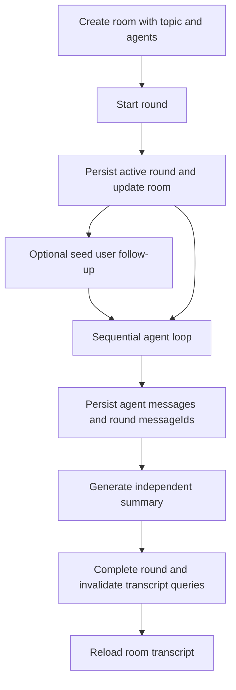
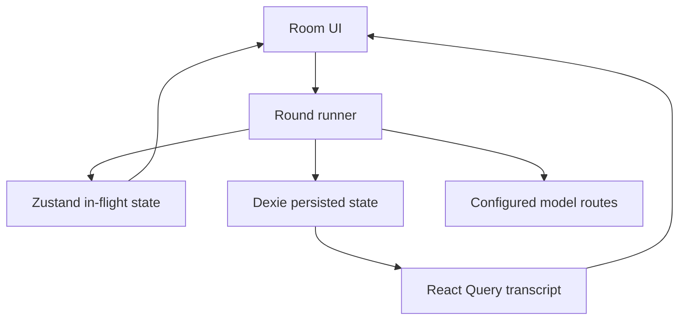

# feat: Close CouncilKit Discussion MVP

## Overview

Close the CouncilKit MVP by hardening the existing Web app's real discussion loop: create a room, run a two-agent discussion, persist messages and summary, continue with a user follow-up, and verify that the room survives refresh.

This is not a rewrite and not a return to the historical macOS plan. The current React/Vite/IndexedDB implementation remains the base. The plan focuses on state correctness, context passing, honest model routing, and browser-level acceptance evidence.

## Problem Frame

The repo already contains a confirmed PRD/DESIGN/TECH set and implementation through T12, but current code and validation artifacts show the last gap is "usable closure" rather than initial scaffolding. `docs/vibespec/councilkit/model-path-validation.md` proves the model path and orchestration can work outside a clicked browser flow, while `src/stores/queries.ts` and `src/app/pages/RoomPage.tsx` still leave persistence, query invalidation, follow-up behavior, and transcript display under-specified.

## Requirements Trace

- R1. Fast room creation with topic, optional background, and role-defined agents.
- R2. Durable round lifecycle and refresh-safe persistence.
- R3. Deterministic multi-agent context passing.
- R4. Independent per-round summary.
- R5. User follow-up creates the next discussion round.
- R6. Single-agent failure is skipped without killing the room.
- R7. All-agent failure is visible and retryable.
- R8. Completed streamed messages do not disappear.
- R9. One verified local real-model route exists for MVP validation.
- R10. Model selection behavior and copy do not overclaim production readiness.
- R11. Orchestration tests plus browser QA prove the end-to-end flow.

## Scope Boundaries

- Keep the current Web app and do not build macOS/Tauri packaging.
- Do not implement team collaboration, cloud sync, sharing, marketplace, mobile, or export.
- Do not expand P1 templates or independent-answer comparison mode.
- Do not treat `scripts/model-proxy.mjs` as production architecture.
- Do not split implementation sub-issues until the user reviews this plan.

## Context & Research

### Relevant Code and Patterns

- `README.md` defines the current Web stack and marks historical Swift/macOS docs as non-authoritative.
- `docs/vibespec/councilkit/PRD.md` defines P0 R1-R8, including multi-agent mutual visibility, summaries, follow-up, and first response latency.
- `docs/vibespec/councilkit/DESIGN.md` defines `/rooms/new`, `/rooms/:roomId`, timeline display, summaries, and follow-up flow.
- `docs/vibespec/councilkit/TECH.md` defines React/Vite/Tailwind, Dexie persistence, Zustand discussion state, and React Query access.
- `docs/vibespec/councilkit/model-path-validation.md` proves the dev model proxy can validate a real `ant glm5.2` discussion and summary.
- `src/stores/queries.ts` currently owns `runRound`, but round creation, room `roundIds`, round `messageIds`, summary IDs, and query invalidation are not a coherent persisted lifecycle.
- `src/app/pages/RoomPage.tsx` currently reads only the last round's messages and saves user input into the existing last round without starting the promised continuation flow.
- `src/components/room/DiscussionStream.tsx` renders persisted query messages and drafts, but not the completed in-memory `stream`, which can make just-finished messages depend on stale query refresh.
- `src/types/index.ts` and model services currently use `ModelType` as both provider route and request model name; this is acceptable for the local proxy but weak for direct provider routes.

### Institutional Learnings

- The issue context shows CouncilKit has recurred across several weekly plans without closure. This plan therefore favors one reviewable vertical slice over more product surface.

### External References

- None used. Local source documents and current implementation are sufficient for this plan.

## Key Technical Decisions

- Make persisted round state the source of truth, with the Zustand stream as only in-flight UI state.
- Keep sequential agent turns for MVP; it gives a clear verification path for "later agents saw earlier agents."
- Represent user follow-up as a seed message in a new round, then run agents against that seeded round.
- Keep the current provider enum for MVP, but resolve actual provider model names inside service config so direct routes are not forced to send `"claude"`, `"openai"`, or `"deepseek"` as model IDs.
- Add browser-level QA with deterministic model interception first, then keep real `model-proxy` validation as a manual smoke path.

## Open Questions

### Resolved During Planning

- Should the app be rebuilt as macOS native now? No. The repo explicitly confirms the Web stack as current source of truth.
- Should the MVP add templates, independent mode, or export? No. They do not help close the current weekly goal.
- Should the local model proxy be made production-ready? No. Treat it as dev validation infrastructure only.

### Deferred to Implementation

- Exact helper names and transaction boundaries in `src/lib/db.ts`: defer until implementation touches Dexie code.
- Whether `ModelType` should be renamed now or only wrapped with model-name resolution: defer to the smallest type-safe patch.
- Final QA evidence format: screenshots, Playwright trace, or markdown notes can be chosen during execution based on available browser tooling.

## High-Level Technical Design

> *This illustrates the intended approach and is directional guidance for review, not implementation specification. The implementing agent should treat it as context, not code to reproduce.*

## Implementation Units

- [ ] **Unit 1: Persist Round Lifecycle Correctly**

**Goal:** Make each discussion round durable and query-consistent from creation through completion.

**Requirements:** R2, R4, R6, R7, R8

**Dependencies:** None

**Files:**
- Modify: `src/lib/db.ts`
- Modify: `src/stores/queries.ts`
- Modify: `src/stores/discussion.ts`
- Modify: `src/components/room/DiscussionStream.tsx`
- Modify: `src/app/pages/RoomPage.tsx`
- Create: `tests/unit/round-lifecycle.test.ts`
- Modify: `package.json`

**Approach:**
- Add a small DB lifecycle surface for creating a round, appending messages to the round, completing a round with a summary, and updating room `roundIds`, `lastActiveAt`, and status.
- Keep in-flight chunks in Zustand, but render completed in-memory messages until React Query has rehydrated from IndexedDB.
- Return enough data from `runRound` for `RoomPage` to invalidate or refresh room, round, transcript, and summary queries deterministically.
- Treat all-agent failure as a failed/paused round with a visible retry state rather than creating a fake useful summary.
- Use a Dexie-compatible IndexedDB test setup, adding a minimal test dependency only if needed.

**Patterns to follow:**
- Existing model factories in `src/models/index.ts`
- Existing validation tests in `tests/unit/models.test.ts`
- Existing query key pattern in `src/stores/queries.ts`

**Test scenarios:**
- Happy path: a room with two agents starts round 1; two agent messages are persisted in order, room `roundIds` contains the round, round `messageIds` contains both messages, summary is attached, and room returns to `idle`.
- Edge case: the first agent returns empty content and the second returns text; the first is marked offline, the second message persists, and the round still completes with a summary.
- Error path: all agents fail or return empty content; no misleading summary is stored, the room exposes a retryable failure state, and the UI can render a clear error.
- Integration: after `runRound` finishes, a simulated transcript reload reads the same round messages and summary from IndexedDB without relying on Zustand state.

**Verification:**
- Completed messages remain visible immediately after streaming finishes and after a reload.
- Room metadata reflects the latest round and last activity.

- [ ] **Unit 2: Make Follow-Up Start a Real Next Round**

**Goal:** Turn user participation from a passive saved message into a continuation flow that agents can answer.

**Requirements:** R3, R5, R8

**Dependencies:** Unit 1

**Files:**
- Modify: `src/app/pages/RoomPage.tsx`
- Modify: `src/components/room/UserInputBar.tsx`
- Modify: `src/lib/context.ts`
- Modify: `src/stores/queries.ts`
- Create: `tests/unit/follow-up-round.test.ts`

**Approach:**
- Extend the round runner to accept an optional seed user message for the new round.
- When the user submits after an existing round, persist the user message as the first message of the next round and then run the agent loop.
- Build context so agents receive the topic, prior summary, the seed user follow-up, and earlier messages in the current round.
- Update UI copy so the action is clear, for example "发送并开始新一轮" when a completed round exists.
- Display room history by round order, not only the last round, so the user can see prior discussion, their follow-up, and the new answers together.

**Patterns to follow:**
- `docs/vibespec/councilkit/DESIGN.md` flow 2 and flow 3
- Existing `buildContext` summary injection pattern in `src/lib/context.ts`

**Test scenarios:**
- Happy path: after round 1 summary exists, user submits "如果缩写呢"; round 2 starts with that user message, and the first agent request context includes the follow-up and prior summary.
- Edge case: blank follow-up submission does nothing and does not create a round.
- Integration: room transcript query returns round 1 messages, round 1 summary, round 2 user message, round 2 agent messages, and round 2 summary in stable order.

**Verification:**
- A user follow-up visibly starts a new round and agents respond to it.
- Reloading the room preserves the full multi-round transcript.

- [ ] **Unit 3: Make Model Routing Honest and Testable**

**Goal:** Keep the working local model route while avoiding ambiguous provider/model behavior.

**Requirements:** R9, R10

**Dependencies:** Unit 1 for orchestration tests; otherwise independent

**Files:**
- Modify: `src/types/index.ts`
- Modify: `src/services/claude.ts`
- Modify: `src/services/openai.ts`
- Modify: `src/services/deepseek.ts`
- Modify: `src/services/dispatch.ts`
- Modify: `.env.example`
- Modify: `scripts/model-proxy.mjs`
- Create: `tests/unit/model-routing.test.ts`

**Approach:**
- Keep the visible MVP provider choices, but resolve actual model names from provider-specific config before sending requests.
- Preserve the existing dev proxy path for Claude-compatible local validation.
- Make empty-key and HTTP-error behavior explicit so orchestration can distinguish skipped agents from successful empty responses.
- Update UI-facing labels or docs so "Claude/GPT/DeepSeek" are understood as configured routes, not guaranteed production accounts.

**Patterns to follow:**
- Existing CR1 base URL configuration in `docs/vibespec/councilkit/change-router-validation-report.md`
- Existing model proxy validation in `docs/vibespec/councilkit/model-path-validation.md`

**Test scenarios:**
- Happy path: a configured Claude route sends the resolved configured model name, not the provider enum, to the service request.
- Edge case: missing API key produces a skipped/offline result without throwing an uncaught UI error.
- Error path: a non-OK model response becomes a structured service failure that `runRound` can present as an offline agent.
- Integration: the dev proxy route still accepts the request shape used by the browser app.

**Verification:**
- Direct provider requests and local proxy requests use clear, documented model routing semantics.
- The UI no longer overclaims support beyond configured routes.

- [ ] **Unit 4: Add Browser Acceptance Coverage**

**Goal:** Prove the actual user workflow, not only model and unit-level logic.

**Requirements:** R1, R2, R3, R4, R5, R8, R11

**Dependencies:** Units 1 and 2

**Files:**
- Create: `playwright.config.ts`
- Create: `tests/e2e/discussion-flow.spec.ts`
- Modify: `package.json`
- Modify: `src/app/pages/NewRoomPage.tsx`
- Modify: `src/app/pages/RoomPage.tsx`
- Modify: `src/components/room/DiscussionStream.tsx`

**Approach:**
- Add a deterministic browser test that intercepts model API calls and returns predictable SSE chunks.
- Drive the real UI: create room, add two agents, start first round, verify two messages and summary, submit follow-up, verify second round, reload, and verify transcript persistence.
- Add stable accessible names or test IDs only where user-facing selectors are insufficiently stable.
- Keep one manual smoke path with `scripts/model-proxy.mjs` for real local model validation after deterministic browser coverage passes.

**Patterns to follow:**
- Existing `/rooms/new` and `/rooms/:roomId` routes
- Existing README verification section

**Test scenarios:**
- Happy path: user creates a room with two agents; mocked agent B response references agent A; summary appears.
- Follow-up path: user submits a follow-up and receives a second round response that references the follow-up.
- Persistence path: after page reload, the same room displays prior messages and summaries.
- Error path: one mocked model call fails; the failing agent is marked offline and the other agent result remains visible.

**Verification:**
- Browser acceptance test passes in CI/local development.
- Manual real-model smoke notes confirm the local proxy still works for at least one two-agent discussion.

- [ ] **Unit 5: Update MVP Evidence and Handoff Docs**

**Goal:** Make completion reviewable by the user without reading run logs.

**Requirements:** R9, R10, R11

**Dependencies:** Units 1-4

**Files:**
- Modify: `README.md`
- Modify: `docs/vibespec/councilkit/VERIFY.md`
- Create: `docs/vibespec/councilkit/MVP-ACCEPTANCE.md`

**Approach:**
- Update README status from implementation-complete claims to the new evidence-backed MVP status.
- Resolve stale contradictions in `VERIFY.md`, especially old defect notes that no longer match current test state.
- Add a concise acceptance record covering automated tests, browser QA, real-model smoke path, remaining limitations, and how to run the local proxy path.

**Patterns to follow:**
- Existing `docs/vibespec/councilkit/model-path-validation.md`
- Existing verification matrix style in `docs/vibespec/councilkit/VERIFY.md`

**Test scenarios:**
- Test expectation: none -- documentation-only unit, verified by source review and consistency with completed automated/browser evidence.

**Verification:**
- A reviewer can open one acceptance doc and understand what was proven, what remains out of scope, and how to reproduce the MVP smoke path.

## System-Wide Impact

- **Interaction graph:** `RoomPage` -> `runRound` -> model services -> Dexie -> React Query -> `DiscussionStream` and `SummaryBlock`.
- **Error propagation:** model failures should become per-agent offline state or round-level retryable failure, not silent empty success.
- **State lifecycle risks:** round, room, messages, and summary must update together; partial writes can create orphan rounds or missing summaries.
- **API surface parity:** configured provider routes should behave consistently across Claude, OpenAI, DeepSeek, and the local proxy path.
- **Integration coverage:** unit tests prove lifecycle invariants; browser tests prove routing, UI state, and reload behavior together.
- **Unchanged invariants:** CouncilKit remains local-first; no backend, account, sync, or production proxy is introduced.

## Risks & Dependencies

| Risk | Mitigation |
|------|------------|
| IndexedDB writes become inconsistent across room, round, messages, and summary | Use small lifecycle helpers and tests that reload from DB after each round |
| Browser QA becomes flaky because it depends on real models | Use deterministic API interception for automated browser tests; keep real model route as manual smoke |
| Model route cleanup grows into a full provider settings project | Limit the unit to honest defaults and request model-name resolution; defer full settings UI |
| Existing docs overstate completion | Update `VERIFY.md` and add `MVP-ACCEPTANCE.md` with current evidence and limitations |
| Adding Playwright increases project setup cost | Keep one narrow e2e spec and only add the dependency if it is not already available locally |

## Documentation / Operational Notes

- Keep `scripts/model-proxy.mjs` documented as a dev validation bridge only.
- Update `.env.example` with model-name defaults and local proxy expectations if Unit 3 changes config.
- Do not mark the Multica issue `done` solely because docs are written; implementation should complete the acceptance scenario first.
- After user review, the plan can be handed to implementation or broken into execution issues.

## Sources & References

- **Origin document:** [docs/brainstorms/2026-07-08-councilkit-discussion-mvp-requirements.md](docs/brainstorms/2026-07-08-councilkit-discussion-mvp-requirements.md)
- Current product source: [docs/vibespec/councilkit/PRD.md](docs/vibespec/councilkit/PRD.md)
- Current design source: [docs/vibespec/councilkit/DESIGN.md](docs/vibespec/councilkit/DESIGN.md)
- Current technical source: [docs/vibespec/councilkit/TECH.md](docs/vibespec/councilkit/TECH.md)
- Current real-model validation: [docs/vibespec/councilkit/model-path-validation.md](docs/vibespec/councilkit/model-path-validation.md)
- Current orchestration code: [src/stores/queries.ts](src/stores/queries.ts)
- Current room UI: [src/app/pages/RoomPage.tsx](src/app/pages/RoomPage.tsx)
