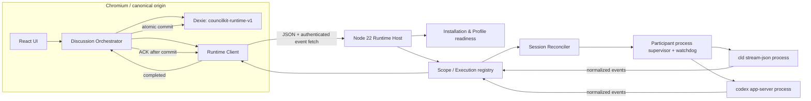
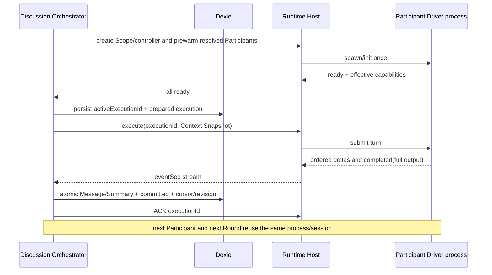
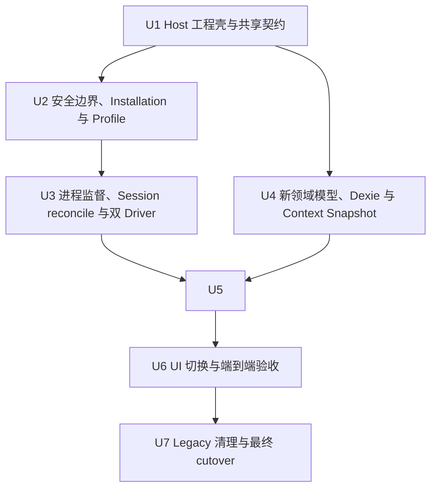

# Runtime Host 双 Driver V1 Cutover

## 结论

本计划只交付一个最终目标：在 macOS、Node.js 22 和 Chromium 上，把正式执行路径切换到前台 Runtime Host，完成一个由 `claude-stream-json` Participant 与 `codex-app-server` Participant 组成的 Room，连续运行两个 Round，并用自动化故障注入证明持久化、进程复用、断流重连和暂停语义正确。

这不是最小原型，而是首个可切换的 V1 工程里程碑；内部使用四个可独立停止的 stage gate，先证伪真实 CLI 协议，再建设持久化、UI 与最终清理。它仍不实现 `docs/runtime-host-design.md` 的全部 V1 能力。完成后，应能回答以下关键问题：

- 浏览器是否已经完全停止直接调用模型 Gateway，统一通过本机 Runtime Host 执行？
- `cld ant glm5.2`、`cld moonshot`、`cld deepseek` 和 Codex 本地登录能否分别形成可用的类型化执行配置？
- 同一 Room 内的 Participant 是否能跨 Round 复用各自的长期进程与 Execution Session？
- Discussion 数据是否能保持为唯一事实源，并按“先持久化、后 ACK”实现幂等提交？
- effective model 不匹配或 Codex 工具状态无法恢复时，Round 是否会可靠暂停且不污染讨论记录？

## 背景与问题

当前代码仍是浏览器直连 Gateway 的 legacy 实现：`src/stores/queries.ts` 在一次页面调用中完成 Round 循环，`src/services/dispatch.ts` 分发浏览器 HTTP 请求，设置页保存 Gateway/API Key。这个路径可以解释 DeepSeek 偶尔可用、Ant GLM/Kimi 失败的差异，但无法稳定复用本机 CLI 的安装、认证、协议和长期会话，也无法让 Codex app-server 参与同一套生命周期管理。

目标设计已经在以下文档中收敛：

- `CONTEXT.md` 定义 Runtime Host、Driver、Profile、Participant、Scope、Context Snapshot 和 Model Execution 等领域语言。
- `docs/runtime-host-design.md` 定义本机 Host、两种 Driver、长期 Participant 进程、持久化 Orchestrator 与安全边界。
- `docs/adr/0001-use-local-runtime-host-for-model-execution.md` 到 `docs/adr/0007-negotiate-codex-capabilities-instead-of-pinning-versions.md` 记录关键取舍。

本计划把这些设计收窄为可以开发、自动验证并用真实 CLI 冒烟的首个工程目标。

## 需求追踪

| 已确认需求 | 本目标中的落实方式 | 验收证据 |
|---|---|---|
| 采用类似本地 daemon 的 CLI Runtime 方式 | 前台 Node.js 22 Runtime Host 同时提供 UI 与 `/api/v1`；浏览器无直连回退 | E2E 网络断言、旧分发路径不再被目标页面引用 |
| 只实现两种 Runtime Driver | 仅实现 `claude-stream-json` 与 `codex-app-server` | Host capability 响应、Driver 契约测试 |
| Codex 复用本地登录和 Agent 能力 | 使用官方 `codex app-server --listen stdio://`，执行 `account/read`、`model/list`、thread/turn 协议 | fake app-server 集成测试与真实 Codex 冒烟 |
| Agent 绑定 `executionProfileId + modelId` | Profile 不含模型；Participant 保存加入 Room 时的完整解析快照 | 模型校验、Participant 快照与 reload 测试 |
| 一个 Room 内跨轮次保持 warm、延迟重要 | 每个 Participant 一个长期进程；本 cutover 的可验证承诺限定为 10 Round/至少 15 分钟 | 冷/暖 A/B、第二轮不新增进程/thread、warm 首事件与 10-Round soak；不据此宣称已通过 60 分钟 endurance |
| `cld` 和 Codex 使用统一生命周期 | 两个 Driver 都实现同一 Host Driver 契约和 Participant 级状态机 | 双 Driver 契约套件通过 |
| Credential Source 为 `installation-managed` | Host 只发现/验证 Installation；不读取、保存或导出 token | schema、安全测试及数据检查 |
| Codex 不锁 CLI 版本 | 只按协议能力与关键语义握手；忽略未知字段/通知 | 当前 live conformance + 至少两个协议版本语料回放；运行时无版本 allowlist |
| Codex 工具无需禁用 | 允许 app-server 内建工具；专用 cwd、`read-only`、`never` 作为边界 | 启动参数/请求 fixture 断言 |
| effective model 不匹配时暂停 | 未知或不相等均视为 mismatch；不提交正文、不自动重试 | 故障注入 E2E 与 Dexie 状态断言 |
| Codex 工具状态无法恢复时暂停 | 已出现工具活动且 Session 在完成前丢失时标记 unknown 并暂停 | app-server 崩溃 fixture 与 E2E 状态断言 |
| 首版只支持 Chromium，可要求 Node 22 | 启动时检查 Node 22；E2E 只跑 Chromium；UI 明示平台约束 | 启动测试、Chromium E2E |
| Legacy 数据允许清空 | 使用新 Dexie 数据库 `councilkit-runtime-v1`，不迁移、不读取旧数据 | 从 legacy 数据环境启动仍得到空目标库 |

## 范围

### 本目标必须完成

- 固定 canonical origin `http://127.0.0.1:43127`；端口冲突明确失败。
- Node.js 22 前台 Host：开发时承载 Vite middleware，生产时提供构建产物与同源 `/api/v1`。
- 共享 Runtime API 类型、运行时 schema、错误码和有序事件模型。
- 发现并验证 `cld`、`codex` Installation；Profile 使用 `installation-managed` 和 Driver 声明的类型化选项。
- `claude-stream-json` 支持 GLM 5.2、Moonshot/Kimi、DeepSeek 三条固定 route；模型选择必须来自 Driver 显式映射，不接受原始命令参数。
- `codex-app-server` 完成初始化、登录状态、模型目录、thread、turn、stream、interrupt 的最小能力协商；不做版本白名单。
- 每个 Participant 一个长期 Driver 进程；同一 Scope 跨至少两个 Round 保持。
- Host-owned Session Reconciler：只有严格纯追加的 Context Snapshot 才复用当前 Session；非追加变化在本目标中可靠暂停，自动 rebase 延后。
- 新的 Agent、Participant、Round、Message、Summary、ModelExecution、RuntimeBinding 持久模型，以及持久化 Discussion Orchestrator。
- Context Snapshot 三段 digest 和确定性共享上下文投影。
- `completed -> Dexie 原子提交 -> ACK`，并以 `sourceExecutionId` 保证幂等。
- SSE framing 的 authenticated fetch 事件流；集成测试主动断开并用 `afterSeq` 重连，证明不重复执行。
- 最小 Scope Controller fencing：Host 和 Dexie mutation 都校验同一 `controllerId + leaseEpoch`，第二个页面只能观察。
- parent-pipe watchdog：Host 异常退出、cancel/close 超时时回收整个 Driver 进程组；遗留进程 ledger 延后。
- Orchestrator 启动一致性审计，以及 ACK acknowledged tombstone/expired 收敛。
- 正常双轮流程、有效模型不匹配、Codex 工具状态 unknown 三条端到端路径。
- 真实 CLI 冒烟矩阵及可保存的验收结果模板。

### 明确延后

- Legacy Gateway 数据迁移、兼容读取或主动删除；旧库保持原样，新目标库从空数据开始。
- BroadcastChannel 协调、显式接管 UI、租约续期/过期和资源宽限；本目标实现最小 Web Lock 选主、锁转移时自动递增 epoch，以及 Host/Dexie fencing。
- 页面在执行中的完整刷新恢复；本目标只要求事件连接断开重连，以及已完成 Round 后刷新可恢复。
- 10 分钟资源宽限、遗留进程 ledger、Host 下次启动的遗留身份核验和跨 Host 重启恢复。
- 60 分钟 soak、LaunchAgent、自动后台启动、Tauri/Electron、LAN/远程访问。
- Profile 导入导出、手工批准任意本地路径、诊断包导出。
- `codex-acp`、`cdxb`、Kimi ACP、HTTP Driver、API Key/Keychain 模式。
- 暂停后的精细恢复、强制接受输出或跳过 Participant；本目标只提供结束当前 Round、修复配置后新开 Round。
- 非追加 Context Snapshot 的无缝 rebase；本目标检测 `needs_rebase` 后暂停，释放旧 Scope 后的新 Round 从完整 Snapshot 建立冷 Session。

## 规划中已经解决的决策

### 1. 采用 stage-gated cutover，而不是一次实现完整 daemon

完整接管 UI、10 分钟租约宽限、遗留进程 ledger 和无缝 Session rebase 都重要，但不应阻止先证伪真实 CLI 协议。当前目标以四个 stage gate 顺序交付；保护真实本地执行所必需的最小 Web Lock fencing 与 parent-pipe watchdog 已纳入，后续能力可在不改变 Driver/Orchestrator 边界的前提下增量加入。

### 2. Host 与 UI 固定同源

IndexedDB 绑定 origin，随机端口会制造多个互不相见的数据空间；浏览器直连另一个本地端口又会重新引入 CORS 和恶意网页探测风险。因此开发和生产都以 `127.0.0.1:43127` 为 canonical origin：开发由 Host 挂载 Vite middleware，生产由 Host 提供静态文件。

### 3. 新建目标数据库，不做 destructive 清理

数据库名固定为 `councilkit-runtime-v1`。这满足“开发阶段允许清空”的要求，同时避免在用户未额外授权时删除 legacy `councilkit` IndexedDB 或 localStorage。目标代码不读取旧库，因此验收环境等价于干净启动。

### 4. 自动验收依赖 fake Driver，真实 CLI 作为环境冒烟

真实模型的可用性、认证、网络和响应时间都不稳定，不能作为确定性 CI 门槛。两个 fixture 进程模拟真实 stdio 协议并记录 spawn、init、thread、turn、cancel 计数；真实 `cld`/Codex 冒烟作为本机发布前 gate，失败时明确区分产品缺陷与外部环境问题。

### 5. 所有不可证明安全重试的 Codex 结果都暂停

Codex dispatch 只在 `not_dispatched` 时允许一次自动重试；`accepted` 或 `unknown` 均暂停。effective model 为 null/unknown 或与请求不相等时也暂停。发生任何 tool/command activity 后若 thread/app-server 在 `turn/completed` 前丢失，则 tool state 为 `unknown`，同样暂停。上述路径不提交 Message/Summary 正文，也不复用预览文本。

### 6. 预热失败阻止整轮开始

本目标不延续 legacy 的“某个 Agent offline 后跳过”行为。开始 Round 时并行预热全部活跃 Participant；任一失败则 Round 进入 `paused`，其余 Participant 不发言，从而保证固定顺序和显式 Facilitator 语义。

### 7. Facilitator 是显式 Participant

Room 保存 `facilitatorParticipantId`，本验收房间默认选择 Codex Participant。Summary 是独立 Model Execution，但复用 Facilitator 的进程和 Session；不可用时暂停，不静默切换到第一个成功 Agent。

### 8. 动态 readiness 只由真实 Driver 协议实现提供

Installation 发现层只负责 realpath、权限、fingerprint 和信任状态，Profile 层只负责静态 schema。`account/read`、`model/list`、`system/init` 等动态 readiness 与真正执行共用 U3 的 Driver parser/handshake，避免形成第二套协议实现。最终 Profile readiness 是静态绑定结果与 Driver capability 的组合。

### 9. 模型身份先规范化，再比较

Browser 只提交类型化 Profile DTO；Host 依据当前受信 Installation、Driver schema 和能力目录返回 canonical resolved binding 及 digest，Participant 保存该安全解析结果。route 与 modelId 分离，requested/effective model 先由 Driver 规范化到同一 canonical ID；只有 Driver 明确声明的 alias 可视为等价，真实 reroute 或 null/unknown 一律暂停。prewarm 时再次核验 Installation fingerprint 与 binding。

### 10. ACK 表示“终态已持久处理”

成功正文与被拒绝结果使用同一顺序：先在 Dexie 原子持久化业务提交或结构化暂停，再发送带 `disposition: committed | discarded` 的 ACK。Host 释放大 payload 后，在 Scope 生命周期内保留轻量 acknowledged tombstone；重复 ACK 幂等。Host 已重启且旧 execution 不再存在时，本地 ACK 收敛为 `expired`，但绝不重新调用模型。

### 11. 双轮 warm gate 使用纯追加上下文，非追加安全暂停

本目标的双 Round 验收不做 Summary compaction 或历史替换，新的 Message/Summary 都追加到共享投影，因此长期 Session 可以保持 warm。Session Reconciler 必须检测历史替换、digest version 变化、Participant 快照变化或 Session 丢失并进入 `needs_rebase`，但本目标不在活动 Scope 内自动重建；它先持久化暂停并释放旧 Scope。用户结束旧 Round 后，新 Round 可以从完整 Snapshot 建立冷 Session。这样“进程复用”不会掩盖过期或重复上下文，也不会把无缝 rebase 扩进首个 cutover。

### 12. Browser-owned orchestration 是已确认边界，但 Stage B 可以证伪其实现代价

按照已接受的 ADR，Room/Round/Message/Summary 和编排留在浏览器/Dexie，Host 保持模型执行边界，不复制讨论领域状态。其明确代价是跨进程 ACK、RuntimeBinding、fencing 和启动审计，本计划已经把这些代价纳入 Stage B。若 Stage B 无法在不把 Room/Round 语义复制进 Host 的前提下通过 crash-window、幂等与双页面 gate，应停止在 U5 并重新评审 ADR，而不是把隐式领域状态塞入 Host 后继续 U6；在证据出现前不重新选择 Host-owned orchestration。

## 高层技术设计

以下图只表达组件边界与事实归属，不规定具体函数或类的签名。

### 正常执行序列

### 目标状态边界

- Installation trust：`discovering | discovered | trusted | changed | not_found | invalid`；只描述本机路径与 fingerprint。
- Driver capability：`checking | ready | auth_required | incompatible`；由真实 Driver handshake 产生，不持久化凭据。
- Execution Profile：`ready | invalid_binding | model_unavailable | runtime_unavailable`；组合静态绑定与 Driver capability。
- Participant Runtime：`cold | prewarming | ready | busy | failed`。
- Scope：`creating | active | closing | closed`。
- Round：`pending | prewarming | running | summarizing | completed | paused | aborted`；`pausedFrom` 支持 `prewarming | running | summarizing`。
- ModelExecution：`prepared | running | succeeded_uncommitted | committed | discarded | failed | interrupted`；`discarded` 表示终态已持久拒绝，具体 mismatch/tool/stale/empty 原因单独保存。
- ACK：`pending | acknowledged | expired`。
- Tool state：`none | active | completed | unknown`。
- Session reconciliation：`cold | in_sync | needs_rebase`；本目标不自动进入 rebasing。

## Stage gates

最终 cutover 不能作为一个“大爆炸”任务执行。各阶段必须独立通过后才能进入下一阶段；任一阶段证伪上游假设时立即停止，不继续堆下游代码。

| Stage | 实施单元 | 可独立交付的结果 | 进入下一阶段的 gate |
|---|---|---|---|
| A：协议证伪 | U1-U3 | 安全 Host、fake Driver、真实 `cld` 三 route 与 Codex 测试客户端 | 四条真实路径各通过启动、两个连续 turn、effective model、cancel、close；否则不做新 DB/UI |
| B：持久化闭环 | U4-U5 | 无产品 UI 依赖的 Room/Orchestrator 集成纵切 | fixture 双轮、commit/discard ACK、crash window、fencing、暂停不变量全部通过 |
| C：目标路径接入 | U6 | React 正式入口只使用 Runtime Host，但 legacy 源码暂时不可达地保留 | Chromium E2E 与真实 Room/Summary 矩阵通过；运行时无 browser-direct/legacy data read |
| D：清理与 cutover | U7 | 删除 legacy Gateway 代码/依赖/测试，保留旧用户数据不触碰 | 全量 build/typecheck/lint/test、legacy import 扫描、自动 gate 重跑全部通过 |

每个 stage 都应形成一份简短验证记录。Stage C 通过前不得删除 legacy 源码；目标入口从 Stage C 起就不得提供 fallback，因此保留源码只用于降低回滚成本，不形成双运行路径。

## 实施单元与依赖

### U1：建立 Host 工程壳、固定 Origin 与共享契约

**目标**

让同一仓库可以构建浏览器代码和 Node.js 22 Host，并用一个受运行时校验的契约连接两端。

**主要文件**

- 修改：`package.json`
- 修改：`vite.config.ts`
- 修改：`vitest.config.ts`
- 修改：`biome.json`
- 修改：`tsconfig.json`
- 新增：`tsconfig.host.json`
- 新增：`runtime-host/main.ts`
- 新增：`runtime-host/server.ts`
- 新增：`runtime-host/config.ts`
- 新增：`shared/runtime/contracts.ts`
- 新增：`shared/runtime/schemas.ts`
- 新增：`shared/runtime/events.ts`
- 新增：`shared/runtime/errors.ts`

**实现要点**

- 保持单 package，不为首个 cutover 引入 monorepo；补齐 Node 类型、Host 开发/构建 runner、运行时 schema、`fake-indexeddb` 和 Playwright Chromium 所需依赖，不引入 Express/Fastify。
- 默认 typecheck/lint/test 总入口覆盖 `src`、`runtime-host`、`shared`、unit、host、integration 和 E2E 配置；保留可单独运行的测试层。用各目录的故意失败 sentinel 验证收集范围后删除 sentinel。
- Host 启动时校验 Node.js 22、固定 loopback address/port；端口占用返回可识别错误并退出。
- 开发环境由 Host 挂载 Vite middleware，生产环境提供 `dist`；浏览器始终从 canonical origin 进入。
- API 统一在 `/api/v1`，输入和输出同时具备 TypeScript 类型与运行时 schema。
- mutation 契约从一开始包含 `controllerId + leaseEpoch`；ACK 包含 `disposition: committed | discarded`，重复 ACK 返回同一终态。
- resolved binding 契约同时携带 Installation fingerprint、Driver capability digest、canonical model ID/alias mapping 和 binding digest，不能把浏览器 Profile DTO 当作已受信执行配置。
- 事件为开放集：已知事件强校验，未知 Driver 原始通知只能进入结构化诊断，不能让流崩溃。
- `executionId` 全局唯一，`eventSeq` 在单 execution 内严格递增；终态包含规范化完整输出。
- V1 默认上限固定为：HTTP JSON body 4 MiB、单条 NDJSON 8 MiB、JSON 嵌套 64 层、单 execution 规范化输出加事件缓存 32 MiB、每进程 stderr ring 256 KiB、单个诊断字符串 4 KiB。超限只终止对应 Participant execution并产生结构化协议失败，不能拖垮 Host 或记录原始 payload；后续调整属于兼容性变更并同步更新测试。
- Host 级 V1 配额固定为：最多 4 个 active Scope、每 Scope 8 个 Participant、全局 16 个 Driver 进程、4 个并发 Model Execution、32 条事件连接，Scope create 每 session 每分钟 10 次。超限返回结构化 `RESOURCE_LIMIT`/429，但 health、cancel、ACK 和 close 始终可用以收敛已有工作。

**测试与验证**

- 新增：`tests/unit/runtime-contract.test.ts`
- 新增：`tests/host/runtime-host-bootstrap.test.ts`
- 验证 Node 21/23 均得到明确 unsupported 错误，Node 22 正常启动。
- 验证固定端口冲突不会随机换端口。
- 验证同一 schema 对浏览器和 Host fixture 的正常/异常 payload 给出一致结果。
- 验证生产静态资源、前端路由 fallback 和 `/api/v1/health` 可从同一 origin 读取。
- 验证超过每一项协议/缓存上限时请求或 Driver 被有界拒绝，另一个 Participant 和 Host health 仍正常；canary prompt/token/path 不出现在诊断与日志。
- 批量创建 Scope/Participant/execution/event stream 验证每项 Host 配额和 create rate；超限时既有 execution 可继续 cancel/ACK/close，Host health 正常且不增加子进程。
- 验证默认总测试入口实际收集 unit/host/integration，默认 typecheck/lint 实际覆盖 browser/Host/shared；E2E 只配置 Chromium。

**完成信号**

在尚未接入真实 Driver 时，Host 已能从固定 origin 提供 UI shell 和带版本/capability 字段的 health 响应，契约负例会被边界拒绝。

### U2：实现 loopback 安全边界、Installation 发现与类型化 Profile 静态绑定

**目标**

确保只有 CouncilKit 自身页面可以操作 Host，并把“本机程序是否可信、Profile 静态绑定是否合法”变成显式可测试状态；动态协议 readiness 统一留给 U3 的 Driver。

**主要文件**

- 修改：`runtime-host/server.ts`
- 新增：`runtime-host/security/request-guard.ts`
- 新增：`runtime-host/security/session-capability.ts`
- 新增：`runtime-host/installations/registry.ts`
- 新增：`runtime-host/installations/discovery.ts`
- 新增：`runtime-host/installations/validation.ts`
- 新增：`runtime-host/profiles/readiness.ts`
- 新增：`src/models/execution-profile.ts`
- 新增：`src/runtime/readiness.ts`

**实现要点**

- 只监听 loopback；精确校验 `Host` 和 `Origin`，不发 CORS 允许头。
- 每次 Host 启动使用密码学安全随机源分别生成至少 256-bit 的 session 与 CSRF capability；Cookie 明确为 `HttpOnly; SameSite=Strict; Path=/`、无 Domain，固定 HTTP loopback 下不设置 Secure，并在 Host 重启时失效。capability 不进入 URL、Referer 或日志，bootstrap/API/events 均 `Cache-Control: no-store`。
- 开发与生产使用同一安全头基线：CSP 至少限制 `default-src`、`script-src`、`connect-src`、`object-src 'none'`、`base-uri 'none'`、`frame-ancestors 'none'`，不允许无约束 inline/eval；首屏 capability 注入与 CSP nonce 配合。
- 为 health、Installation、Profile readiness、Scope、execute、events、ACK、cancel、close 建立逐路由/方法授权矩阵。request guard 必须在读取大 body 或触发 discovery/子进程动作前执行；除最小无副作用 health 外，读取与 mutation 都要求 session，mutation 额外要求 Origin/CSRF/controller fencing。
- 从继承 PATH 与受支持的 macOS 常见位置发现 `cld`、`codex`；Installation 层只验证 realpath、可执行权限、文件 fingerprint 和信任状态，不实现协议握手。
- 已发现候选固化为经验证的绝对 realpath；spawn 前重新核验 realpath/fingerprint，拒绝 group/other 可写的 executable、父目录或 symlink swap，不因 PATH 顺序变化静默切换。此边界仍遵循既定威胁模型：不防御同一 macOS 用户主动替换其受信程序。
- discovered → trusted 的 V1 自动晋级只适用于 Host 启动时从继承 PATH/内置常见目录发现、名称与 Driver 匹配、owner 为当前 uid 或 root、完整路径链均非 group/other 可写的候选；其他候选保持 discovered 且不可执行，任意路径手工批准延后。晋级绑定 fingerprint，任何变化必须重新验证。协议握手成功本身不能建立信任。
- `cld` 是复合 Installation：除 wrapper 外还发现并固定其实际 Claude executable 的绝对 realpath，通过受控 `CLD_CLAUDE_BIN` 传入；fingerprint/binding digest 同时覆盖两者，缺失或任一漂移都回到 changed/invalid，不能重新经 PATH 猜测。
- Host 不读取 `~/.config/cld/env` 或 Codex token；Driver 进程自行使用 installation-managed credential。
- Profile 只允许 `driverId`、`installationId`、credential mode 与 Driver 定义的 route/reasoning 等安全选项；禁止 executable、argv、Shell、原始 env 和 token 字段。
- 静态 Profile schema 不声称 ready；最终 readiness 必须在 U3 组合当前 Installation fingerprint 与真实 Driver handshake/capability。

**测试与验证**

- 新增：`tests/host/request-guard.test.ts`
- 新增：`tests/host/installation-registry.test.ts`
- 新增：`tests/unit/execution-profile.test.ts`
- 对授权矩阵逐项验证错误/缺失/重复 Host，`localhost`、IPv6、错误端口、DNS-rebinding 域名，缺失/`null`/错误 Origin，无 Cookie/CSRF，跨站 form/`text/plain`、streaming body 和预检全部在产生副作用前被拒绝；所有响应均无 CORS allow 头。公开 health 不返回路径、账号、模型或 fingerprint。
- 验证开发 Vite middleware 与生产静态服务具有相同 Cookie、CSP、no-store 和 capability 生命周期；Host 重启后旧 Cookie/CSRF 立即失效。
- 验证 PATH 中合法 fixture 固化为绝对路径；PATH reorder、同名双候选、symlink swap、验证后替换、realpath/fingerprint 改变和 group/other 可写路径均不会执行未验证程序。
- 验证协议伪装成功但来源/owner/路径权限不满足自动晋级规则的候选仍停在 discovered 且不可执行。
- 验证 `cld` wrapper 与底层 Claude 的组合发现、固定和双 fingerprint；底层缺失、PATH reorder 或替换时旧 binding 不可执行。
- 验证 Profile 注入 executable、额外 argv、env、token 或未知 route 时 schema 失败。

**完成信号**

Host 可以安全返回两种 Installation 的结构化静态状态，浏览器只能保存无秘密、类型化 Profile；尚未经过 U3 动态 handshake 的 Profile 不得显示为最终 ready。

### U3：实现 Participant 进程监督、Session reconcile、watchdog、fake CLI 与两个 Runtime Driver

**目标**

让两个协议不同的本地 CLI 在同一 Scope/Execution 契约下表现一致，并证明每个 Participant 的进程和 Session 可以跨 Round 复用。

**主要文件**

- 新增：`runtime-host/drivers/types.ts`
- 新增：`runtime-host/drivers/claude-stream-json.ts`
- 新增：`runtime-host/drivers/codex-app-server.ts`
- 新增：`runtime-host/process/process-supervisor.ts`
- 新增：`runtime-host/process/watchdog.ts`
- 新增：`runtime-host/scopes/scope-manager.ts`
- 新增：`runtime-host/scopes/session-reconciler.ts`
- 新增：`runtime-host/executions/execution-registry.ts`
- 新增：`runtime-host/profiles/resolver.ts`
- 新增：`tests/fixtures/drivers/fake-cld.mjs`
- 新增：`tests/fixtures/drivers/fake-codex-app-server.mjs`
- 新增：`tests/fixtures/protocol-corpus/cld/`
- 新增：`tests/fixtures/protocol-corpus/codex/`

**实现要点**

- 一个活跃 Participant 对应一个长期 Driver 进程；不同 Room/Participant 绝不共享，同一 Participant 同时只允许一个 Model Execution。
- Driver 公共契约覆盖 prewarm、execute、cancel、close、动态 readiness、effective model、tool activity、dispatch state、Session reconciliation 和规范化事件。Installation readiness 与 execute 必须使用同一 parser/handshake 实现。
- Profile resolver 把 Browser DTO 与 U2 的当前 Installation、Driver capability/model 目录组合为 canonical resolved binding；prewarm 再核验 fingerprint/binding digest。Driver 对 requested/effective model 先做 canonical ID 与显式 alias 归一化，再判断 mismatch。
- Supervisor 只接受 Driver 构造的绝对 executable、固定 argv、Participant 隔离的安全专用 cwd、Driver 声明的环境变量 allowlist 和独立进程组；明确清除未允许的 token、代理、动态加载、调试和注入变量，Profile 不能指定 cwd/env。`claude-stream-json` 通过 Host 生成的 `CLD_CLAUDE_BIN=<validated absolute path>` 固定复合 Installation 的底层 executable。
- watchdog 是 Driver 的直接父进程并拥有其进程组与 stdio 转发；Host 通过独立控制/stdio 管道与 watchdog 通信。只有 watchdog 回报 `supervised` 后 Participant 才能 ready，消除 spawn 到登记间的孤儿窗口。Host EOF、interrupt/close 指令或超时由 watchdog 作用到整个进程组；watchdog 自身崩溃时 Host 使用已知 PGID 回收。遗留进程 ledger 与下次启动清理仍延后。
- V1 固定时限：启动/handshake 15 秒、dispatch acknowledgement 5 秒、stream idle 60 秒、单 turn 最长 10 分钟、interrupt grace 5 秒、shutdown grace 10 秒、Host/控制管道死亡后 5 秒内回收进程组。任一无响应路径按当前 dispatchState 保守持久化失败/中断/丢弃后再升级取消或 kill，不能无限 busy。
- `claude-stream-json` 按设计文档固定参数启动开放式 NDJSON 进程，确认 init 中工具/MCP/skills/slash commands 为空；用 replay 事件确认入队，用 `result.result` 作为权威完整输出，累计 usage/cost 计算单次差值。
- `cld` route 只允许 `ant/glm5.2`、`moonshot`、`deepseek` 的显式映射；不要猜测 Moonshot/DeepSeek 的 modelId，真实 modelId 由受支持目录或验收配置提供。
- `codex-app-server` 每进程只 initialize 一次，使用 `account/read`、`model/list`、ephemeral thread 和 turn；专用空 cwd、`read-only` sandbox、`approvalPolicy: never`，允许内建工具。
- Codex 对必须交互的 server approval request 明确拒绝，不能无限等待；专用 cwd 不是文件读取或网络 capability sandbox，本目标只承诺 cwd 内写入被 read-only 阻止，并把其他本地工具能力列为接受的剩余风险。
- Codex parser 忽略未知通知；记录 tool/command activity。请求写出前失败为 `not_dispatched`，写出后未获确认为 `unknown`，服务端确认后为 `accepted`。
- Session Reconciler 保存 Participant Session 已应用的 digestVersion、revision/digest、消息前缀和 execution 映射。只有严格纯追加才增量复用；非追加变化进入 needs_rebase，Host 不继续调用该 Session，由 Orchestrator 持久化暂停并关闭 Scope。后续新 Scope 的冷 Session 接受完整 Snapshot；自动 Codex 新 thread/Claude 重启 rebase 延后。
- Driver 必须消费协议提供的 compaction/truncation/context-loss 信号；无可靠信号时，任一 Session 到 32 个 execution，或累计估算输入达到模型报告 context window 的 50%（无法报告时用 64k token），取先到者进入 needs_rebase/paused，不能仅凭 CouncilKit digest 假设 Runtime 仍保有全部历史。
- fake Driver 不能自行定义事实标准。Stage A 从真实 `cld` 三 route 与 Codex 采集脱敏协议语料，至少覆盖正常、partial frame、cancel、错误、approval/tool activity、write-before-ack 与异常退出；保留事件结构/顺序和 CLI 版本元数据，移除凭据、路径、prompt 与正文。parser 对语料做回放、截断和顺序扰动测试。
- completed 的规范化完整输出为空或仅空白时产生 `empty_output` 协议终态；不创建 Message/Summary，按 discarded 暂停，不能停在 succeeded_uncommitted。
- 同一 `executionId` 的重复 execute 只能返回已存在 execution 或事件流，不得再次提交模型。
- 事件缓存允许在硬上限内合并早期 delta 为 snapshot，但必须保留终态和完整输出；`afterSeq` 从严格大于给定序号的位置继续。未知事件只保留 allowlist 字段，stdout/stderr、原始参数、正文与本地路径在写日志前脱敏。
- Scope 创建时颁发 controllerId/leaseEpoch；execute、cancel、ACK、close 都校验 token。ACK 后释放大 payload，但保留轻量 tombstone，使响应丢失后的重复 ACK 仍返回 acknowledged。

**测试与验证**

- 新增：`tests/host/driver-contract.test.ts`
- 新增：`tests/host/claude-stream-json.test.ts`
- 新增：`tests/host/codex-app-server.test.ts`
- 新增：`tests/host/session-reconciler.test.ts`
- 新增：`tests/host/process-watchdog.test.ts`
- 新增：`tests/host/protocol-corpus.test.ts`
- 新增：`tests/integration/runtime-host.test.ts`
- 同一套契约测试分别驱动两个 fixture：prewarm、文本流、完整结果、cancel、关闭、进程崩溃、未知通知、重复 executionId。
- 验证静态 Installation 与动态 readiness/execute 使用同一 Driver handshake fixture；任意 Codex 版本字符串与额外未知 capability 不影响 readiness，只要必需协议存在，缺失登录/必需能力分别为 auth_required/incompatible。
- 运行两个 Round 加 Summary 后，断言每个 Participant 的 spawn/init 计数仍为 1，Codex thread 计数不因 Round 增长，turn 计数与实际 Message/Summary 数一致。
- 注入非追加 Snapshot 或 digestVersion 变化：不向现有 Session 提交 turn，返回 needs_rebase 并进入 discarded/paused；关闭旧 Scope 后，新冷 Scope 收到完整 Snapshot 且不混入旧 Session 历史。
- 主动断开事件连接，再以最后 eventSeq 重连；断言事件无缺口、无重复终态、模型调用计数不增加。
- 注入 Codex write-before-ack 断线，断言 dispatchState 为 unknown 且没有自动重试；注入 write 前失败，断言最多一次自动重试。
- 注入 Claude 可安全重试错误，断言只按该 Driver 的策略重试一次。
- 在父进程放入 canary secret、代理和注入变量，fixture 只能看到 Driver allowlist；专用 cwd 彼此隔离且 symlink 预置失败。
- fake Codex 主动请求 approval，Driver 明确拒绝且协议继续；真实 Codex 冒烟验证专用 cwd sentinel 无法写入，工具 activity 只保留脱敏元数据。
- 在 watchdog spawn 前后、supervised ACK 前后和两个 Driver 执行中强制终止 Host，5 秒内进程组和孙进程全部退出且无关 fixture 不受影响；watchdog 崩溃、interrupt 5 秒或 close 10 秒超时也回收整个进程组。
- fixture 分别永久卡在 spawn/handshake、dispatch ACK、stream idle、turn completed；Host 按 15 秒/5 秒/60 秒/10 分钟边界产生保守终态、暂停并回收，不留下 busy。测试使用注入时钟缩短墙钟时间但保持边界值断言。
- 空/纯空白 completed 结果进入 empty_output discarded/paused，无正文且 ACK 可收敛。
- 发送边界内/外的 NDJSON、深层 JSON、无限 delta、含 canary 的 stderr/未知事件，断言超限 Participant 失败、其他 Participant 可继续，持久日志无 canary 原文。
- Stage A 真实 conformance（通过 Host 测试客户端而非直接运行 CLI）：`cld ant glm5.2`、`cld moonshot`、`cld deepseek` 与 Codex 分别完成启动、两个连续 turn、canonical effective model、cancel、正常 close；任一路径失败即停止，不进入 U4/U5。
- 真实语料回放与扰动测试必须约束 fixture/parser；Codex corpus 至少包含当前实机版本与一个历史协议版本的脱敏样本。live gate 运行当前安装版，持续集成可额外运行最新 CLI，但运行时仍不按版本号 allowlist。
- 注入 compaction/truncation 信号、32 execution 和 50% context-window 阈值，均在下一 turn 前 needs_rebase/paused；真实 10-Round gate 用早期 sentinel 事实对照完整 Snapshot 冷 Session，记录语义差异而不要求生成文本逐字一致。

**完成信号**

真实协议语料约束的 fixture/parser 测试全部通过，且 Stage A 四条真实 CLI conformance 与冷/暖 A/B 通过；可以证明在本目标阈值内的纯追加复用、非追加/内部压缩安全暂停、断流不重复模型、Codex 不确定派发不误重试，以及 Host 强杀不留下孤儿进程。未达到此信号不得开始 U4。

### U4：建立新领域模型、Dexie 事务与确定性 Context Snapshot

**目标**

把 Room/Round/Participant/Message/Summary 重新建立为可恢复、可幂等提交的唯一事实源，并与临时 CLI Session 解耦。

**主要文件**

- 修改：`src/models/agent.ts`
- 修改：`src/models/room.ts`
- 修改：`src/models/message.ts`
- 修改：`src/models/round.ts`
- 修改：`src/models/template.ts`
- 修改：`src/models/index.ts`
- 修改：`src/types/index.ts`
- 新增：`src/models/participant.ts`
- 新增：`src/models/model-execution.ts`
- 新增：`src/models/runtime-binding.ts`
- 修改：`src/lib/db.ts`
- 新增：`src/lib/discussion-transactions.ts`
- 新增：`src/orchestrator/context-snapshot.ts`

**实现要点**

- DB 名切换到 `councilkit-runtime-v1`，直接建立目标 schema；目标入口不得实例化、打开、迁移或删除 legacy DB，也不得读取 legacy localStorage key。
- Agent 成为全局实体并绑定 `executionProfileId + modelId`；Participant 保存加入 Room 时的人格、解析后 Profile 安全字段、revision/digest 与 modelId 快照。
- Room 显式保存 Facilitator、runState、`activeRoundId`、contextRevision/contextDigest；创建 Round 的事务 CAS activeRoundId 为空，确保每个 Room 至多一个未终结 Round。Round 保存顺序快照、phase、pausedFrom、cursor 与 activeExecutionId，并以 `aborted` 区分用户结束的失败 Round 和真正 completed。
- `ModelExecution.executionId` 是全局提交锚点，在 dispatch 前固定 `resultKind: message | summary`；提交时原子保存 `committedEntityType + committedEntityId`。模型 Message/Summary 的 sourceExecutionId 必须非空，用户消息缺省该字段。
- ModelExecution 保存状态、requested/effective model、dispatch/tool state、expected room/participant/instruction digests、result kind、正文 digest、usage、错误、终态序号和 ACK 状态，不保存 delta、instruction 或重复正文。`discarded` 是已持久处理且将发送 discarded ACK 的最终 disposition；`failed/interrupted` 仅用于没有可 ACK Host 终态的失败，tool/mismatch/stale/empty 的底层 runtime outcome 另存结构化字段。
- Context Snapshot 分为共享上下文、Participant 快照和本次 instruction；使用带 `digestVersion` 的 canonical serialization 与共享测试向量生成稳定 digest。只有共享持久投影变化才增长 contextRevision，digestVersion 不同不能被 Session Reconciler 视为纯追加。
- 成功提交事务重新读取 Room、Participant、Round、ModelExecution 与 RuntimeBinding，同时 CAS controller/epoch、activeExecutionId、Room revision/digest、Participant snapshot digest、resultKind 和预期状态；事务同时写正文、committed/ACK pending、Room revision/digest 与 Round 游标/phase。
- 相同 executionId 的重放只有在 room、round、participant、resultKind、finalEventSeq 和正文 digest 全部一致时才返回既有提交；任何差异产生 `IDEMPOTENCY_CONFLICT` 并整体回滚。模型正文禁止经过通用裸 add 入口。
- mismatch、toolState unknown、stale context 等丢弃结果也必须用一个事务保存 execution 终态、finalEventSeq、结构化 pause reason、`pausedFrom` 和 Round paused，再由 U5 发送 discarded ACK；不得先释放 Host 结果。
- Round 不变量：completed 必须有 committed Summary、cursor 到末尾且无 activeExecutionId；aborted 无 activeExecutionId 且不要求 Summary；paused 必须有 reason/pausedFrom；committed execution 必须有 committed entity；discarded 不得有 committed entity；failed/interrupted 不能转为 committed/discarded，除非 Host 后续重放出与该 active execution 匹配的终态并由专用 reconcile 事务处理。
- RuntimeBinding 使用 `creating | active | closing | closed`，Browser 预生成唯一 scopeRequestId；Host 按 requestId 幂等创建并只返回一次逻辑 Scope/controller generation。所有结果事务校验同一 controllerId/leaseEpoch。完整接管 UI 延后，但第二页面不能 mutation 或提交。

**测试与验证**

- 新增：`tests/unit/context-snapshot.test.ts`
- 新增：`tests/unit/discussion-transactions.test.ts`
- 新增：`tests/unit/domain-models.test.ts`
- 使用 `fake-indexeddb` 验证 fresh DB schema、索引和约束。
- 相同持久投影以不同对象构造顺序输入，得到相同 digest；消息、摘要、用户追问或共享配置变化各自只增长一次 revision。
- Participant-only 配置变化只更新 participantSnapshotDigest；单次 instruction 变化只更新 instructionDigest。
- 两个并发 Message 提交同一 execution 时只有一个成功；同一 execution 并发提交 Message/Summary 时只有预先固定的 resultKind 成功；相同 id 但不同正文/finalEventSeq 必须冲突。
- stale activeExecutionId、controller/epoch、room digest/revision 或 participant digest 不提交正文、不推进游标；stale context 被持久化为 paused/discarded，且不增长 contextRevision。
- 验证 prewarm pausedFrom=prewarming 后 abort 可新开 Round；并发新建两个 Round 只有一个成功；无 committed Summary 不能 completed；终态不能回退。
- 验证 RuntimeBinding 的 creating/active/closing/closed 转换与 scopeRequestId 唯一性；相同 requestId 重试不创建第二个 Host Scope。
- 记录 `indexedDB.open` 与 legacy localStorage 访问：目标启动和双轮流程只打开 `councilkit-runtime-v1`，legacy 读取次数为 0，前后内容不变；目标 DB 初始化失败也不 fallback。

**完成信号**

所有已 committed 的讨论进度可以仅从 Dexie 恢复；CLI thread/process 全部丢失也不会丢失已提交 Message/Summary。未提交 execution 由 U5 启动审计转为可解释的 paused 状态，重复或冲突终态不会重复推进 Round。

### U5：实现 Runtime Client、持久化 Discussion Orchestrator 与暂停语义

**目标**

用可恢复状态机取代页面内 `runRound()` 循环，把 Host 执行、业务提交和 ACK 串成明确边界。

**主要文件**

- 新增：`src/runtime/client.ts`
- 新增：`src/runtime/event-stream.ts`
- 新增：`src/orchestrator/discussion-orchestrator.ts`
- 新增：`src/orchestrator/commit-execution.ts`
- 修改：`src/stores/queries.ts`
- 修改：`src/stores/discussion.ts`

**实现要点**

- Zustand 只保存可丢弃的展示状态；Round phase、cursor、active execution、pause reason 和 ACK 进度都落 Dexie。
- 开始 Round 时快照 Participant 顺序并并行预热；任何 Participant 失败则原子进入 paused，不能开始第一位发言。
- 页面先尝试获取按 Room 命名、贯穿控制生命周期的 Web Lock；持锁页才可成为 Controller，未持锁页只观察。锁从旧页释放后，新页用 RuntimeBinding 当前 generation 向 Host 自动 takeover 并取得递增 leaseEpoch；不实现 BroadcastChannel 或用户手工接管 UI，但必须展示控制状态与自动转移结果。
- 创建 Scope 时 Browser 先生成 scopeRequestId，并用 Dexie CAS 写入 creating RuntimeBinding，再调用 Host 幂等 create，最后 CAS 为 active 并保存 controllerId/leaseEpoch。最终 CAS 失败必须用返回 token 补偿 close；Host 对未 activate 的 creating Scope 设置 30 秒 TTL。启动审计查询并收敛 creating/closing binding，不能永久占用 Room 或遗留 warm Scope。
- Host 与 Dexie 的 execute、cancel、ACK、close/commit 都校验当前 Controller token；第二页面即使可读共享 RuntimeBinding，也因未持有 Web Lock/本地 controller identity 而不能由产品代码发起 mutation。
- 每次执行前先持久化 executionId、resultKind、expected digests、dispatchState 和 activeExecutionId，再向 Host 提交。
- delta/snapshot 仅用于预览；只有 completed 事件中的完整输出可以进入提交事务。
- 正常 Message 提交后推进下一 Participant；全部完成后进入 summarizing，由显式 Facilitator 产生独立 Summary execution；提交成功后 Round 才 completed。
- Dexie 成功提交正文或暂停处置后发送对应 committed/discarded ACK；ACK 丢失时保留 pending，并由恢复扫描重发。同一 hostInstanceId 的 tombstone 可把响应丢失收敛为 acknowledged；Host 实例变化或明确不存在时收敛为 expired，均不再次执行或推进 Round。
- effective model 为 null/unknown，canonical ID 不等于 requested，或出现未声明 reroute 时：原子保存结构化 mismatch 和 paused、丢弃正文，再发送 discarded ACK，禁止自动重试。显式 alias 规范化相等则正常继续。
- Codex toolState unknown 时：原子保存 interrupted/unknown 诊断与 paused、丢弃预览，再发送 discarded ACK，禁止自动重试。
- execution 运行中若 context/participant digest 变为 stale，事务不提交正文、不推进 cursor，持久化 stale_context/paused 后 discarded ACK。
- 其他不可恢复执行失败也暂停；本目标不跳过失败 Participant，不自动换 Facilitator。
- Orchestrator 启动时做最小一致性审计：prepared/running/succeeded_uncommitted execution 不自动恢复或清除；结合持久 dispatchState 与 Host 查询结果转为 safe_interruption 或 interrupted_unknown 的 paused 状态。已 committed 数据不得被审计降级。
- 页面只允许结束 paused Round；事务将其变为 aborted、清空 activeExecutionId 与 Room.activeRoundId 并保留 reason。用户修复 Profile/Agent 后创建新 Round，不在旧 Round 上强制继续。

**测试与验证**

- 新增：`tests/unit/discussion-orchestrator.test.ts`
- 新增：`tests/integration/discussion-runtime.test.ts`
- 正常流程断言固定发言顺序、两轮 cursor/phase、显式 Facilitator Summary、contextRevision 和 ACK 顺序。
- 覆盖暂停/成功事务提交前失败、提交后 ACK 未发送、Host 已处理 ACK 但响应丢失：前者仍可重放，后两者不重复正文/暂停推进并最终 acknowledged。
- Dexie commit 后 Host 重启：正文保留、ACK 变为 expired、cursor/revision 不再变化、模型调用计数不增加。
- 注入 effective model mismatch/unknown：Round paused，ModelExecution 保留 requested/effective 和错误，Message/Summary 数量不变，无重试调用。
- 注入 Codex tool activity 后 app-server/thread 丢失：toolState unknown、Round paused、预览不落库、无重试调用。
- 注入任一 Participant prewarm 失败：其他 Participant turn 计数为 0。
- execution 期间修改 Room 共享上下文或 Participant 快照：旧 completed 进入 stale_context paused，不落正文、不增长 revision、不重试。
- 在 prepared 写入后/execute 前、请求已发但未收到 started、Host completed 但 Dexie 未提交三个边界重建 Orchestrator；均转为可解释 paused，不清除后继续、不重试、不伪造正文。
- 两个独立浏览器客户端同时打开 Room：非 Controller mutation 被 Host 拒绝，Dexie CAS 也不能提交或创建第二个活动 Round。
- 在 Dexie creating 写入前后、Host create 成功后、最终 active CAS 前后模拟失败：相同 scopeRequestId 不重复创建，失败补偿 close；页面未返回时 Host 30 秒回收未 activate Scope，启动审计不留下永久 creating。
- 验证持锁页控制、第二页观察、锁释放后新页自动取得更高 epoch；旧页恢复后的 Host mutation 和 Dexie commit 都被拒绝。
- 完成 Round 后重新创建浏览器 store/orchestrator，断言已提交页面状态完全来自 Dexie 且不会重新执行。

**完成信号**

已提交 Room 状态不再依赖组件存活；未提交工作会被确定性审计为 paused。正常、重放、ACK acknowledged/expired、stale context 和两类必须暂停的路径均有确定性结果。

### U6：切换产品 UI，完成自动验收与真实 CLI 冒烟

**目标**

让用户可以从设置到双轮讨论完成整个目标流程，并形成开发者可重复运行、结果可判定的验收包。

**主要文件**

- 修改：`src/app/pages/SettingsPage.tsx`
- 修改：`src/app/pages/NewRoomPage.tsx`
- 修改：`src/app/pages/RoomPage.tsx`
- 修改：`src/app/router.tsx`
- 修改：`src/main.tsx`
- 修改：`src/components/layout/AppShell.tsx`
- 修改：`src/components/agent/AgentConfigCard.tsx`
- 修改：`src/components/message/MessageBubble.tsx`
- 修改：`src/components/room/DiscussionStream.tsx`
- 修改：`src/components/room/ErrorBanner.tsx`
- 修改：`src/components/room/RoomHeader.tsx`
- 修改：`src/components/room/RoomListItem.tsx`
- 修改：`tests/unit/models.test.ts`
- 新增：`playwright.config.ts`
- 新增：`tests/e2e/runtime-host.spec.ts`
- 新增：`tests/smoke/live-runtime-smoke.ts`
- 新增：`docs/verification/runtime-host-v1-cutover.md`
- 修改：`README.md`

**实现要点**

- Settings 是 V1 唯一配置入口，按“Host → Installations/登录能力 → Execution Profiles → Agents”四段自上而下展示，不再显示 API Key/Gateway。动态 readiness 使用与执行相同的 Driver handshake；Agent 在同页独立的“Agents”段创建、查看和编辑，不在 New Room 临时创建。
- Agent 编辑要求选择 Profile 与 modelId；可选模型来自相应 Driver 的闭集 canonical 目录，alias 显示名与 canonical ID 分开。
- New Room 只选择已有 Agent、顺序和显式 Facilitator；无 Profile 时主 CTA 到 Runtime 设置，无 Agent 时到 Agent 段，仅一个 Agent 时提示还需创建一个。验收 fixture 固定一名 Claude Participant、一名 Codex Participant。
- RoomPage 使用按 Round 分组的单一时间线：标题/状态、按 Participant 顺序的 committed Message、Round Summary、终态。活动 preview 固定在当前 Round 尾部并标注“生成中·尚未保存”；commit 后原位替换，discard 后移除正文并保留折叠的结构化失败记录。历史 Round 默认折叠、当前 Round 展开。
- Message、Summary、preview、activity、Driver error 与诊断字段全部是不受信输入：默认使用 React 文本节点；Markdown 禁止 raw HTML，链接协议只允许明确的安全集合，外链使用隔离属性；禁止 `dangerouslySetInnerHTML`，显示前移除终端控制字符。CSP 是第二道防线，不能替代渲染约束。
- running/summarizing 提供“停止生成”，进入 cancelling；Host cancel 终态作为 `user_cancelled` discarded/paused。paused 面板显示原因、受影响 Participant/Profile、已保留 Message、将丢弃 preview，并提供对应 Settings/Agent 修复入口和明确的“终止本轮（不生成总结）”。
- Room 顶部显示 `acquiring | controlling | observing | lost_control | takeover_failed` 控制状态。观察页禁用 mutation，仍通过 Dexie live query 和只读 Host event stream查看已提交状态/活动 preview；锁转移成功后提示取得控制权，旧页立即清理本地 mutation/preview 状态并转为观察。
- 目标页面不得导入或调用 legacy browser-direct 分发，不提供 fallback。冷启动时 Host 未运行或端口占用，由前台 Host 进程输出可执行诊断，浏览器页面本身无法加载；只有页面已加载后 API/Host 丢失时，React UI 才阻止执行并展示修复提示。
- `src/main.tsx` 不再调用 `runStartupMigration()`；目标入口不得导入 legacy DB、Gateway store 或 crypto。旧 IndexedDB/localStorage 保持未触碰。
- 共享类型、组件和模型 fixture 改为 Participant、runState、结构化 execution error 与 Profile/modelId 语义。Stage C 期间 legacy 源码可以保留但必须不可达、未导入、未读取；只在 U7 删除。
- E2E 只配置 Chromium，启动真实 Host 和 fake Driver；使用浏览器可见流程而非直接改 DB 完成主路径。
- 冒烟工具只读取本机既有 Installation/登录，不打印凭据；modelId 从 Host `model/list` 或明确的本机验收配置选择，不在仓库硬编码账号相关值。
- 验收文档记录环境、Host/Driver capabilities、选用的 route/model、关键计数、首事件延迟、结论和失败归因；不记录 prompt 正文或 token。

**Readiness 修复映射**

| 层级/状态 | UI 说明 | 唯一主动作 |
|---|---|---|
| Host unavailable（页面已加载后） | 本地执行服务已断开，禁止新执行 | 查看重启说明 |
| Installation not_found/invalid | 未找到或路径不安全 | 查看安装/路径要求 |
| Installation changed | 已验证程序发生变化 | 重新验证 |
| Driver checking | 正在检查登录与协议 | 禁用相关提交并等待 |
| Driver auth_required | 本地 CLI 尚未登录 | 在终端登录后重新检查 |
| Driver incompatible | 缺少必需协议能力 | 查看诊断/更新 CLI |
| Profile invalid_binding/runtime_unavailable | Installation 或 Driver 不再可用 | 编辑绑定 |
| Profile model_unavailable | 已选 modelId 不在当前目录 | 选择可用模型 |
| 全部 ready | 可以创建 Agent/Room | 继续下一配置段 |

**测试与验证**

- Chromium E2E：从空目标库创建两个 Profile、两个 Agent 和 Room，运行两个 Round，刷新后仍显示两轮 Message/Summary，且每 Participant spawn/init 为 1。
- Chromium E2E：模拟事件 fetch 中断并重连，断言 UI 无重复文字、DB 无重复 Message、fixture turn 计数不增加。
- Chromium E2E：分别注入 effective model mismatch 与 toolState unknown，断言暂停提示、无正文提交、无自动重试，并可结束当前 Round。
- Chromium E2E：合法 alias 归一化正常提交，真实 reroute/unknown 暂停；Installation fingerprint 改变后既有 Participant binding 在 prewarm 被拒绝。
- Chromium E2E：Host 不可用、Installation 缺失、任一 prewarm 失败时执行按钮被阻止或整轮暂停，不触发另一个 Participant。
- 进程级验收：Host 未启动、Node 版本错误或端口占用时，前台进程输出明确诊断；页面已加载后的 API 丢失由 UI 阻止执行并提示，不要求未加载页面自行诊断。
- Chromium E2E：两个页面同时打开 Room，第二页只能观察；其 Host mutation 与 Dexie 提交均被 fencing 拒绝。
- Chromium E2E：验证 acquiring/controlling/observing/lost-control 文案与控件禁用；观察页能看到 committed 更新和活动 preview，锁转移后新页恢复操作、旧页清除 preview 并只读。
- Chromium E2E：运行中停止生成进入 cancelling → user_cancelled paused；“终止本轮（不生成总结）”确认后 aborted，已提交 Message 保留、preview 丢弃、可按修复链接返回对应设置。
- Chromium E2E：对 Message/Summary/preview/activity/error 注入 script、事件属性、`javascript:`/`data:` URL、SVG、终端控制字符和畸形 Markdown，断言无脚本执行、无 Runtime mutation、外链隔离且文本仍可辨认。
- Chromium E2E：监测 IndexedDB/localStorage 访问，目标流程从未打开 legacy DB 或读取 API Key key；目标 DB 失败时不 fallback。
- 浏览器请求审计：执行过程中没有请求供应商 endpoint，也没有 legacy `/api/claude` 调用；模型流量只存在于 Host 子进程。
- 真实冒烟矩阵：
  - `cld ant glm5.2` + Codex：两个 Round 与显式 Codex Summary，验证长期复用。
  - `cld moonshot` + Codex：两个 Round 与显式 Codex Summary，验证 Kimi route 的连续 turn 与长期复用。
  - `cld deepseek` + Codex：两个 Round 与显式 Codex Summary，验证 DeepSeek route 的连续 turn 与长期复用。
- 真实冒烟必须记录 requested/effective model 一致性；任一不一致按产品语义暂停，不能人为标记通过。
- 每条真实路径还要记录冷/暖首 delta 延迟、正常 Scope close；Codex 路径验证 approval 被拒绝、专用 cwd sentinel 不可写。读取其他本地文件和网络仍可能受用户 Codex 配置影响，报告必须明确这一剩余风险。
- UI 可访问性 gate：Profile/Agent/Room/停止/终止流程可纯键盘完成，字段错误有可感知关联，弹层关闭恢复焦点，状态不用颜色单独表达；aria-live 只节流播报 Participant/phase/完成/失败，不逐 delta 播报。窄 Chromium 视口使用单列，长 ID/错误文本可换行，主要操作不遮挡时间线。
- 首次可用性验收：在 Node 22、`cld`/Codex 已安装登录的干净目标库上，一名未参与实现的测试者按 README 在 5 分钟、最多 8 次主要提交/确认内完成 Host 启动、两个 Profile、两个 Agent、Room 和首轮启动；全程不复制 secret。空 Room 列表明确说明 V1 未导入但也未删除 legacy 数据。

**完成信号**

Stage C 自动验收全部通过，真实 Room 冒烟矩阵在一台已登录的开发机上有可复核结果，README 与验证文档足以让另一位开发者重现；legacy 源码仍存在但在目标构建中不可达，随后才进入 U7。

### U7：删除 legacy Gateway 并完成最终 cutover

**目标**

在目标路径已经通过全部功能和真实环境 gate 后，单独移除 legacy browser-direct 代码、依赖和测试，降低首次架构验证的回滚成本，同时保证最终产品只有一条执行路径。

**主要文件**

- 修改：`package.json`
- 删除：`src/services/dispatch.ts`
- 删除：`src/services/gateway-adapters.ts`
- 删除：`src/services/model-registry.ts`
- 删除：`src/stores/gateways.ts`
- 删除：`src/lib/gateway-migrate.ts`
- 删除：`src/lib/gateway-test.ts`
- 删除：`src/lib/crypto.ts`
- 删除：`src/lib/round-errors.ts`
- 删除：`src/lib/stream.ts`
- 删除：`src/lib/summary.ts`
- 删除：`src/lib/context.ts`
- 删除：`src/models/gateway.ts`
- 删除：`src/components/gateway/`
- 删除：`tests/unit/adapters.test.ts`
- 删除：`tests/unit/db-gateways-schema.test.ts`
- 删除：`tests/unit/gateway-crypto-migrate.test.ts`
- 删除：`tests/unit/round-errors.test.ts`
- 删除：`tests/unit/settings-store.test.ts`

**实现要点**

- 只有 Stage C 全部 gate 通过后才执行删除；删除前保留一个可定位的验证 checkpoint，最终仍不提供运行时 fallback 或双写。
- 移除只服务 Gateway/API Key 的依赖、类型、store、组件和测试；不删除 legacy IndexedDB/localStorage 用户数据。
- U7 删除后产品不再具备识别/解密旧 API Key 的代码。README、release note 与目标库空状态必须明确：旧站点数据可能仍包含 legacy credential，CouncilKit 不会读取或迁移；如需清理，用户在 Chromium 站点数据设置中删除旧 origin 数据。不得自动删除，也不得为提示而读取/解密旧 key。
- 对全仓执行 legacy import、`gatewayId`、旧 `roundIds` 关系事实、`/api/claude` 和 API Key 读取扫描；每个命中必须删除或证明只存在于历史文档/fixture。
- 重新运行默认 build、browser/Host/shared typecheck/lint、unit/host/integration/Chromium E2E 与全部自动 gate；不必为纯源码删除重复产生真实模型费用，但 Stage C 的真实验证报告必须属于同一候选版本。

**测试与验证**

- 完整构建无删除后的悬空 import；上述组件和 `tests/unit/models.test.ts` 已在 U6 迁移到新模型。
- 生产 bundle 与源码依赖图均不包含 Gateway、crypto-js、browser provider adapter 或 startup migration。
- 启动和双轮 E2E 仍只打开目标 DB，且没有 `/api/claude`/供应商浏览器请求。
- 删除前后的自动 gate 结果一致；旧 IndexedDB/localStorage 内容仍未触碰。
- 文档化清理流程经过人工验证，且代码扫描证明目标构建没有读取/解密 legacy credential 的路径。

**完成信号**

全仓只有 Runtime Host 正式执行路径，所有自动 gate 通过、Stage C 真实报告仍有效，legacy 用户数据保持原样但无代码读取，V1 cutover 可以交付。

## 可机械判定的验收标准

### 必须通过的自动 gate

1. Host 只在 `127.0.0.1:43127` 启动，Node 非 22 或端口占用时给出结构化失败。
2. Chromium 从 canonical origin 完成设置、建 Agent、建 Room、双 Round、Summary 与完成后刷新。
3. 纯追加双轮结束时，每个 Participant 的 Driver spawn/init 计数恰好为 1，Codex thread 不因 Round 增长而重建；非追加 Snapshot 不调用旧 Session，持久化 needs_rebase/discarded/paused，关闭后新冷 Scope 从完整 Snapshot 启动。
4. 每个成功 ModelExecution 以全局 execution 锚点恰好产生一个匹配 resultKind 的 Message 或 Summary；冲突重放整体失败，持久化发生在 committed ACK 之前。
5. 事件连接中断重连不增加 Driver turn 计数，不产生 eventSeq 缺口，不产生重复正文。
6. effective model mismatch/unknown 时 Round paused、正文数量不变、重试次数为 0。
7. Codex 出现 tool activity 后 Session 丢失时 toolState unknown、Round paused、正文数量不变、重试次数为 0。
8. 任一 Participant prewarm 失败时，其他 Participant 的 turn 计数为 0。
9. prewarm paused Round 可以 abort 后新开 Round；每 Room 至多一个未终结 Round，没有 committed Summary 的 Round 不能 completed。
10. committed/discarded 两类处置均先原子持久化再 ACK；ACK 请求未到、响应丢失或 Host 重启分别收敛为 acknowledged/expired，不重复执行或推进。
11. execution 期间共享上下文或 Participant digest 变化时旧终态进入 stale_context paused，不提交正文、不推进 cursor、不自动重试。
12. prepared/dispatch/completed 未提交的三个 crash window 在启动审计后均为可解释 paused；已 committed 数据不被降级。
13. 两个页面同时打开 Room 时，只有 Controller 可以 Host mutation 和 Dexie commit；非 Controller 只能观察。
14. 预置 legacy DB 后，目标只打开 `councilkit-runtime-v1`，legacy DB/localStorage 的读取次数为 0、内容未变，目标库失败不 fallback。
15. 逐路由授权矩阵、session/CSRF 生命周期、CSP/no-store、无 CORS、不受信输出渲染、Profile 命令注入、Installation 信任/symlink/fingerprint swap、Driver env canary、协议上限与 Host 全局配额测试全部通过。
16. Web Lock 决定唯一 Controller；锁转移后 Host 返回更高 leaseEpoch，旧页 Host/Dexie mutation 均失败。Scope create 的三个 crash window通过 requestId、补偿 close、30 秒 creating TTL 与启动审计收敛。
17. Driver 卡在 handshake/dispatch/idle/turn 时分别按 15 秒/5 秒/60 秒/10 分钟超时暂停；empty completed 也 discarded，不留下永久 busy/succeeded_uncommitted。
18. 执行中强杀 Host，watchdog 5 秒内终止目标进程组及孙进程且不误杀无关进程；interrupt/close 分别在 5 秒/10 秒超时后 kill 整组。
19. Stage C 前不删除 legacy 源码但目标 bundle/入口不可达；Stage C 通过后 U7 删除 legacy，完整自动 gate 重跑仍通过。

### 性能 gate

性能 gate 使用本地 fake Driver，排除供应商网络波动：

- 已预热 Participant 的 execute 请求到首个规范化输出事件，100 次样本的 p95 小于 50 ms。
- 人为断开事件连接后，到收到第一个 replay 事件小于 1 秒。
- 第二轮不得出现新的进程启动或 Codex initialize/thread/start；这比仅测平均延迟更直接地验证 warm 复用。
- 非追加 Context 不参与 warm 延迟 gate；它必须在不调用旧 Session 的前提下快速进入 needs_rebase/paused，只有关闭旧 Scope 后的新冷 Scope才允许完整 Snapshot 执行。

Stage A 必须做真实冷/暖 A/B，而不是只证明“进程没重启”。每条 `cld` route 和 Codex 在相邻网络窗口用同一短输入采集 5 个 cold 与 5 个 warm 样本，分别记录 spawn、handshake、dispatch accepted、首 delta 和 RSS：

- 每条路径 warm 本地准备时延中位数必须比 cold 至少降低 80%，且绝对节省至少 500 ms；如果 cold 本身低于 500 ms，则记录为“不具备时延证据”，在进入 U4 前重新确认长期进程是否仅因 Session 连续性仍值得保留。
- warm 总首 delta 中位数不得比 cold 差 500 ms 以上；每条路径至少 4/5 个 warm turn 从 execute 到首个可见 delta 不超过 10 秒。
- 两 Participant 代表性 Room 的 Host + 两 Driver 常驻 RSS 增量不得超过 2 GiB；超出时 Stage A 停止并调整进程/配额设计，不能继续用“延迟重要”解释资源成本。

全部样本记录实际值和外部错误。若供应商网络/排队导致未达标，候选版本不能声称实现延迟目标，可标记为“外部环境阻塞”后在稳定窗口重跑，但不能用 fake 指标替代通过。

为验证“长期运行”而不把 60 分钟 soak 全部纳入首个 cutover，Stage C 还需用一组代表性的 GLM 5.2 + Codex Room 完成 10 个连续 Round 或持续 15 分钟（以较晚者为准）：进程/init 不增长、Codex thread 不重建、内存/事件缓存不越过硬上限、无 ACK pending 泄漏、每轮 Message/Summary 唯一。完整 60 分钟与三 route soak 留到后续。

### 真实环境 gate

- Stage A 先用 Host 测试客户端让三条 `cld` route 和 Codex 各自通过启动、两个连续 turn、effective model、cancel、close；任一失败时停止，不进入持久化/UI 实现。
- `cld ant glm5.2`、`cld moonshot`、`cld deepseek` 三条 route 分别与 Codex 完成两个连续 Round 和显式 Codex Summary，并记录冷/暖首 delta 延迟。
- 当前本地 Codex 登录经 `account/read` 可用，从 `model/list` 选择的模型在每个矩阵中完成连续发言和 Summary，且正常关闭不遗留进程。
- 四条路径的 requested/effective model 均一致；若 Host 无法确认 effective model，则按 mismatch 暂停，当前构建不通过真实环境 gate。
- 真实冒烟不依赖 Codex CLI 版本号，不要求关闭全部内建工具。
- Codex approval 请求被拒绝，专用 cwd sentinel 写入失败；文件读取和网络能力可能仍受用户本地 Codex 配置影响，作为已接受且文档化的剩余风险。
- 每条 route 的 5 次 warm turn 至少 4 次首个可见 delta 在 10 秒内；代表性 GLM 5.2 + Codex Room 通过 10 Round/至少 15 分钟连续运行 gate。
- 首次使用测试者从已安装/登录的本机 CLI 到启动首轮不超过 5 分钟和 8 次主要提交/确认，且不接触 secret。

## 系统级影响

### 调用链变化

目标调用链从：

`RoomPage -> runRound -> browser dispatch -> Gateway -> provider HTTP`

变为：

`RoomPage -> persistent Discussion Orchestrator -> Runtime Client -> Runtime Host -> Participant Driver process`

UI 不再拥有 Round 生命周期；Host 不获得 Room/Round/Summary 领域职责。

### 数据与一致性

- 新 DB 形成硬切换，不需要兼容 legacy schema，但所有新关系必须使用表/index，不能继续依赖 Room 内 id 数组作为事实源。
- completed 事件在 ACK 前属于 Host 临时事实；只有 Dexie 事务成功后才成为讨论事实。
- 预览字符串永不成为持久正文；ModelExecution 是跨 Message/Summary 的全局提交锚点，正文 digest/resultKind/finalEventSeq 冲突不能被伪装成幂等重放。
- committed 和 discarded 都先落 Dexie；ACK tombstone/expired 只表示 Host 缓存收敛，不改变已经提交的 Round、正文或 revision。
- 结果提交同时 CAS controller/epoch、active execution、Context Snapshot 与 Participant digest，旧上下文结果不能污染新 revision。
- Scope/Session 丢失不删除讨论历史；后续 Round 可以从 Context Snapshot 新建 Session。

### 故障传播

- Installation/Profile 未 ready：阻止 Round 启动。
- 任一 prewarm 失败：整轮 paused，其他 Participant 不执行。
- 单次 Driver 崩溃且可以证明未 dispatch：仅按 Driver 安全策略有限重试。
- dispatch accepted/unknown、effective model mismatch、tool state unknown、Facilitator 不可用：Round paused，不提交正文。
- stale context：Round paused/discarded，不推进 cursor；用户结束后以 aborted 终结，不能伪装成 completed。
- Host 进程丢失：watchdog 回收子进程，活动 execution 经启动审计标为 interrupted/paused；完整 Host 重启与 Scope 接管恢复留到后续。

### 安全与隐私

- 新增本地 HTTP 与子进程攻击面，因此逐路由同源授权、capability、CSRF、CSP、固定绝对 argv、Driver env allowlist、协议资源上限、spawn 前 fingerprint 核验和 watchdog 都是本目标 gate。
- Host 不读取或持久化凭据；测试日志、验收报告不能输出 token、Cookie、完整 prompt 或模型正文。
- Codex 可能使用内建工具；`read-only`/`never` 和专用 cwd 限制写入/审批影响面，但不宣称工具列表为空，也不承诺阻止本地配置允许的文件读取或网络访问。
- V1 威胁模型仍是不受信网页而非同一 macOS 用户；fingerprint/realpath 防意外漂移和替换，不声称能抵御同用户主动篡改其安装或 Host。

### 兼容与运维

- 正式开发/验收环境为 macOS + Node.js 22 + Chromium。
- Codex 兼容性按能力与关键语义而非版本号；当前 live conformance 和跨版本语料支持“升级通常不需同步升级”的目标，但不把未来语义兼容描述为已证明事实。必需能力或语义 gate 缺失时 Driver capability incompatible，并在 UI 给出修复信息。
- 端口、origin 和目标 DB 名一旦交付即成为兼容性常量，后续修改需要单独迁移决策。

## 风险与缓解

| 风险 | 影响 | 本目标的缓解 |
|---|---|---|
| `cld` 三条 route 的实际 modelId/effective model 报告不一致 | Kimi/GLM/DeepSeek 再次出现“能启动但不可验收” | Driver 使用闭集映射并记录 requested/effective；未知即暂停；真实矩阵逐条冒烟 |
| Codex app-server 协议升级改变字段、顺序或语义 | capability 表面仍通过但执行错误 | 开放集解析、当前 live conformance、至少两个版本语料与顺序扰动；不按版本白名单，但语义 gate 失败即 incompatible |
| 长期进程造成资源泄漏 | 开发机残留进程或内存增长 | 正常 close、进程组、协议/缓存上限和 parent-pipe watchdog 进入本目标；跨 Host ledger/soak 后续完成 |
| Host 完成、Dexie 提交和 ACK 跨两个进程 | 重复正文、错误 kind 或 ACK 永久 pending | ModelExecution 全局锚点、上下文 CAS、原子 committed/discarded、ACK tombstone/expired 与 crash-window 测试 |
| 浏览器刷新/多标签页竞争 | 旧页面重复执行或提交 | Host + Dexie 最小 Controller fencing 进入本目标；完整选主/接管和执行中刷新恢复留后续 |
| 真实模型延迟和网络不稳定 | 冒烟结果不可重复 | fake Driver 负责机械 gate；真实报告区分协议失败、认证失败、模型失败和外部超时 |
| 新旧 UI/数据路径并存 | 无意继续调用 API Key Gateway | 删除目标入口 legacy migration/dispatch/import，访问探针断言旧 DB/API Key 读取为 0；旧数据保持未触碰 |
| 本地 CLI 输出畸形或携带秘密 | Host OOM、日志泄漏或影响其他 Participant | HTTP/NDJSON/event/stderr/诊断硬上限、allowlist 诊断和写盘前脱敏；canary 与隔离性测试 |
| 固定端口被占用 | Host 无法启动 | 明确失败和诊断，不静默改变 origin；文档提供定位占用进程的操作说明 |

## 本目标完成后仍需进入下一里程碑的事项

以下不是实现时的开放产品问题，不应阻塞本目标；它们已明确排期到后续：

- 完整 Scope Controller 多标签页选主、显式接管、租约续期/过期与执行中页面刷新恢复；基础 leaseEpoch fencing 已在本目标完成。
- 30 秒心跳、120 秒租约、10 分钟资源宽限及跨 Host 重启的 RuntimeBinding 恢复。
- 进程 ledger、PID/PGID/启动时间/realpath 核验和 Host 启动时异常残留回收；parent-pipe watchdog 已在本目标完成。
- 长时间 soak、资源上限调优、事件缓存压力与 delta snapshot 压缩策略优化；基础硬上限已在本目标完成。
- paused Round 的恢复产品流程，以及 Profile/Participant 变更后的 Participant replacement UI。
- Profile 导入待绑定、手工 Installation 批准、诊断包导出。

## 文档交付

- 更新 `README.md`：Node 22、Chromium、Host 启动入口、固定 origin、Installation/登录前置条件、无 browser-direct fallback。
- 新增 `docs/verification/runtime-host-v1-cutover.md`：四个 stage gate、冷/暖 A/B、真实协议/Room 矩阵、结果模板和常见失败归因。
- 实现偏离目标设计时先更新对应 ADR 或 `docs/runtime-host-design.md`，不能让代码隐式改变 Driver/Orchestrator 边界。
- 在 legacy 页面/服务仍保留期间明确标注其不属于目标路径，避免 README 把 legacy 行为描述为正式能力。

## 参考资料

- `docs/brainstorms/2026-07-08-councilkit-discussion-mvp-requirements.md`
- `docs/plans/2026-07-08-001-feat-councilkit-discussion-mvp-plan.md`
- `CONTEXT.md`
- `docs/runtime-host-design.md`
- `docs/adr/0001-use-local-runtime-host-for-model-execution.md`
- `docs/adr/0002-snapshot-agent-configuration-in-room-participants.md`
- `docs/adr/0003-keep-councilkit-discussion-data-as-source-of-truth.md`
- `docs/adr/0004-separate-discussion-orchestration-from-model-execution.md`
- `docs/adr/0005-use-typed-runtime-profiles-instead-of-raw-commands.md`
- `docs/adr/0006-use-durable-round-state-and-idempotent-commit.md`
- `docs/adr/0007-negotiate-codex-capabilities-instead-of-pinning-versions.md`
