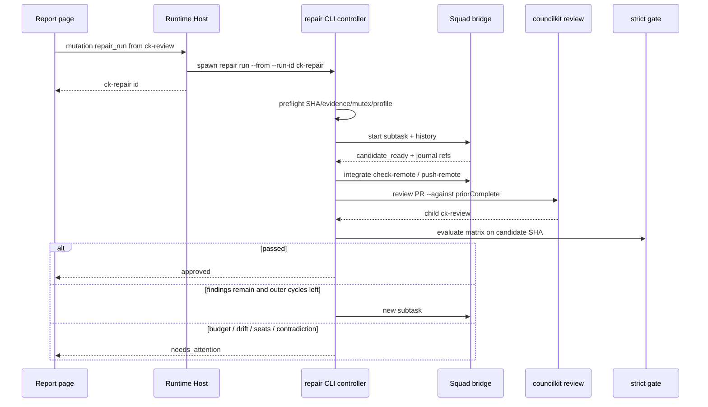
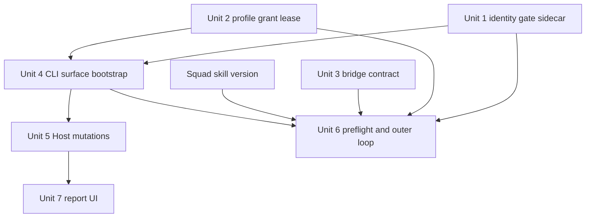
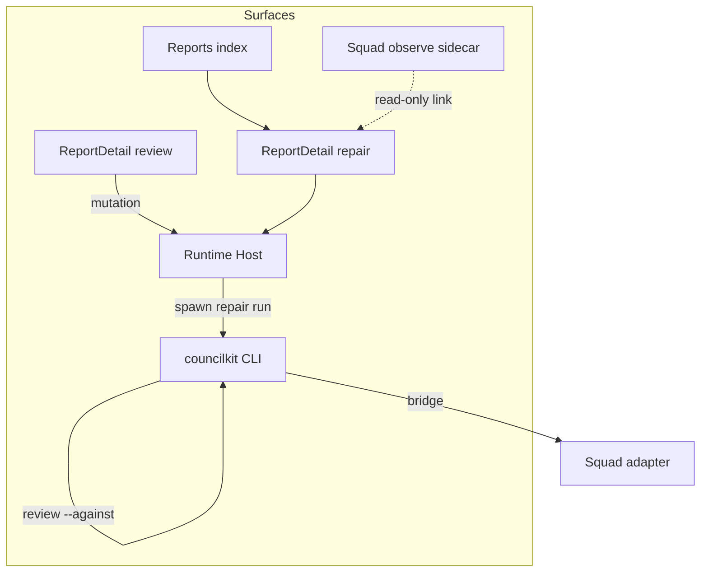

# feat: Squad 自动修复直到机器准出

## Overview

CouncilKit 新增独立父 Run `ck-repair-<uuid>`：从一份已有 PR 审查报告启动一次 Autonomous Run，导出全量待修包，经版本化 Squad 执行桥做工程交付，把同一候选快进推到原 PR 源分支，再跑 CouncilKit `--against` 复审，用机器准出矩阵决定继续、准出或需要处理。

首版必须同时打通 CLI 与报告页。Host 只启动同 checkout 的 `councilkit`，不 spawn `squadctl`、不读 `.squad/`。

## Problem Frame

操作者今天手动走「审查报告 → Squad 修复 → 更新原 PR → CouncilKit 复审 → 再开 Squad」。`fix` 只有单轮方案陪审 + 一集群 apply + 一次 follow-up，并用复审退出码当结束条件。`repair export` 只给手工交接。产品要接管这段往返，但完成判定必须是可核验证据，不能靠模型自述、进程退出或 observe `closed`。(see origin: docs/brainstorms/2026-09-20-squad-repair-until-approved-requirements.md)

## Requirements Trace

- R1. 一次启动一条 PR；默认导出全部当前需处理 finding，不按 cluster 宣告整个 PR 准出。
- R2. 先核对证据再派修；SHA 漂移先补审；失败/截断/缺覆盖不盲修；零待修且无同 SHA Squad 门禁 → 需要处理，不准出。
- R3. 启动时冻结修改范围、验证与快进推源分支授权；grant 绑定本次 Run，可复用但不得扩权。
- R4. 真实 Squad 流程；Orchestrator 是独立 adapter 连续会话；CouncilKit 只启动/查询/停止。
- R5. 每次外部复审对应新 Squad 子任务；内部修复续同一 Builder session；跨 task 不声称连续，不清零预算。
- R6. 仅同一候选 SHA 向前流转；发布用 `integrate check-remote/push-remote`；隔离工作区不得等于 CouncilKit checkout 或用户脏树。
- R7. `--against` 指向上一份完整有效复审；范围内缺陷自动回流；范围外待裁决。
- R8. 机器准出矩阵；全部非有效 accepted finding（含 minor/nit）必须 `isFindingVerifiedClosed`。
- R9. 父预算最多 10 次外循环；Squad 内部最多 3 次 candidate fix 不扣父预算；默认无整段墙钟。
- R10. 同稳定 finding id 两次有效源码修复仍成立 → 只读诊断；无新证据则需要处理。
- R11. 独立父 Run，不覆盖来源报告，不把 `pipeline.pid` 写入来源 `ck-review`。
- R12. 同一规范化仓库 + PR 源分支一个自动 writer；含现有 `fix`/`apply`；重复点击返回已有父 Run。
- R13. 用户可见终态四字：已准出、需要处理、已停止、执行中断。前三项是 `businessResult`（`approved` / `needs_attention` / `stopped`）；「执行中断」只映射进程轴 `interrupted`，不是第四个 businessResult。停止不回滚已推送。
- R14. CLI 与页面同构；写动作 `auth:mutation`；resume 再核 grant；Host 枚举 argv。

准出矩阵八行（身份、Squad 候选、CouncilKit 完整、覆盖完整、问题闭环、裁决一致、例外可追溯、PR 未漂移）是 R8 的验收细则，不得改成 `canExportRepairPackage` 或 review 退出码。

## Scope Boundaries

- 不做自动合并、部署、PR 评论、定时轮询、跨仓库批量修复。
- 不自动接受风险、不降级 severity、不删 finding。
- 不做本地钉 SHA 复审模式（已锁定逐轮更新原 PR）。
- 不建通用多执行器/插件框架；只集成这一种 Squad 桥。
- 不把 Squad 工程引擎搬进 CouncilKit（方案 C）。
- 不把 `repair export` 语义改成自动准出；手工 export 可暂留旧 `evidenceComplete` 兼容，但自动环禁用该兼容。
- 首版不提供「空修复任务只补 Squad 验收」。

### Deferred to Separate Tasks

- **Squad skill / squadctl 桥接实现**（个人 skills 仓库 `hengzhuo-engineering-squad`）：受控祖先任务目录解析、`repair-history.v1` 校验导入、独立 adapter Orchestrator 可恢复入口、`candidate_ready/blocked/failed/stopped` 与 integrate 回执。CouncilKit 在该版本缺失时启动前失败，并禁用/隐藏无法执行的主 CTA。本计划 Unit 3 先冻结契约与假实现测试；真实 adapter 接通依赖该交付版本号。

## Context & Research

### Relevant Code and Patterns

- CLI 路由：`cli/src/cli.ts` 已有 `repair`，`cli/src/commands/repair.ts` 仅 `export`。子命令扩展抄 `cli/src/commands/findings.ts`。
- 新建独立 Run + Host handshake：抄 `POST /api/v1/cli-runs`（review/ideate），**禁止**抄 `POST /api/v1/cli-runs/:runId/actions`（会把 `pipeline.pid` 写进来源 `ck-review`）。
- 身份闭集：`shared/runtime/cli-runs-index.ts` `CLI_RUN_ID_RE`、`shared/runtime/schemas.ts` `cliRunKindSchema`、`parseTranscriptMeta`。抄 `ck-ideate` 加入路径。
- 原子写：`cli/src/store/atomic-write.ts`；home 目录 `0700` / 文件 `0600`。
- 账本关闭：`shared/runtime/cli-ledger.ts` `isFindingVerifiedClosed`。覆盖：`assessment-diagnostics.v1.json` → `reviewEvidence.evidenceComplete`。
- 过宽兼容（反模式）：`shared/runtime/review-case.ts` `canExportRepairPackage`（`evidenceComplete !== false`）。
- Follow-up 复审：`cli/src/commands/fix.ts` `startFollowUpReview`；失败必须非零。
- PR 身份：`shared/runtime/pr-url.ts`；GitHub `headSha` 已有，AntCode `cli/src/auto/checkout-pr.ts` `parseAntCodePrShow` 无 `headSha`。
- 报告页：`src/app/pages/ReportDetailPage.tsx`、`src/components/report/FixPipeline.tsx`、`RepairExportCard.tsx`；路由已是 `/reports/:runId`。
- Squad observe：只读 sidecar；Host 不读 `.squad/`。
- 测试：Vitest node，`cli/tests` + `tests/unit` + `tests/host`；UI 用 `renderToStaticMarkup`；交互走 Playwright。

### Institutional Learnings

- `docs/solutions/` 不存在。
- Autonomous Run 不经 Host 跑 agent；浏览器动作只 spawn 同 checkout CLI (`AGENTS.md`)。
- 关闭证据与覆盖率是质量跃迁未完成项：覆盖可见但不挡 review 退出；准出环必须把「同 SHA 覆盖完整 + verified_closed」当前置，不能靠兼容字段放行 (`docs/ideation/2026-09-07-councilkit-quality-leap-ideation.md`)。
- CLI 与浏览器数据世界分离 (`docs/adr/0013-cli-as-orchestrator-with-separate-data-world.md`)。

### External References

- 跳过通用外部调研：CLI/Host/报告页本地模式充足。Squad 控制面以已安装 skill 的 `references/squadctl.md`、`repair-workflow.md`、`playbook.md` 为准。

## Key Technical Decisions

| 决策 | 选择 | 理由 |
| --- | --- | --- |
| 父 Run 身份 | 新 kind `repair`，id `ck-repair-<uuid>` | 现闭集无此 kind；列表/详情/live 都靠 `CLI_RUN_ID_RE` |
| Host 启动模板 | 抄新建 review 的 POST + handshake，pid 只写父目录 | `/actions` overlay 会污染来源审查，违反 R11 |
| 进度模型 | 权威状态 = 父目录 `journal.jsonl` + 版本化 `repair.json`；`status.json` 只做投影；**`pipeline` 对 repair 恒为 `null`** | 现有 `parsePipeline`/`FixPipeline`/`cliRunNeedsPoll` 是 fix 闭集；未知 phase 会丢 live |
| 准出函数 | 新的严格评估器；禁止调用 `canExportRepairPackage` | 旧兼容把缺 `evidenceComplete` 当通过 |
| Writer 互斥 | `COUNCILKIT_HOME` 级租约，键 = 规范化 repo + PR 源分支；`fix`/`apply`/`repair` 共用 | 现有互斥只是单 review 的 `pipeline.pid` |
| 外循环计数 | 固定次序：`cycle.intent`（reserved）→ CAS `outerUsed+1` → 桥 start（active）。内部 candidate.fix 不扣父预算；与 history 对账冲突则需要处理，禁止取较小值 | 已锁定 10 外循环 vs Squad 内 3 次；内存 `++` 无法恢复 |
| Orchestrator | profile 写死 requested/actual adapter；缺失则启动前失败 | 不把 Host PID 当 native session |
| 发布 | 只调固定 `squadctl integrate check-remote/push-remote`；repo/ref/expected SHA 只来自父 Run 冻结身份 | 禁止 shell `-c`、包内 argv、桥建议的 remote |
| AntCode | 无 PR HEAD SHA 则 `repair run` 启动前失败 | 矩阵要求远端 HEAD == 候选；现 `inspectPullRequest` 不返回 headSha |
| 主 CTA | 桥接版本或 profile 缺失时禁用并说明原因，不展示可点的假按钮 | 需求明确禁止无法执行的入口 |
| 复审班子 | 冻结来源完整审查的 models/council；完整 `--against priorComplete`；**不抄 `fix` 的 `--focus`** | follow-up 收窄焦点会丢掉范围内回流 |
| 自动导出范围 | 全部当前需处理项；cluster 下拉只留手工 export | R1 |
| 页面启动 | Host **先查活跃父 Run 再 mint**；命中则返回旧 id。CLI 前台跑到终态才打最终 JSON | 抄 review「先 uuid 再 handshake」会铸出第二个 writer |
| 可选总时限 | CLI 可传；报告页首版不暴露高级时限控件 | 已锁定默认无整段墙钟 |
| 心跳 | 父目录必须有活着的 **文件** `pipeline.pid`（仅父 CLI PID）并刷新 `status.json` 的 `updatedAt`。这与 `status.json` 里的 **字段** `pipeline`（repair 必须为 `null`）不是同一对象 | 无 pid 文件的 `running` 会在 5 分钟 overlay 成 failed |
| 业务结果 | `businessResult` 进 summary DTO，不挤进 `CliRunLiveStatus` | `completed` 绿药丸不能表示「需要处理」 |

## Open Questions

### Resolved During Planning

- Host 是否复用 `/actions`：否，新建独立 Run。
- 准出是否看 Aggregator approve：否，只看矩阵。
- 有效 accepted：必须有理由且授权范围未变；运行器不得新增。
- 重复点击：返回已有非终态 `ck-repair`，不是 409 再开。
- 与进行中 `fix` 冲突：writer 租约冲突 → 需要处理，文案区分，不并行 push。
- 无 profile：页面先走启动摘要并保存 profile，再启动；CLI 无 `--profile` 则 usage 失败。
- R10 诊断：首版保留只读诊断阶段；无新证据不得再写。
- 父 sidecar：`journal.jsonl` + `repair.json` 为权威；`status.json` 投影；`pipeline` 恒 null。
- 复审调用：in-process `runReview` 注入，不改公开 `review.ts`，不带 `--focus`。
- 保存 profile：Host 第三条枚举动作，body 闭集字段，不塞进 `repair run` argv。

### Deferred to Implementation

- cursor / codex / grok 哪一个 adapter 能作为可恢复 Orchestrator：隔离仓实测后写入默认 profile，测失败则启动前报依赖，不改产品契约。
- squadctl 为桥接新增的精确子命令名：以 Unit 3 契约测试为准，skill 侧对齐。
- AntCode `pr show` JSON 里 HEAD 字段的实际键名：先表征再接入 `parseAntCodePrShow`；读不到就失败关闭。

## High-Level Technical Design

> *This illustrates the intended approach and is directional guidance for review, not implementation specification. The implementing agent should treat it as context, not code to reproduce.*

父 Run 状态两轴：

| 轴 | 值 |
| --- | --- |
| 进程 | `running` / `interrupted` / `failed` / `completed` |
| 业务 | `approved` / `needs_attention` / `stopped` /（进行中无业务终态） |
| 阶段 | `preparing` / `squad_repair` / `squad_verify` / `publishing` / `reviewing` / `diagnosing` / `finalizing` |

`completed` 只表示控制器结束，成功与否看业务结果。CLI 仅 `approved` 退出 0；`needs_attention` 非零；用户停止 130。`inspectRunDir` 必须投影 `businessResult` / `reasonCode` / `sourceRunId` / child ids；非法组合（如 `running`+`approved`、`completed` 且无业务结果）失败关闭，不得静默修显示。

**持久化（权威 vs 投影）**

- 权威：父目录 append-only `journal.jsonl` + 版本化 `repair.json`（CAS `casVersion`）。
- 投影：`status.json`（进程态、心跳、阶段文案）。`pipeline` 必须为 `null`。
- 父目录写活着的 `pipeline.pid`（仅父 CLI PID），等桥期间刷新 `updatedAt`，避免 5 分钟 stale overlay。
- 来源 `ck-review` 的 `status.json` / `pipeline.pid` **零写入**；进行中横幅只读父 Run 投影。
- 稳定指针：`sourceReviewId`（只读）、`priorCompleteReviewId`（失败/incomplete 永不替换）、`latestReviewId`、`currentSquadTaskId`、`candidateSha` / `publishedSha` / `lastRemoteHead`、`frozenReviewModels`、`grantId`/`grantHash`/`profileHash`、`outerUsed`/`outerMax`。
- 外循环记录生命周期：`reserved → active → published? → reviewed → gated → closed`。UI「第 N/10」只派生自落盘记录。
- 先 intent 后 effect，次序锁死：`reserved` → CAS `outerUsed+1` → `active`（桥 start）。崩溃：CAS 前中断 → 重入同一 reserved、不重复 +1；CAS 后、start 前中断 → 占用该槽再 start，不得另开一轮。不存在「已 start 未 +1」的合法窗口。history 与父计数冲突 → 需要处理，禁止取较小值。

**Publish ladder**（缺任一级则 resume 不得再调 `push-remote`）：durable `publish_intent` → 桥 integrate 回执或明确失败 → 远端 HEAD == 候选 → 父记录 `published` → 才允许 review / 下一可写子任务。HEAD 相对 `priorComplete` 未前进则需要处理（禁止同 SHA 空转）。

**Stop 进程清单：** journal 记录桥返回的 Orchestrator/Builder session/pid；stop 经桥确认 writer 闭集全死再释租约；无法确认则保持写入阻塞。Review 子进程 in-process 调 `runReview`，persist 只进 child runDir。

## Implementation Units

- [ ] **Unit 1: 父 Run 身份与严格准出评估器**

**Goal:** `ck-repair-*` 能被索引/读取；准出矩阵有纯函数实现，且不复用宽松 export 判断。

**Requirements:** R8, R11, 准出矩阵

**Dependencies:** None

**Files:**
- Modify: `shared/runtime/cli-runs-index.ts`
- Modify: `shared/runtime/schemas.ts`
- Modify: `shared/runtime/cli-run-progress.ts`
- Create: `shared/runtime/repair-gate.ts`
- Modify: `shared/runtime/review-case.ts`（仅加严格入口，不放宽 `canExportRepairPackage`）
- Test: `tests/unit/cli-runs-index.test.ts`
- Test: `tests/unit/repair-gate.test.ts`

**Approach:**
- 把 `repair` 加入 ID 正则、kind 枚举、`inspectRunDir` / `parseTranscriptMeta`。
- 权威 sidecar：`repair.json` + `journal.jsonl` 字段进入 schema。`status.json` 只投影进程态。**字段 `pipeline` 对 repair 恒为 `null`**（不扩 `CliRunPipelinePhase`）。阶段写入 `progress.phase` 时必须用已加入 `CLI_RUN_PROGRESS_PHASES` 的 `repair-*` 值（如 `repair-preparing`），否则 `parseLiveStateJson` 会丢弃整份 sidecar。未知 phase 不得写进 `status.json`。
- 只读「活跃父 Run」谓词与租约文件格式放在 `shared/runtime`（Host 只依赖 shared，不 import `cli/src`）。CLI 负责 CAS 写入。
- `businessResult` / `reasonCode` / `sourceRunId` / child ids 进入 summary DTO；非法两轴组合失败关闭。
- 严格评估器输入：来源/最终 review 摘要、账本、coverage、Squad journal 引用、远端 HEAD、冻结策略 hash、已授权例外。输出 `passed`、原因码、证据引用。`evidenceComplete` 必须显式 `true`。accepted 以**当前完整复审账本**为准（中途 `findings accept` 可生效），无理由 accepted 当未关。
- 问题闭环对每个非有效 accepted 调用 `isFindingVerifiedClosed(row, candidateSha)`，含 nit。
- 定义「活跃父 Run」谓词（status ∧ lease ∧ pid/journal），供 CLI/Host/UI 共用。

**Execution note:** Implement the gate test-first with one fixture per matrix row, including the compatibility trap (`evidenceComplete` omitted must not pass).

**Patterns to follow:**
- `shared/runtime/cli-ledger.ts` `isFindingVerifiedClosed`
- `ck-ideate` 加入 `CLI_RUN_ID_RE` 的测试

**Test scenarios:**
- Happy path: 全席成功、`incomplete=false`、coverage 完整、全部 finding verified_closed 于同一 SHA、远端 HEAD 相等 → `passed=true`
- Edge case: `evidenceComplete` 缺省 → 不准出（与 `canExportRepairPackage` 相反）
- Edge case: 历史 `closed` 无 `verified_closed`、仅有 `repairClaim`、无理由 `accepted` → 不准出
- Error path: Aggregator `changes-requested` 与账本「全关」矛盾 → 原因码 + 证据引用
- Error path: `ck-repair` 目录可被 `listCliRuns` 看见；乱 id 仍拒绝

**Verification:** 严格评估器单测全绿；`canExportRepairPackage` 旧行为单测仍绿。

- [ ] **Unit 2: Profile、grant、交接目录与 writer 租约**

**Goal:** 启动授权、凭据边界和单 writer 互斥有可测试的存储契约。

**Requirements:** R3, R6 凭据, R12, R14 grant

**Dependencies:** None（可与 Unit 1 并行）

**Files:**
- Create: `cli/src/auto/repair-profile.ts`
- Create: `shared/runtime/repair-lease.ts`（文件格式 + 只读谓词）
- Create: `cli/src/auto/repair-lease.ts`（CAS 写入）
- Create: `cli/src/auto/repair-handoff.ts`
- Modify: `cli/src/commands/apply.ts`
- Modify: `cli/src/commands/fix.ts`
- Test: `cli/tests/repair-profile.test.ts`
- Test: `cli/tests/repair-lease.test.ts`
- Test: `cli/tests/apply-command.test.ts`（互斥失败一条）
- Test: `cli/tests/fix-command.test.ts`（互斥失败一条）

**Approach:**
- Profile 在 `COUNCILKIT_HOME`（`0700/0600`），**名字闭集**解析（禁止 `../` 与绝对路径）。绑定规范化 PR/仓库/源分支/base 与能力白名单（仅快进推该源分支）；**capability 进入完整性 hash**；复用时能力必须 ⊆ 启动摘要；过期/吊销后所有写路径失败。
- Grant id/hash 写入父 Run；CLI 与 Host resume 共用同一校验器；新 CSRF 不足以重新武装 push。
- 交接目录在 home 下、`runs/` 外，`wx`、拒 symlink；每外循环新文件不覆盖；父 Run 存 path+hash+generation。
- 租约键 = 规范化 repo + 源分支；指向 `ck-repair-id` 或 `ck-review-id` + pid + epoch。writer 闭集 = 父 CLI + 桥返回的 Orchestrator/Builder/integrate。`release ⇒ 闭集 PID 全死`；`termination_unknown ⇒ 保持阻塞`；stale pid 回收前必须 journal+远端核对。
- **本单元末尾**才改 `fix.ts`/`apply.ts` 拿同一把锁；与 Host `/actions` 的 review pid 是双锁，不能互相替代。

**Execution note:** Lease tests first: two overlapping writers, stale pid, resume after stop.

**Patterns to follow:**
- `cli/src/commands/repair.ts` export 的 `wx` + `0600`
- `cli/src/store/atomic-write.ts`

**Test scenarios:**
- Happy path: 匹配身份的 profile 可复用；grant 写入父 Run
- Edge case: base/源分支漂移后旧 profile 拒绝
- Error path: 同分支 `fix` 持锁时 `repair run` 不启动写入
- Error path: 活跃 `ck-repair` 上再次 run → 返回同一 id
- Error path: 交接路径落在 `runs/` 内或 symlink → 拒绝
- Integration: `apply` 在租约占用时失败且不 push

**Verification:** profile/lease/handoff 单测覆盖上述路径；`fix`/`apply` 至少各有一条互斥失败测试。

- [ ] **Unit 3: Squad 执行桥契约（CouncilKit 假实现）**

**Goal:** 父控制器只通过版本化桥交谈；契约测试不依赖真实 adapter。

**Requirements:** R4, R5, R6, R9 对账, 执行桥接最小能力

**Dependencies:** None（可与 Unit 1/2 并行；不要把租约语义塞进本单元测试）

**Files:**
- Create: `cli/src/auto/squad-bridge.ts`
- Create: `shared/runtime/squad-bridge-contract.ts`
- Test: `cli/tests/squad-bridge.test.ts`

**Approach:**
- 桥能力：start/resume/stop/status；事件 `candidate_ready | blocked | failed | stopped`；发布时返回可核验 integrate 回执。
- `candidate_ready` 只表示可交付候选；控制器仍核 journal：独立 Review/Verify、同一 SHA、required gates、未 invalidate。
- 历史交接：只接受桥解析出的受控祖先目录 + 校验过的 `repair-history.v1`；禁止包内任意祖先路径。
- 分层 env：agent 席无 push/CI token；仅 integrate 步骤允许本机 git/gh helper。integrate 的 repo/ref/expected SHA 只来自父冻结身份。
- 版本指纹不匹配 → 启动前失败，不静默降级。
- 本单元用进程内 fake 桥；真实 adapter 接通标为 skill 交付版本依赖。内部 fix 事件不得表现为父外循环 +1。

**Execution note:** Contract tests first against the fake: ready-without-gates must not be publishable.

**Patterns to follow:**
- Squad observe 只读投影与 Host 不 spawn squadctl 的边界
- `repair-workflow.md` 的 history / convergence 语义（只读建议，不写 PASS）

**Test scenarios:**
- Happy path: fake 桥给出同 SHA 的独立门禁引用 → 控制器接受 `candidate_ready`
- Edge case: observe `closed` 但 journal 缺 Verify → 不发布
- Edge case: 内部三次 candidate.fix 不增加父外循环
- Error path: 包指定祖先目录 → 拒绝
- Error path: 桥版本缺失 → 启动失败原因码
- Error path: 伪 token 出现在 fake journal/回执时，契约仍视为不可发布（不把 secret 当成功信号）

**Verification:** 契约测试不启动真实 squadctl；失败用例不把模型布尔值当准出。

- [ ] **Unit 4: CLI 表面与父 Run bootstrap**

**Goal:** `repair run/status/stop/resume` 可解析；能早建 `ck-repair-*` 目录供 Host handshake；`export` 不变。

**Requirements:** R11, R14 CLI 表面

**Dependencies:** Units 1–2

**Files:**
- Modify: `cli/src/commands/repair.ts`
- Modify: `cli/src/main.ts`
- Create: `cli/src/auto/repair-persist.ts`
- Test: `cli/tests/repair-command.test.ts`

**Approach:**
- 抄 `findings.ts` 分子命令。`run --from --profile [--run-id] [--max-outer-cycles] [--timeout] --json`。
- `--run-id` 已存在则复用；否则创建目录、写投影 `status.json`（`pipeline` 字段 null、`progress.phase` 为已知 `repair-*`）、父目录 **文件** `pipeline.pid`、空 journal。来源 review 零写入。
- 本单元不跑外循环；无 profile 名或非法 profile 路径 → usage 失败。

**Execution note:** Handshake 目录出现即可，先于 Host 单元。

**Patterns to follow:**
- `cli/src/commands/findings.ts` 分发
- review/ideate 的 `--run-id` / `ensureRunDir`

**Test scenarios:**
- Happy path: `repair run --run-id ck-repair-…` 创建目录，`status.json.pipeline` 为 null，父目录存在 `pipeline.pid` 且等于该进程，来源 ck-review 无该文件
- Edge case: `export` 仍拒绝写入 `runs/`
- Error path: `--profile ../x` 拒绝
- Error path: 来源 review 目录无新 pid/status 变化

**Verification:** Host 可以用该表面做 handshake，不必等外循环。

- [ ] **Unit 5: Host 启动/停止/恢复 mutation**

**Goal:** 报告页能异步拿到父 Run id；Host 仍不碰 squadctl。

**Requirements:** R11, R14

**Dependencies:** Unit 1（活跃父 Run 谓词 / 投影字段）+ Unit 2（grant / 租约）+ Unit 4（可 handshake 的 CLI 表面）

**Files:**
- Modify: `runtime-host/cli-launcher.ts`
- Modify: `runtime-host/routes/cli-runs.ts`
- Modify: `src/runtime/client.ts`
- Modify: `shared/runtime/schemas.ts`
- Test: `tests/host/cli-runs.test.ts`
- Test: `tests/host/cli-launcher.test.ts`

**Approach:**
- 租约 CAS（`shared/runtime` 格式）成功后再 mint。命中活跃父 Run 则返回旧 id、不 spawn。两并发 POST 不得各 mint 一个目录。
- handshake 超时必须回查活跃父 Run：若 CLI 已复用旧 id，返回旧 id，而不是 HANDSHAKE_TIMEOUT 当硬失败。
- 必须扩展 `CliRunAction` 增加 `repair`，`launchArgs` 固定为 `repair run …`，并走与 review/ideate 相同的 handshake。缺省 fallback 是 `fix --run`，测试必须断言 argv 不是 fix。
- 新 POST（对齐 ideate），不是来源 review 的 `/actions`。body 闭集：`from` + `profile` id。stop/resume 针对父 id。
- 保存 profile 是单独枚举动作，不把路径/argv 塞进 run body。
- resume 服务端再核 grant（含过期/吊销）；失效则不武装 push。
- 父目录写 pid 文件；来源 review 零写入。

**Patterns to follow:**
- `POST /api/v1/cli-runs` / ideate handshake
- `auth:mutation` Origin/CSRF
- 反模式：`POST …/:runId/actions`

**Test scenarios:**
- Happy path: 新 id；源 review 无 pid overlay
- Happy path: 重复 mutation 返回同一活跃父 Run（先查后铸）
- Error path: 无 CSRF/Origin → 拒绝
- Error path: body 带 argv 或 `authorized` → schema 失败
- Error path: grant 吊销后 resume 拒写
- Integration: Host 重启不杀父 CLI；页面 stop 经 CLI 再经桥确认 writer

**Verification:** 不 spawn squadctl、不读 `.squad/`、不改来源 `status.json`。

- [ ] **Unit 6: Preflight、外循环与 resume 矩阵**

**Goal:** 前台 CLI 在 fake 桥上跑完外循环链，崩溃可幂等恢复。

**Requirements:** R1–R10, R12, 验收场景表

**Dependencies:** Units 1–4；真实闭环还依赖 Squad skill 版本

**Files:**
- Create: `cli/src/auto/repair-preflight.ts`
- Create: `cli/src/auto/repair-run.ts`
- Modify: `cli/src/auto/checkout-pr.ts`
- Test: `cli/tests/repair-command.test.ts`
- Test: `cli/tests/checkout-pr.test.ts`

**Approach:**
- Preflight：显式 coverage、同 PR against 链、HEAD 一致否则先补审、mutex、profile、桥版本、工作区 toplevel。零待修且无同 SHA Squad 门禁 → 需要处理，不导出空包；已有可核验同 SHA Squad 门禁则可直接走严格准出，仍不创建空修复任务。AntCode 无 headSha → 启动失败。
- 循环：export 新交接文件 → journal `cycle.intent` → 桥 start → 门禁核 journal → publish ladder → in-process `runReview`（`--against priorComplete`，**无 `--focus`**，persist 进 child dir）→ 严格 gate。
- 第 10 次仍跑完验证；禁止第 11 次可写子任务。
- R10：两次**已发布**修复后同 against-id 仍成立 → 只读诊断。
- resume：先读远端+回执+child reviews；已有完整子 Run 则关联、不再 spawn 复审；publish ladder 未完成不得 `push-remote`。
- 凭据：agent env 剥离；伪 token 不得出现在 log/handoff/journal。
- `--json`：stderr 进度，stdout 一个终态。

**Execution note:** Fake bridge + injected `reviewImpl`，抄 `cli/tests/fix-command.test.ts`，不要改 `review.ts`。

**Patterns to follow:**
- `FixDeps.reviewImpl`
- 复审非零必须失败（`fix-command.test.ts`）
- 禁止抄 `--focus`

**Test scenarios:**
- Happy path: 一次外循环准出；来源 review 零写入
- Happy path: 范围内残留 → 第二次子任务，外循环 2/10
- Edge case: 内部门禁失败后修好 → 不扣父预算
- Edge case: 第 10 次通过/不通过；无第 11 次写入
- Error path: review exit 0 但 incomplete → 不准出
- Error path: CAS+1 后立刻中断 → resume 不新开第 11 次
- Error path: push 成功父崩 → 补记 published，不重推
- Error path: 复审已完成父缺失 → 关联 child，不再审
- Error path: history=3 父=2 → 需要处理
- Error path: 用户 stop 后 fake writer 仍活 → 租约不释放，exit 130
- Integration: 失败 against 不当 `priorComplete`

**Verification:** 验收表中不接真实 PR 的行由本单元覆盖。

- [ ] **Unit 7: 报告页主 CTA 与父 Run 详情**

**Goal:** 用户从审查报告点一次「Squad 自动修复」，在父 Run 页看到外循环、阶段、原因码恢复入口。

**Requirements:** R13, R14, 拟定 CLI 与界面

**Dependencies:** Unit 5 + Unit 1 投影字段

**Files:**
- Modify: `src/app/pages/ReportDetailPage.tsx`
- Modify: `src/components/report/FixPipeline.tsx`（仅保证 repair 不误入）
- Modify: `src/components/report/RepairExportCard.tsx`
- Modify: `src/lib/cli-run-status.ts`
- Modify: `src/lib/report-groups.ts`
- Create: `src/components/report/RepairRunPanel.tsx`
- Modify: `src/app/pages/ReportsPage.tsx`
- Test: `tests/unit/fix-pipeline.test.ts`
- Test: `tests/unit/repair-run-panel.test.ts`

**Approach:**
- 自动修复走 `RepairRunPanel`，不要把父阶段塞进 `FixPipeline`。
- 「立即修复」改文案「内置修复」并降为次级。
- 无 profile：启动摘要表单 → 保存 profile 动作 → 启动。桥缺失：禁用 CTA。
- 来源审查横幅只读父 Run 链接。进度「第 N / 10 次外循环」来自落盘 cycle。
- 恢复按钮按原因码；预算耗尽无再写。准出卡片无合并 CTA。
- Export 卡降为高级；cluster 不影响自动范围。
- `cliRunNeedsPoll` 认 repair 进程 `running` + 独立 phase，不靠 fix `pipeline`.

**Execution note:** Markup tests first；点击跳转用 Playwright 若静态测不够。

**Patterns to follow:**
- `FixPipeline` busy/error 作为次级内置修复
- 现有 `auth:mutation` client

**Test scenarios:**
- Happy path: 就绪 profile → 主 CTA 可点 → `/reports/ck-repair-…`
- Edge case: 无 profile → 摘要表单
- Edge case: 桥缺失 → 禁用
- Edge case: 活跃父 Run → 「查看自动修复」
- Error path: mutation 失败 → 页内 error
- Error path: 需要处理/预算耗尽 → 无「再修一次」
- Integration: kind=repair 不渲染内置 fix 阶段条

**Verification:** 审查页、父 Run 页、索引一致；桌面与移动都看主 CTA。浏览器核验启动、跳转、停止、按原因出现的恢复入口。

## System-Wide Impact

- **Interaction graph:** 报告页 mutation、Host launcher、CLI 父控制器、review 子 Run、Squad observe 只读链、`fix`/`apply` 租约。
- **Authority graph:** Browser → `auth:mutation` → Host 枚举 argv → repair CLI → bridge。仅 integrate 可触达 push helper；agent 席无 push/CI token；任务包无授权。
- **Grant lifecycle:** 启动摘要可见范围 → 绑定父 Run → resume 再核 → 过期/吊销后所有写路径失败。CLI 与 Host 共用校验器。
- **Secret surfaces:** 任务包、CLI argv、`pipeline.log`、父 sidecar、Squad journal、交接文件、过程 UI 均不得落凭据。
- **Error propagation:** 桥/复审/gate 失败变成父 Run 原因码；禁止把子进程 exit 0 映射成已准出。
- **State lifecycle risks:** 源审查零写入；publish ladder 未完成不得再 push；外循环与 history 对账冲突则需要处理；Host 重启后新 session 不得仅凭 CSRF 武装 push；writer 闭集未死不得释锁。
- **API surface parity:** CLI 与页面动作同构；`repair export` 保持手工语义。
- **Integration coverage:** fake 桥单测不够证明真实 adapter；skill 版本与隔离仓验收是发布门槛。
- **Unchanged invariants:** Host 不 spawn squadctl；不读 `.squad/`；不静态提供 handoff 原文；CLI 不拉起 Host；body/`authorized`/`passed` 不替代 grant；内置 `fix` 单轮语义保留。

## Risks & Dependencies

| Risk | Likelihood | Impact | Mitigation |
| --- | --- | --- | --- |
| 现网复审经常覆盖不全 / 无 verified_closed，10 次外循环仍到不了已准出 | High | High | 准出环把覆盖重建当前置；覆盖失败只恢复复审不派写；不放宽矩阵 |
| 无头 adapter Orchestrator 实际跑不完 playbook | High | High | 启动前版本/runtime 探测；失败禁用 CTA；不退化成方案 A |
| Squad skill 版本与 CouncilKit 不同步 | Med | High | 契约版本指纹；缺失则失败关闭 |
| 逐轮 push 污染真实 PR / 与同事提交冲突 | Med | High | ff-only + 读回；漂移需要处理；不覆盖 |
| AntCode 无 HEAD 却做身份一致 | High | Med | 无 headSha 启动失败；GitHub 可先用 |
| 把 `/actions` 模板抄到 repair | Med | High | Host 测试锁定「源目录无 pid」；先查活跃父 Run 再 mint |
| Agent 席继承 Host ambient push/CI token | High | High | 分层 env；契约 deny 表；integrate 单独放行 helper |
| 凭据进入 log / 父 Run / handoff / journal | Med | High | 写入禁令 + 伪 secret 泄漏测试 |
| 过期/吊销 grant 仍被 resume 武装 | Med | High | CLI+Host 共用 grant 校验；失效则 needs_attention |
| 磁盘改 profile 或路径穿越扩权 | Med | High | 名字闭集；capability ⊆ hash |
| 隔离工作区落到 CouncilKit checkout 或用户脏树 | Med | High | 启动冻结路径 + toplevel 失败关闭 |
| stop 后仍存活的 push-capable writer | Med | High | writer 闭集全死才释锁；不明则阻塞 |
| 崩溃窗口重复 push / 烧轮 / 双计 | High | High | publish ladder + cycle 状态机 + history 对账测试 |
| 4 小时旧草稿被实现者写回 | Low | High | R9 已改为无默认墙钟 |
| R10 用标题相似度计同根因 | Med | Med | 只认 against 链原 id + 已发布 SHA |

## Phased Delivery

与 origin 三阶段对齐：

1. Units 1–3：契约、准出、租约、桥（可不接真实 PR）。
2. Units 4–5：可 handshake 的 CLI 表面 + Host mutation（此时还没有报告页 CTA）。
3. Unit 6 + skill 版本：CLI 闭环。
4. Unit 7：报告页主 CTA 与父 Run 详情；隔离仓真跑一条「修复一次 → 准出」路径。

## Documentation / Operational Notes

- 更新 README CLI 章节：`repair run/status/stop/resume`；标明仅已准出为成功。随 Unit 4 落地，不要拖到全部做完。
- `AGENTS.md`：Autonomous Run 增加 `repair`；Host 仍不 spawn squadctl。
- 报告页文案：「Squad 自动修复」vs「内置修复」。
- 操作说明：保存的是能力授权不是长期 token；如何吊销；log 可含仓库路径但不得含凭据。
- LaunchAgent：实现落地后按仓库惯例全量 build 并重启 Host；本计划不执行发布。
- 验收不依赖生产 PR：用隔离仓库 + fake/实桥开关。真 adapter 验收是 skill 版本的发布门槛。

## Sources & References

- **Origin document:** [docs/brainstorms/2026-09-20-squad-repair-until-approved-requirements.md](docs/brainstorms/2026-09-20-squad-repair-until-approved-requirements.md)
- Related code: `cli/src/commands/repair.ts`, `cli/src/commands/fix.ts`, `runtime-host/cli-launcher.ts`, `runtime-host/routes/cli-runs.ts`, `shared/runtime/cli-ledger.ts`, `shared/runtime/review-case.ts`, `src/components/report/FixPipeline.tsx`
- Squad skill (install-resolved, not a hard-coded machine path): `SKILL.md`, `references/repair-workflow.md`, `references/squadctl.md`, `references/playbook.md`, `references/builder-continuity.md`
