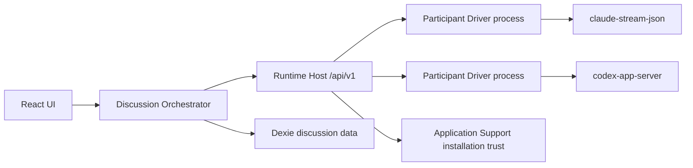
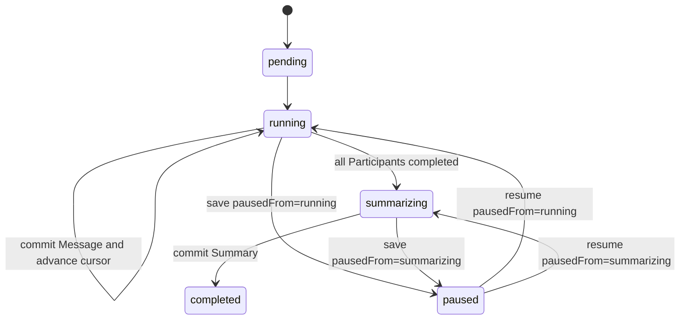

# CouncilKit Runtime Host 设计

本文记录已经确认、可进入实现的 Runtime Host 设计。领域词汇见 [`CONTEXT.md`](../CONTEXT.md)，关键取舍见 [`docs/adr/`](./adr/)。当前仓库代码仍是 legacy browser-direct Gateway 实现；完成本文迁移前，不应把目标设计描述成已经上线的行为。

## 目标与非目标

目标：

- 通过本机 CLI Runtime 运行讨论 Agent，复用本地安装所管理的认证与原生会话能力。
- 解决浏览器 CORS、供应商私有鉴权和浏览器不能可靠管理子进程的问题。
- 一个 Room 内长期保持 Participant 进程 warm，优先降低连续发言延迟。
- 保持 Participant 隔离、可恢复流式输出、幂等持久化和可解释的讨论历史。
- Codex CLI 升级不因为版本号变化而要求同步升级 CouncilKit。

V1 非目标：

- 不提供 HTTP Driver、API Key 或 macOS Keychain 配置。
- 不提供 LaunchAgent 常驻服务、Tauri/Electron 壳、LAN 或远程控制。
- 不复用 Multica daemon，也不引入 Multica 的任务与工作区领域模型。
- 不支持 Kimi ACP、`codex-acp` 或当前 `cdxb` wrapper。
- 不保证 Codex app-server 的工具列表为空。

## 产品形态与职责边界

- V1 正式支持 macOS。
- 用户主动启动一个前台 Node.js 22 + TypeScript Runtime Host。
- Host 同时提供构建后的 React UI 与同源 Runtime API。
- 浏览器中的 Discussion Orchestrator 负责 Room、Round、Participant 顺序、Context Snapshot、Summary 和业务持久化。
- Runtime Host 负责 Runtime Installation 信任、Driver、进程、Session、Scope、取消和标准化事件；它不理解或调度 Room、Round 和 Summary。



CouncilKit 的 Room、Round、Message、Participant 和 Summary 是讨论的唯一事实源。CLI session/thread 只是可丢弃的 Execution Session；恢复失败时，Host 使用 CouncilKit 提供的 Context Snapshot 建立新 Session。

## Runtime Host API 与固定 Origin

- 生产使用一个固定 canonical origin；端口占用时明确失败，不静默切换随机端口。IndexedDB 按 origin 隔离，因此 origin 是数据兼容性的一部分。
- API 统一位于 `/api/v1`，使用共享 TypeScript 类型和运行时 schema 校验。
- Scope、预热、执行、续租、接管、ACK、取消和关闭使用 JSON HTTP 请求。
- 流式事件使用带 SSE framing 的 authenticated `fetch`；不用原生 `EventSource`，以便携带 capability header，并通过 `afterSeq` 恢复。
- 不引入 CouncilKit WebSocket 层；Host 到 Codex 子进程仍使用 app-server 自己的 stdio JSONL。
- `GET /api/v1/health` 至少返回 `apiVersion`、`hostInstanceId`、Driver capabilities 和 readiness。
- 事件缓存有硬上限；达到上限时可以把早期 delta 合并成 `output.snapshot`，但终态事件始终携带完整规范化输出。

逻辑 API 资源包括：

- Runtime Installation 发现、验证和 capabilities。
- Execution Scope 创建、续租、接管、状态读取和关闭。
- Participant 预热与 Session 状态。
- Model Execution 启动、事件重连、ACK 和取消。

## Loopback 安全边界

V1 防御恶意网页访问本机 Runtime Host，不承诺防御同一 macOS 用户权限下的恶意本地进程。

- 只监听 loopback，校验精确 `Host` 和 `Origin`，不开放 CORS。
- Host 每次启动生成随机 session capability。
- 页面会话使用 `HttpOnly + SameSite=Strict` Cookie；所有状态修改还必须携带首屏注入的 CSRF capability header。
- UI 使用严格 CSP，并设置 `frame-ancestors 'none'`。
- Driver 只能使用 Host 构造的固定 argv、专用 cwd、最小环境和独立进程组。
- Host 通过一个随产品分发的 process watchdog 启动 Driver：watchdog 持有父进程控制管道，Host 异常退出导致管道 EOF 时，它终止对应 Driver 进程组。
- Host 在 Application Support 保存不含秘密的子进程回收 ledger；下次启动先校验 PID/PGID、进程启动时间和 executable realpath，再清理 watchdog 未能回收的遗留进程，避免 PID 重用误杀。
- Profile 或导入数据不能传入 executable、原始 argv、Shell 片段或任意环境变量。
- 不提供 browser-direct fallback、LAN 监听或远程控制。

讨论数据的本地优先只描述持久化位置，不表示模型执行离线：每次调用会把选定 Context Snapshot 发送给相应模型服务商；Codex 的有效本地工具配置还可能访问 Snapshot 之外的数据。

## 配置、信任与数据归属

| 概念 | 持久化位置 | 含义 |
|---|---|---|
| Runtime Driver | Host 代码 | 内置协议实现 |
| Runtime Installation | macOS Application Support | 已发现或明确批准，并通过验证的本机程序及 fingerprint |
| Execution Profile | Dexie | 无秘密的 Driver、Installation 和类型化选项引用 |
| Credential Source | Installation 自身 | V1 固定为 `installation-managed` |
| Agent / Participant / Room 数据 | Dexie | CouncilKit 领域事实源 |
| Execution Session / event cache | Host 内存 | 可丢弃执行缓存 |

### Runtime Installation

- Host 从继承的 PATH 与 macOS 常见安装目录发现候选程序。
- 候选项经 realpath、可执行权限、版本输出、协议握手和文件 fingerprint 验证。
- `cld` 等脚本内容或 realpath 改变后，Installation 回到待验证状态。
- 用户手工选择路径时必须明确批准；导入数据不能建立 Installation 信任。
- Codex Installation 不按 CLI 版本号设 allowlist。Driver 使用最小稳定协议和能力握手；只有必需能力确实缺失时才标记不可用。

### Execution Profile 与 Agent

- Profile 只保存 `driverId`、`installationId`、`credentialMode: installation-managed` 与 Driver 类型化选项。
- Profile 不保存默认模型；Agent 固定绑定 `executionProfileId + modelId`。
- `claude-stream-json` Profile 可以选择受支持的 `cld` route；modelId 由 Agent 提供并通过 Driver 白名单映射。
- 导入 Profile 只能进入 `needsBinding`，不能自动绑定或信任路径。
- Participant 保存人格、解析后的 Profile 安全字段、Profile revision/digest 和 modelId 快照。
- 编辑 Agent 或 Profile 不改变已有 Participant；已发言后切换配置会结束旧 Participant，并从下一 Round 创建新的活跃 Participant。

### Credential Source

- V1 唯一模式为 `installation-managed`，不是 `local-cli-login`。
- Codex app-server 复用本地 Codex 登录状态。
- `cld` wrapper 自行加载其本地 endpoint/token 配置。
- Runtime Host 不读取、复制、导出或持久化秘密内容，也不提供登录、登出或账号切换 UI。

## 目标 Dexie 模型

在现有表基础上新增：

- `executionProfiles`
- `participants`
- `modelExecutions`
- `runtimeBindings`

核心约束：

- Agent 是全局可复用实体，不再通过 `roomId` 归属某个 Room。
- Participant 是 Agent 加入 Room 时的快照，并成为 agent Message 的 sender。
- Room 保存 `runState`、单调递增的 `contextRevision`，并显式保存 `facilitatorParticipantId`。
- Room 同时保存确定性的 `contextDigest`；它只覆盖所有 Participant 共享的规范化持久讨论投影，不包含目标 Participant 人格/Profile/model、单次 execution instruction、executionId 或流式预览。
- Round 保存 Participant 顺序快照、phase、`pausedFrom`、`nextParticipantIndex`、`activeExecutionId` 和 retry 状态。
- Message 与 Summary 增加唯一、可空的 `sourceExecutionId`。
- Participant 为人格、Profile 安全字段、Profile revision/digest 和 modelId 的完整快照保存 `participantSnapshotDigest`。
- ModelExecution 只保存状态、dispatch 时的 `hostInstanceId`/`executionScopeId`、requested/effective model、usage、结构化错误、retry 关联、`dispatchState`、`contextRevision`/`contextDigest`、`participantSnapshotDigest`、`instructionDigest`、最终 `eventSeq`、ACK 状态和工具活动标记，不复制 delta、正文或 instruction。成功路径至少区分 `succeeded_uncommitted` 与 `committed`；`ackState` 使用 `pending | acknowledged | expired`。
- RuntimeBinding 保存 `hostInstanceId`、`executionScopeId`、Controller 和租约恢复信息；Host 实例变化时该绑定失效并重建。
- `Room.agentIds`、`Room.roundIds` 等数组不再作为关系事实源，使用表索引查询。

Message 或 Summary 提交、对应 ModelExecution 转为 `committed` 且 `ackState: pending`、Room `contextRevision` 增长、Round phase/游标推进必须位于同一个 Dexie 事务中。事务必须先比较当前 RuntimeBinding 的 `controllerId + leaseEpoch` 以及 Round 的预期 `activeExecutionId`；任一不匹配都以 stale-controller/stale-execution 失败，不允许旧页面推进状态。任何会影响共享持久讨论上下文的写操作——包括 Message、Summary、用户追问、Room topic/background 和上下文策略——都必须原子增长 Room revision，并重新计算 `contextDigest`。Participant 人格或配置在首次发言前变化时原子重算其 `participantSnapshotDigest`；若某个 Participant roster 字段也进入共享提示，则该共享字段的变化同时增长 Room revision。

## 持久化 Discussion Orchestrator

Round 是可恢复状态机，不能继续依赖页面内一次性的 `runRound()` 循环。



- Round 启动时快照本轮 Participant 顺序；每个 Room 同时最多一个未结束 Round。
- 调用 Host 前先持久化新的 `activeExecutionId`。
- 完成 Message 提交时，原子清除 active execution 并推进游标。
- 页面刷新后，有活动 execution 时先重连；执行已丢失时应用中断策略；没有活动 execution 时从下一位 Participant 继续。
- 所有发言完成后进入 `summarizing`；Summary 持久化成功后才进入 `completed`。
- Round 因错误暂停时使用 `phase: paused`，并持久化 `pausedFrom: running | summarizing` 和结构化 pause reason；恢复时只能回到 `pausedFrom` 指定的 phase。
- Room 的 `runState: paused` 是独立的用户调度门，不改写 Round phase 或 `pausedFrom`；恢复 Room 后继续原 Round phase。
- Execution Scope 可以跨多个 Round 保持 warm，不随单个 Round 完成而释放。

## Execution Scope、Controller 与租约

- Orchestrator 为一次房间执行建立不透明的 `executionScopeId`；Host 不解释其业务含义。
- Scope 创建时并行预热所有活跃 Participant。
- 一个 Scope 同时只有一个 Scope Controller；其他标签页只能读取状态和观察事件。
- 浏览器使用 Web Locks 和 BroadcastChannel 快速选主，Host 使用单调递增的 `leaseEpoch` 作为最终 fencing token。
- Controller 候选先取得 Web Lock，并在 Dexie 原子写入新的 `controllerId` 和 pending generation，先 fence 旧页面；随后向 Host 接管并保存返回的 `leaseEpoch`。两步都完成前不得执行或提交。
- 页面刷新恢复 Controller；用户显式接管时产生新 epoch，旧页面的 execute、cancel、ACK、renew 和 close 请求全部被 Host 拒绝，其 Dexie 写事务也因 controller/epoch CAS 失败。
- 所有执行结果提交还必须比较 Round 的 `activeExecutionId`；新 Controller 可以提交接管前已启动、仍为 active 的 execution，旧 Controller 或过期终态不能提交。

默认时间参数：

- 心跳：30 秒。
- Controller 租约：120 秒。
- 资源宽限期：10 分钟。

租约到期后 Host 拒绝新执行，但允许已开始的执行继续并缓存终态。宽限期内进程保持 warm；Controller 重连或接管后继续。宽限期结束仍无人接管时，Host 取消当前执行并关闭 Scope。

Room `paused` 时，只要 Controller 续租，Scope 和进程继续保持 warm，但 Orchestrator 不提交新执行。Room 结束、删除、用户显式释放运行时或宽限期结束时，Host 关闭 Scope 并回收全部进程组。

## 长期进程模型

V1 统一采用“每个活跃 Participant 一个长期 Driver 进程”：

- 同一 Agent 在不同 Room 中形成不同 Participant，绝不共享进程或 Execution Session。
- 每个 Participant 同时最多有一个进行中的 Model Execution。
- 取消优先使用 Driver 协议；协议取消失败或进程失效时才终止进程组。
- 单个 Driver 崩溃只影响对应 Participant。
- Host 正常退出时终止所有子进程组；异常退出由 parent-pipe watchdog 回收，遗漏项由下次启动在核验身份后清理。
- Context Snapshot 发生非追加替换时允许重建 Session；Codex 可在原 app-server 中准备新 thread，Claude 则重启进程并立即并行预热。完整 Snapshot 在该 Participant 下一次 Model Execution 时注入，不为预热额外调用模型。

V1 只实现两个 Runtime Driver：

| Driver | Runtime Installation | 执行路径 |
|---|---|---|
| `claude-stream-json` | `cld` | `cld ant glm5.2`、`cld moonshot`、`cld deepseek` |
| `codex-app-server` | 官方 `codex` | `codex app-server --listen stdio://` |

现有 Gateway 数据只作为 legacy 数据保留，不参与 V1 执行。

## `claude-stream-json` Driver

标准启动模板：

```text
env CLD_SKIP_UPDATE_CHECK=1 \
  cld <route> [modelAlias] \
  --print \
  --input-format stream-json \
  --output-format stream-json \
  --verbose \
  --include-partial-messages \
  --replay-user-messages \
  --no-session-persistence \
  --safe-mode \
  --disable-slash-commands \
  --no-chrome \
  --strict-mcp-config \
  --mcp-config '{"mcpServers":{}}' \
  --tools '' \
  --system-prompt '<Participant persona + discussion contract>'
```

- Driver 按 Profile route 与 Agent modelId 构造白名单 argv；不接受原始参数或 `--model` 注入。
- 必须设置 `CLD_SKIP_UPDATE_CHECK=1`，避免预热路径执行 npm 更新查询或 TTY 询问。
- `system/init` 必须确认 tools、MCP、skills 和 slash commands 为空，否则 readiness 失败。
- stdin user message 使用 UUID；`--replay-user-messages` 作为入队确认。
- stdout 是开放集 NDJSON。Driver解析 `system/init`、`stream_event`、`assistant`、`result` 和 control response；未知事件忽略并记录结构化诊断。
- 只有 `text_delta` 用于预览，`result.result` 是权威完整输出。
- 长期 query 的 `modelUsage` 与 `total_cost_usd` 可能累计；Driver 保存上一累计值并计算本次差值，不能直接当作单 turn 成本。
- 正常取消发送 `control_request/interrupt` 并等待匹配的 control response；超时后才终止进程组。
- Scope 正常释放且无 inflight 时先关闭 stdin；超时再 kill。
- 使用 `--no-session-persistence`；进程崩溃后从 Context Snapshot 重建，不 resume 本地 Claude session。

## `codex-app-server` Driver

### 兼容性策略

- 不设置 Codex CLI 版本白名单，不因为版本号未知而阻止运行。
- 不在启动时要求生成或匹配某个固定版本 schema。
- Driver 使用最小稳定 JSONL 协议、能力握手和开放集事件解析；忽略未知字段与未知通知。
- Codex CLI 升级通常不需要 CouncilKit 变更。只有 `initialize`、account/model、thread、turn、stream 或 interrupt 等必需能力确实缺失时，Installation 才报告不兼容。
- 不依赖仅用于清空工具的实验字段，因此升级不会被 zero-tools 约束卡住。

### 进程与 thread

- 每个 Participant 启动一个 `codex app-server --listen stdio://` 长期进程。
- 每条 stdio 连接只发送一次 `initialize`，随后发送 `initialized`。
- 启动后使用 `account/read` 检查现有本地登录；不提供登录或登出流程。
- 使用 `model/list` 作为模型和 reasoning effort 的权威目录。
- 每个 Participant 使用一个 `ephemeral: true` thread；Session 重建时在同一 app-server 进程中创建新 thread。
- `thread/start` 使用 Agent modelId、专用空 cwd、`sandbox: read-only` 和 `approvalPolicy: never`。
- CouncilKit 不注册额外 dynamic tools 或 capability roots，但不要求 app-server 的有效工具列表为空，也不把工具列表作为 readiness 门槛。
- 用户本地 Codex 配置可能继续影响可用工具；CouncilKit 不提供 approval UI，任何必须交互审批的 server request 都由 Driver 明确拒绝。

### Turn 与事件

- `turn/start.clientUserMessageId` 使用 CouncilKit `executionId`。
- `item/agentMessage/delta` 用于文本预览；完成的 agent message item 是权威正文。
- 工具、命令和其他非文本 item 被标准化为 `activity` 事件，供 UI 最小展示和重试风险判断；它们不成为 Message 正文，默认也不在日志中保存原始参数或输出。
- `turn/interrupt` RPC 成功不等于执行已结束；Driver 必须等待 `turn/completed(status = interrupted)`。
- `error.willRetry = true` 表示 Codex 内部仍在重试，Orchestrator 此时不能并发发起自己的重试。
- usage 读取同一 turn 最新的 token usage 事件；缺失时返回 `null`，不估算。
- 监听模型 reroute，分别记录 requested model 与 effective model。
- 进程崩溃时 ephemeral thread 丢失；Driver 报告 `interrupted`，重启进程/thread 后从 Context Snapshot 重建。

## 可恢复 Model Execution 事件流

- Orchestrator 为每次模型调用生成全局唯一 `executionId`。
- Host 以 `executionId` 保证启动幂等；同一 ID 的重试只能重连，不得再次调用模型。
- 每个事件携带从头递增的 `eventSeq`，并在 Scope 内临时缓存。
- UI 重连时提交 `afterSeq`；Host 先重放遗漏事件，再继续实时推送。
- 标准事件至少包括：started、output delta/snapshot、activity、usage、completed、failed 和 interrupted。
- 终态结果保留到 Orchestrator ACK 或 Scope 被释放。
- Host 进程崩溃导致缓存丢失时，Model Execution 视为 interrupted，由 Orchestrator 恢复。

## Message 与 Summary 的 `persist → ACK`

- `completed` 携带完整规范化输出、最终 `eventSeq`、usage、requested/effective model、dispatch state 和工具活动标记。
- 流式 delta 只用于 UI 预览，不能作为最终正文的唯一来源。
- Orchestrator 先在带 Controller/active-execution CAS 的 Dexie 事务中提交 Message 或 Summary、保存唯一 `sourceExecutionId`，并把对应 ModelExecution 从 `succeeded_uncommitted` 转为 `committed`，同时保存 `finalEventSeq` 和 `ackState: pending`。
- 本地事务成功后才发送 `ack(executionId, eventSeq)`。
- Host 收到幂等 ACK 后释放该 execution 的事件缓存，但保留长期进程和 Session；Orchestrator 随后把 `ackState` 更新为 `acknowledged`。
- ACK 丢失时 Host 重放 completed；Orchestrator 按 `sourceExecutionId` 幂等提交并再次 ACK。
- Controller 启动、刷新恢复或接管完成后，必须扫描 `committed + ackState: pending` 的 ModelExecution，使用保存的 `hostInstanceId`、Scope、executionId 和 `finalEventSeq` 补发 ACK；若 Host 实例已变化或明确报告终态不存在，则把 ACK 标记为 `expired`，不重新调用模型。
- 本地持久化失败时不 ACK、不调度下一位 Participant，只重试持久化，不重新调用模型。

现有通用 `addMessage()` 不能提交模型结果；实现需要专用 `commitModelMessage()` 与 `commitSummary()` 事务入口。

## Context Snapshot、Summary 与 Session rebase

- 每次 Model Execution 都由 Orchestrator 发送完整、权威的 Context Snapshot。
- Snapshot envelope 分成 `roomContext`、`participant` 与 `instruction`。`roomContext` 至少包含 `contextRevision`、确定性的 `contextDigest`、Room topic、有序消息 ID/角色/内容和最近 Summary；`participant` 包含当前 Participant 人格、解析后的安全配置和 `participantSnapshotDigest`；`instruction` 单独包含本次任务、类型和 `instructionDigest`。
- Room 的 `contextDigest` 基于规范化的共享持久讨论投影计算，覆盖会发送给所有 Participant 的 Room 字段、上下文策略、选中 Summary、有序 committed Message 以及显式进入共享提示的 roster 字段；明确排除目标 Participant 的人格/Profile/model、单次 instruction、executionId、临时 delta 和未提交输出。
- 单次 instruction 不增长 `contextRevision`。ModelExecution 保存所用的 Room `contextRevision`/`contextDigest`、当前 `participantSnapshotDigest` 和 `instructionDigest`，以便诊断与安全重试，但不复制原始 instruction。
- 上下文窗口、摘要和裁剪规则完全由 Orchestrator 决定；Host 不自行总结或选择历史。
- Host 临时记录 Session 已应用的 Room revision/digest、Participant snapshot digest、规范化组件 digest、消息 ID/内容 digest、Summary digest 和自身历史 execution 映射。
- 只有新 Snapshot 的 Room revision 连续、Participant snapshot digest 与非追加组件 digest 未变、旧有序项的 ID 与内容 digest 保持精确前缀，并且新 `contextDigest` 重算通过时，才视为纯追加并只向健康 CLI Session 注入新增内容；单次 instruction 的变化不影响这项判断。
- Participant 自己已完成的输出通过 `sourceExecutionId` 识别为 Session 中已有 assistant 内容，不重复注入。
- 历史编辑、Summary 替换、Profile/model 变化、Session 丢失或 revision 无法衔接时，Host 使用完整 Snapshot rebase。

Room 显式指定一个 `facilitatorParticipantId`：

- Summary 是独立 Model Execution，但复用 Facilitator 的进程和 Session。
- Summary 同样执行 `persist → ACK`。
- Facilitator 不可用时 Round 进入 `phase: paused, pausedFrom: summarizing`；不静默换 Participant 或模型。
- 下一 Round 使用 Participant 人格、Room topic、最近完成 Summary、Summary 后消息、当前 Round 消息和本次指令构造 Snapshot。
- 默认预留约 20% context window 给输出。
- 不静默裁剪当前 Round；当前 Round 自身超限时暂停并报告 `CONTEXT_TOO_LARGE`。
- Summary 替换旧历史后，把所有 Session 标记为 `needsRebase` 并行预热：Codex 在原进程中创建新 thread，Claude 重启进程并等待输入。下一次 Model Execution 注入完整 Snapshot 完成 rebase，因此不为预热额外消耗模型调用，同时避免下一 Round 承担 CLI 冷启动。

## 中断与重试

- Runtime Host 不静默重新调用模型。Host 或 Driver 崩溃时，当前 execution 终结为 `interrupted`；Host 只负责恢复 Participant 的可执行状态。
- Orchestrator 对可以证明未进入有副作用执行阶段的 `retryable` 中断最多自动重试一次，使用新 `executionId`，并保存 `retryOfExecutionId`。
- ModelExecution 的 `dispatchState` 是三态：`not_dispatched` 表示请求字节确定未交给 Runtime；`accepted` 表示 Runtime 已确认接受；请求可能已写出但确认未到、写入结果不确定或协议连接在确认边界断开时必须记为 `unknown`。
- 即使已有部分文本，也丢弃未提交预览，从完整 Context Snapshot 重新生成。
- 认证失败、配置错误、模型不存在、主动取消和显式释放 Scope 不自动重试。
- `claude-stream-json` 已验证工具列表为空，因此可以应用上述自动重试。
- Codex 只有在 `dispatchState: not_dispatched` 时可以自动重试；`accepted` 和 `unknown` 都必须暂停 Round 并等待用户确认，因为无法证明没有工具副作用。
- 自动重试仍失败时暂停 Room，等待用户处理。
- 只有完整成功的 execution 可以提交 Message 或 Summary。

## 错误、日志与诊断

统一错误 envelope：

```text
code / phase / retryable / driverId / executionId /
participantId / diagnosticId / retryAfterMs?
```

错误类别至少覆盖 Installation、login、model、Profile、busy、Scope、timeout、cancel、Driver crash、protocol 和 approval/tool activity。

- Host 使用本地轮转结构化日志，并只保留有上限的子进程 stderr 尾部。
- 默认不记录 prompt、completion、凭据、认证 token、Cookie、完整环境变量或 CLI 配置内容。
- UI 与 ModelExecution 只保存结构化错误摘要和 diagnosticId。
- 诊断包只能由用户主动导出，并在导出前脱敏。
- 首屏 readiness gate 在 Host、Installation、认证状态、Profile 或 Driver 不可用时阻止开始 Round，并提供修复入口。

## Legacy 数据迁移

- 每个旧 room-scoped Agent 一对一迁移为全局 Agent 与 Participant，不猜测性去重。
- 历史 Message sender 改为对应 Participant。
- 旧 Agent 标记 `needsProfile`，不自动猜测或绑定本地 CLI；用户绑定后为后续发言创建新 Participant。
- 旧 Round 全部迁移为历史终态，不恢复旧的内存执行。
- Gateway 元数据和现有密钥保持 legacy/inactive，不删除、不转换，也不参与执行；跨 origin JSON 导出明确排除解密后的 credential material。
- Dexie v1/v2/v3 migration 必须事务化、可重复，并使用 fixture 验证。
- 新固定 origin 无法直接读取旧 `http://localhost:5173` IndexedDB；切换前提供显式 JSON 导出/导入，不设计跨 origin 隐式桥接。

## 发布验收

真实 smoke path：

- `cld ant glm5.2`
- `cld moonshot`
- `cld deepseek`
- `codex app-server`

恢复与隔离：

- 流式中刷新并按 `afterSeq` 恢复，不重复模型调用或 Message。
- ACK 丢失后重放终态并幂等提交。
- Driver/Host 崩溃、协议取消、Scope 过期和最多一次自动重试。
- 两个 Room 复用同一 Agent 时，进程与 Session 隔离。
- 多标签页 Controller fencing，不发生重复调度。
- Host 正常退出、Room 结束以及模拟 Host 强杀后，watchdog 或下次启动回收机制不会遗留未经管理的 Driver 进程。
- 60 分钟、多 Round 讨论中，Participant 连续 turn 保持 warm；Summary rebase 在后台完成。

Codex 兼容性：

- 对安装的 Codex 使用能力握手，不根据版本号拒绝。
- 未知字段和新增通知不导致 Driver 崩溃。
- Codex CLI 升级后不要求 CouncilKit 数据或 Profile 迁移。
- read-only sandbox、无审批 UI、文本/工具 activity 事件和 interrupted 恢复路径可工作；不测试或承诺 zero-tools。

性能与切换：

- warm 路径 Host 自身开销 p95 小于 50ms。
- 已存在事件缓存时，页面重连恢复小于 1 秒。
- 两个 Driver 同时通过验收后再切换正式执行路径。
- 生产切换后不保留 Gateway/browser-direct fallback；开发阶段可以使用显式 feature flag 对照验证，但不能静默回退。

## 已记录的架构决策

- [ADR-0001：采用本地 Runtime Host 作为模型执行边界](./adr/0001-use-local-runtime-host-for-model-execution.md)
- [ADR-0002：Participant 保存 Agent 配置快照](./adr/0002-snapshot-agent-configuration-in-room-participants.md)
- [ADR-0003：CouncilKit 讨论数据是唯一事实源](./adr/0003-keep-councilkit-discussion-data-as-source-of-truth.md)
- [ADR-0004：分离讨论编排与模型执行](./adr/0004-separate-discussion-orchestration-from-model-execution.md)
- [ADR-0005：Execution Profile 不接受任意命令](./adr/0005-use-typed-runtime-profiles-instead-of-raw-commands.md)
- [ADR-0006：使用持久化 Round 状态机与幂等提交](./adr/0006-use-durable-round-state-and-idempotent-commit.md)
- [ADR-0007：Codex 兼容性基于能力而非 CLI 版本](./adr/0007-negotiate-codex-capabilities-instead-of-pinning-versions.md)
